# 실습 환경 준비

## 개요
Microsoft Copilot Studio 포털에 액세스하고, 이후 실습 전반에서 사용할 환경 및 솔루션을 만듭니다.

## 실습 중 접속 URL

| 서비스/용도 | URL | 비고 |
|---|---|---|
| Power Platform 관리 센터 | [https://admin.powerplatform.microsoft.com/manage/environments](https://admin.powerplatform.microsoft.com/manage/environments) | 실습 환경 생성 및 관리 |
| Microsoft Copilot Studio | [https://copilotstudio.microsoft.com/](https://copilotstudio.microsoft.com/) | 에이전트 생성 및 관리 |
| Power Apps Maker Portal | [https://make.powerapps.com/](https://make.powerapps.com/) | Dataverse 테이블 생성 및 관리 |
| Microsoft Teams 웹 | [https://teams.cloud.microsoft/](https://teams.cloud.microsoft/) | 게시된 에이전트 및 워크플로 테스트 |
| 복지로 | [https://www.bokjiro.go.kr](https://www.bokjiro.go.kr) | 공개 웹 사이트 지식 소스 등록 |
| 국세법령정보시스템 | [https://taxlaw.nts.go.kr/](https://taxlaw.nts.go.kr/) | 공개 웹 사이트 지식 소스 등록 |

## 실습 1 - Power Platform 환경 만들기

### 작업 1.1 - Power Platform 관리 센터

# 환경 생성
실습을 시작하기 전에, 작업할 개발 환경을 만들어야 합니다.

1.  웹 브라우저를 열고 [https://admin.powerplatform.microsoft.com/manage/environments](https://admin.powerplatform.microsoft.com/manage/environments) 로 이동한 후 이 실습용 자격 증명으로 로그인합니다. 
2. 표시되는 팝업 메시지는 모두 닫습니다.
3. **환경** 페이지에서 환경을 생성합니다.

1. **+ 새로 만들기**를 선택하여 다음 설정으로 새 환경을 생성합니다:
   - **유형**: Developer
   - **지역**: **대한민국**
   - **Name**: *Student00_env* (이름 자유롭게 변경하여 입력합니다.)
   

2. **다음**을 선택합니다.

3. 다음 설정을 입력합니다:
   - **언어**: 한국어(대한민국)
   - **통화**: KRW
   - **샘플 앱 및 데이터 배포**: 예
   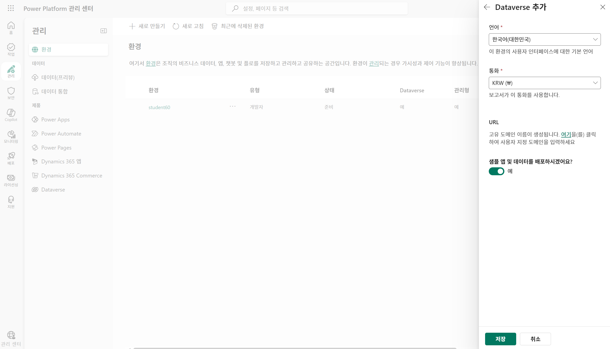

4. **저장**을 선택하고 환경 상태가 **준비**가 될 때까지 기다립니다(화면 갱신을 위해 **Refresh** 버튼을 사용할 수 있습니다).
   > [!NOTE]
   > 테넌트 구성에 따라 환경 프로비저닝에는 몇 분이 소요될 수 있습니다.

   Power Platform 관리 센터에서 환경이 생성되었습니다.
   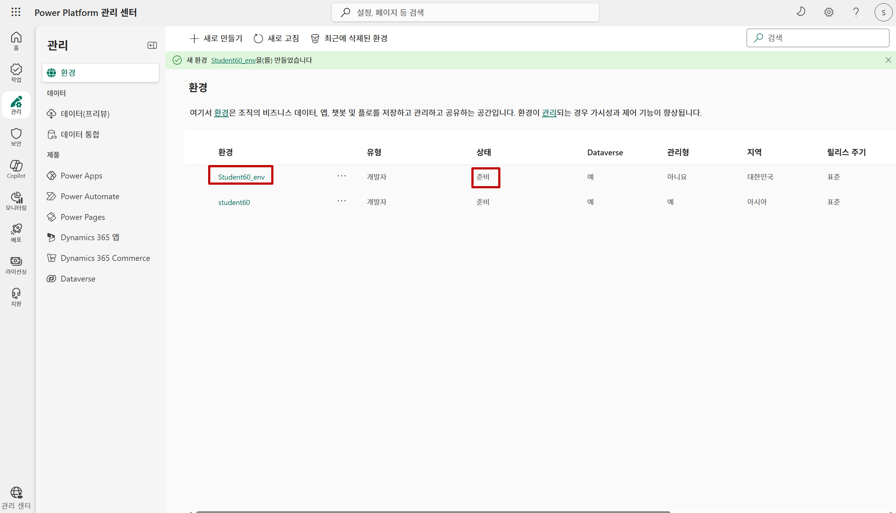

### 작업 1.2 - 사용자 추가
1. 생성한 **환경** 을 클릭합니다.
   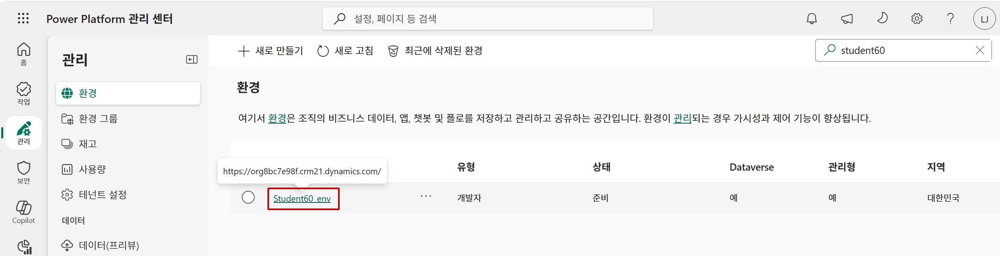

2. **액세스** 하위의 **사용자:** **모두보기**를 클릭합니다.
   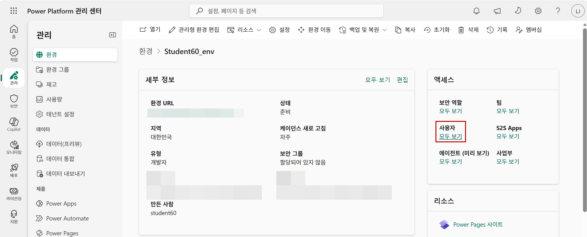

1. **+ 사용자 추가**를 클릭하여 나타나는 사용자 추가 화면에서 사용자 정보를 검색 후 선택합니다.
   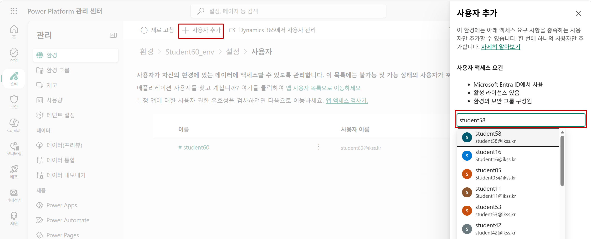
   **추가** 합니다.
   

1. 추가가 완료되면 보안 역할 관리 화면에서 **Environment Maker** 와 **Basic User**역할을 선택하고 **저장**을 클릭합니다.
   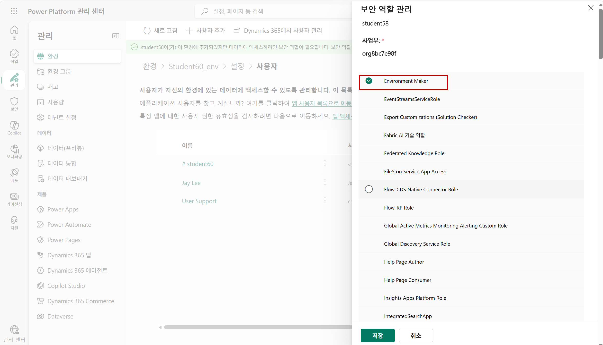
   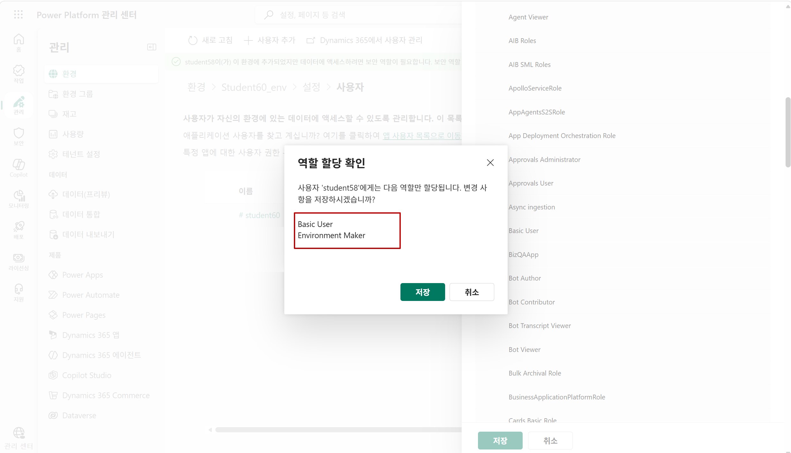
   
   이 과정을 반복하여 사용자를 추가합니다.
   사용자에게 정상적으로 환경에 권한이 추가된 경우, [Copilot Studio](https://copilotstudio.microsoft.com/) 페이지에 접속 시 해당 환경이 **지원 환경** 하위에 표시됩니다.
   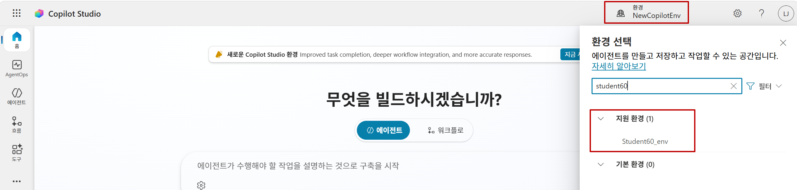

### 작업 1.3 - 솔루션 만들기

1. Copilot Studio [https://copilotstudio.microsoft.com/](https://copilotstudio.microsoft.com/) 페이지 오른쪽 상단의 **환경 선택** 사용해 환경을 생성된 환경(Student00_env)로 전환합니다. 

   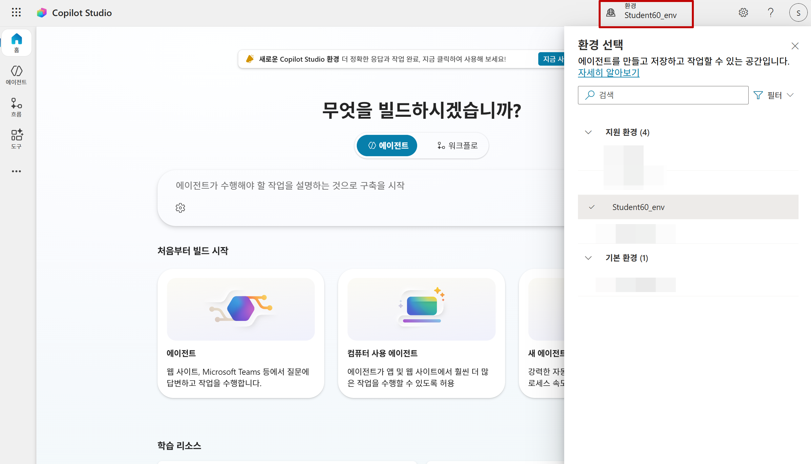

1. 왼쪽 탐색 창에서 줄임표(**...**)를 선택한 다음 **솔루션**을 선택합니다.
   

1. *Default Solution* 및 *Common Data Services Default Solution*을 포함한 여러 솔루션이 표시되는지 확인합니다.

   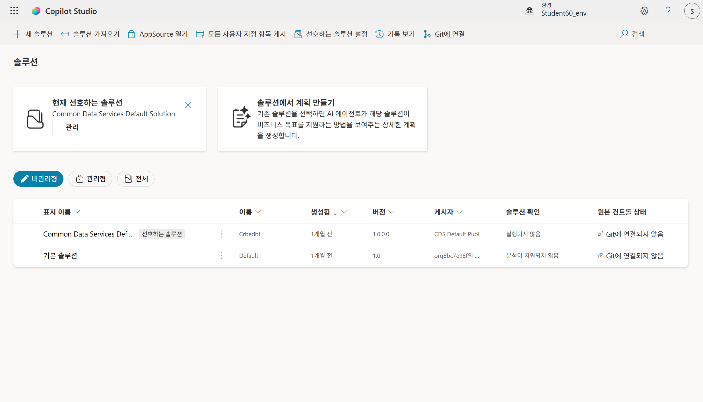

1. **+ 새 솔루션**을 선택합니다.

1. **표시 이름** 텍스트 상자에 `Lab Exercises`를 입력합니다.

1. **이름**이 자동으로 채워졌는지 확인합니다.

1. **게시자** 드롭다운 아래의 **+ 새 게시자**를 선택합니다.

1. **표시 이름**에 `Fabrikam`을 입력합니다.

1. **이름**에 `fabrikam`을 입력합니다.

1. **접두사**에 `fab`를 입력합니다.

   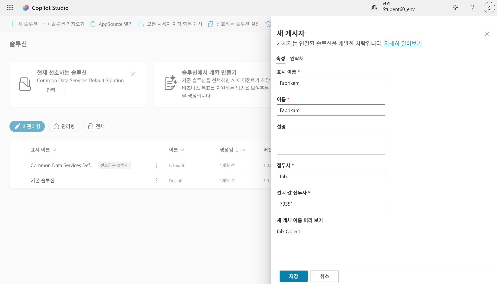

1. **저장**를 선택합니다.

1. **게시자** 드롭다운에서 **Fabrikam (fabrikam)**이 선택되어 있는지 확인합니다.

1. **선호하는 솔루션으로 설정** 체크박스를 선택합니다.

   > [!NOTE]
   > 이를 선호 솔루션으로 설정하면 이후 실습에서 만드는 새 자산이 기본적으로 Lab Exercises 솔루션에 추가됩니다.

   

1. **만들기**를 선택합니다.

1. **솔루션** 이 생성된것을 확인하고 뒤로 가기를 클릭하여 솔루션 화면으로 이동합니다.

1. 생성된 솔루션을 다시 한번 확인하고 브라우저를 닫습니다. 
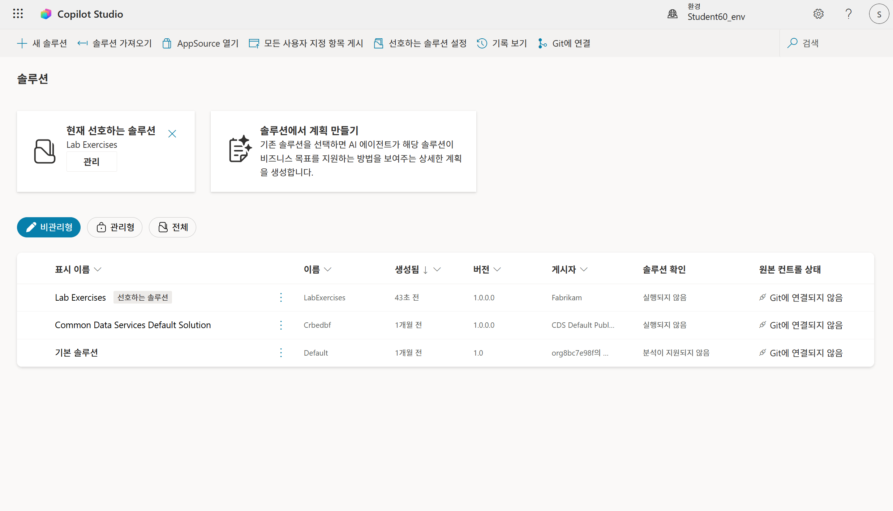

1. **Copilot Studio** 페이지를 새로 고칩니다.
이제 작업에 사용할 Power Platform 환경과 솔루션이 준비되었습니다.

