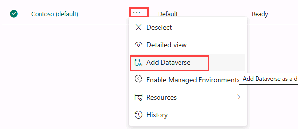
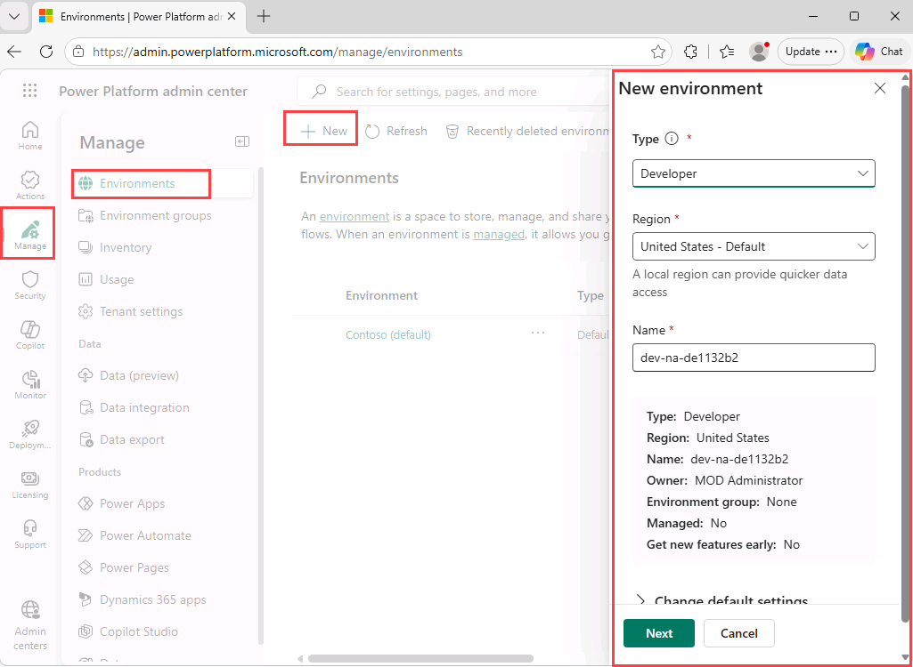
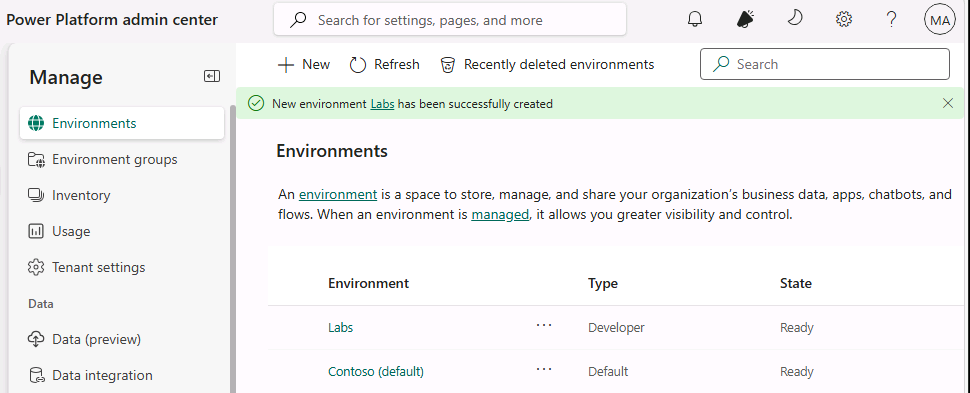
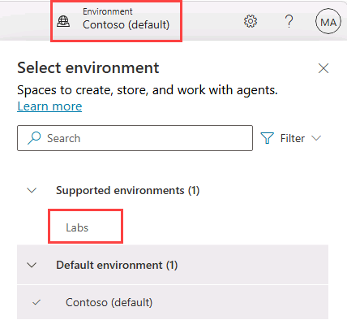
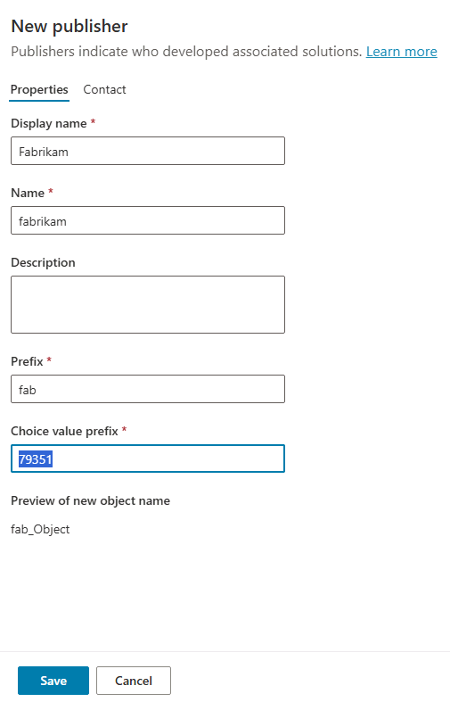
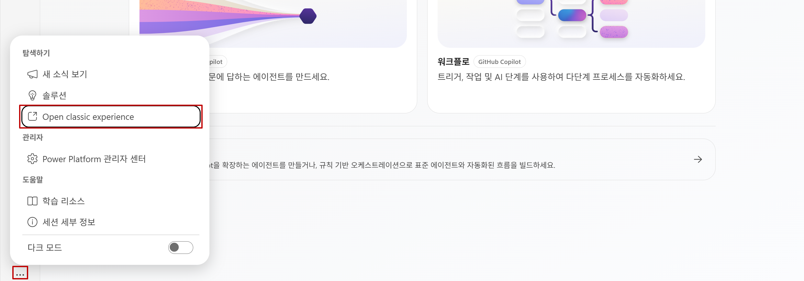

# 실습 환경 준비

## 실습 개요

| 구분 | 내용 |
|------|------|
| 난이도 | Level 200 (Developer) |
| 소요 시간 | 약 10분 |
| 대상 | Power Platform 개발자, Copilot Studio 학습자 |
| 목적 | Microsoft Copilot Studio 실습을 위한 Power Platform 환경 및 솔루션 구성 |

## 실습 1 - Power Platform 환경 만들기

### 작업 1.1 - Power Platform 관리 센터

실습을 시작하기 전에, 작업할 개발 환경을 만들어야 합니다.

1. 웹 브라우저를 열고 `https://admin.powerplatform.microsoft.com/manage/environments`로 이동한 다음, 이 실습용 자격 증명으로 로그인합니다.

1. 로그인 상태 유지 여부를 묻는 메시지가 표시되면, 로그인 상태 유지를 선택합니다.

1. 표시되는 팝업 메시지를 모두 닫습니다.

### 작업 1.2 - 기본 환경에 Dataverse 추가

1. **Contoso (default)** 환경의 줄임표(**...**)를 선택하고 **Add Dataverse**를 선택합니다.

   

1. 모든 기본 설정을 그대로 두고 **Add**를 선택합니다.

### 작업 1.3 - 새 환경 만들기

1. **Environments** 페이지에서 **+ New**를 선택하고 다음 설정으로 새 환경을 만듭니다.

   - **Type**: Developer
   - **Region**: 기본 지역
   - **Name**: *사용자 이름*
   - **Environment group**: None
   - **Make this a Managed Environment**: No
   - **Get new features early**: No
   - **Create on behalf**: No

   

1. **Next**를 선택하고 **Add Dataverse** 섹션에서 다음과 같이 설정합니다.

   - **Language**: English (United States)
   - **Currency**: USD ($)
   - **Deploy sample apps and data**: No

1. **Save**를 선택하고 환경 상태가 **Ready**가 될 때까지 기다립니다(표시를 업데이트하려면 **Refresh** 버튼을 사용).

   > [!NOTE]
   > 테넌트 구성에 따라 환경 프로비저닝에는 몇 분이 소요될 수 있습니다.

   

1. 새 브라우저 탭에서 `https://copilotstudio.microsoft.com/`로 이동하고, 요청되면 로그인합니다.

1. 요청되면 **Get Started**를 선택하고 기본 국가 또는 지역 설정을 유지합니다.

1. 환영 메시지가 표시되면 건너뜁니다.

1. 페이지 오른쪽 위에서 Environment Selector를 사용해 환경을 전환하고, 방금 만든 환경을 선택합니다.

   

### 작업 1.4 - 솔루션 만들기

1. 왼쪽 탐색 창에서 줄임표(**...**)를 선택한 다음 **Solutions**를 선택합니다.

1. *Default Solution* 및 *Common Data Services Default Solution*을 포함한 여러 솔루션이 표시되는지 확인합니다.

   

1. **+ New solution**을 선택합니다.

1. **Display name** 텍스트 상자에 **`Lab Exercises`**를 입력합니다.

1. **Name**이 자동으로 채워졌는지 확인합니다.

1. **Publisher** 드롭다운 아래의 **+ New publisher**를 선택합니다.

1. **Display name**에 `Fabrikam`을 입력합니다.

1. **Name**에 `fabrikam`을 입력합니다.

1. **Prefix**에 `fab`를 입력합니다.

   

1. **Save**를 선택합니다.

1. **Publisher** 드롭다운에서 **Fabrikam (fabrikam)**이 선택되어 있는지 확인합니다.

1. **Set as your preferred solution** 체크박스를 선택합니다.

   > [!NOTE]
   > 이를 선호 솔루션으로 설정하면 이후 실습에서 만드는 새 자산이 기본적으로 Lab Exercises 솔루션에 추가됩니다.

   

1. **Create**를 선택합니다.

1. **Solutions** 브라우저 탭을 닫습니다.

1. **Copilot Studio** 페이지를 새로 고칩니다.

이제 작업에 사용할 Power Platform 환경과 솔루션이 준비되었습니다.

------------------------
Backup
1. https://copilotstudio.microsoft.com/ 에서 Microsoft Copilot Studio 포털에 액세스합니다. 요청되면 이 실습용 자격 증명으로 로그인합니다.
2. 요청되면 **시작하기/Get Started**를 선택하고 기본 국가 또는 지역 설정은 **한국**을 유지합니다.
3. 환영 메시지가 표시되면 건너뜁니다.
4. 페이지 오른쪽 위에서 **환경**에서 Student00(제공된 실습 계정, 예시:Student60) 으로 환경이 생성되었는지 확인합니다. 

-------------------------

