# Copilot Studio로 에이전트 만들기

## 실습 개요

| 구분 | 내용 |
|------|------|
| 난이도 | Level 200 (Developer) |
| 소요 시간 | 약 45분 |
| 대상 | Power Platform 개발자, Copilot Studio 학습자 |
| 목적 | Copilot Studio 포털에서 새 에이전트를 생성하고 기본 구성 완료 |

## 시나리오

이 실습에서 수행할 작업:

- 템플릿에서 에이전트 만들기
- 에이전트 생성 및 이름 지정
- 지침(Instructions)으로 에이전트 동작 정의
- 공개 웹사이트를 지식 소스로 추가
- 에이전트를 게시하고 Demo website로 테스트

이 실습은 약 **45**분이 소요됩니다.

## 학습 내용

- 템플릿에서 에이전트를 만드는 방법
- 자연어로 에이전트를 만드는 방법
- 에이전트 지침이 생성 동작에 미치는 영향
- 생성형 AI 응답이 구성된 지식 소스를 사용하는 방식
- 에이전트를 Microsoft Teams에 게시하는 방법

## 전반적인 실습 단계

- 템플릿에서 에이전트 만들기
- Copilot을 사용해 에이전트 만들기
- 지침으로 에이전트 동작 정의
- 생성형 AI 지식 소스 추가
- 에이전트 게시

## 사전 요구 사항
- Microsoft Entra ID 계정 보유
- Copilot Studio 라이선스 보유 또는 [무료 평가판](https://go.microsoft.com/fwlink/p/?linkid=2252605) 등록
- 에이전트 및 관련 자산을 만들 수 있는 Power Platform 환경과 솔루션에 대한 액세스 권한
- 다음 중 하나를 사용할 수 있습니다:
  - **Lab00** 단계에서 만든 환경 및 **Lab Exercises** 솔루션
  - 기존에 사용 중인 환경 및 솔루션
- 환경과 솔루션이 아직 준비되지 않았다면, 계속하기 전에 **Lab00** 실습 단계를 먼저 완료하세요.
  
> [!IMPORTANT]
> 현재 프리뷰 상태인 새로운 Copilot Studio 환경을 보게 될 수 있습니다. 이 실습은 현재 Copilot Studio 인터페이스를 기준으로 하므로 일부 단계와 스크린샷이 프리뷰 환경과 다를 수 있습니다. 실습을 원활히 진행하려면 이 연습 전체에서 현재 Copilot Studio UI를 사용하세요.

## 핵심 개념: 에이전트 구성 요소와 동작

생성 오케스트레이션이 활성화되면, 에이전트는 지침, 지식, 토픽, 도구를 사용해 응답을 동적으로 생성할 수 있습니다.

## 실습 1 - 템플릿에서 에이전트 만들기

이 실습에서는 템플릿을 사용해 에이전트를 만든 다음, 해당 에이전트를 테스트합니다.

### 작업 1.1 - Safe Travels 템플릿에서 에이전트 만들기

1. **Copilot Studio** 홈 페이지 [https://copilotstudio.microsoft.com/](https://copilotstudio.microsoft.com/)에서 왼쪽 탐색 메뉴의 **에이전트**를 선택합니다.

1. 페이지 상단에서 이 실습에 사용할 환경인지 확인합니다.

1. **에이전트 탬플릿으로 시작** 섹션에서 **안전한 여행(Safe Travels)** 템플릿을 선택합니다.

   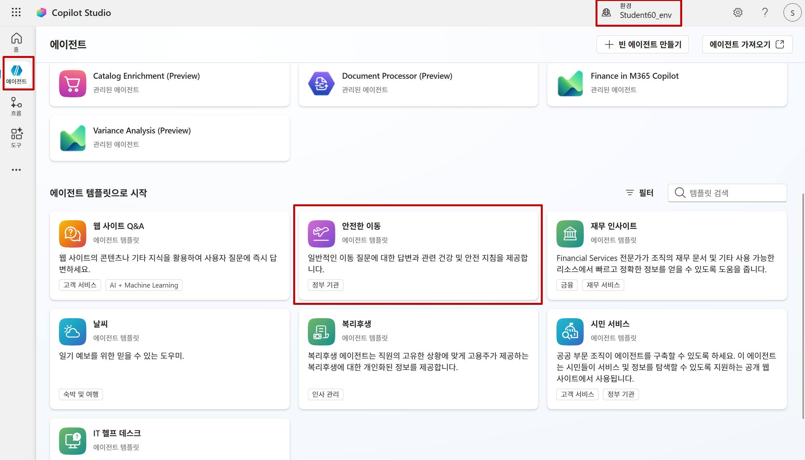

1. 페이지 오른쪽 위에서 줄임표(**...**)를 선택하고 **고급 설정 편집**을 선택합니다.


1. 선택된 *Solution*이 **Lab Exercises**이고 *스키마 이름* 접두사가 **fab**인지 확인한 뒤 **취소**를 선택합니다. 만약, 다른 솔루션이 선택되어있을 경우 **Lab Exercises**를 선택하고, *스키마 이름* 접두사가 **fab**인지 확인 후 저장합니다.
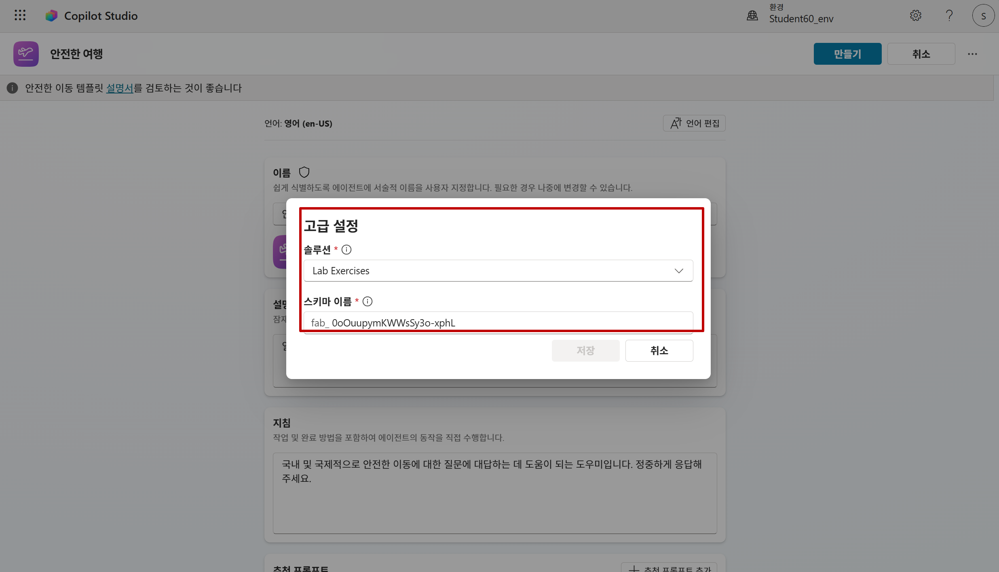

1. 페이지 오른쪽 위에서 **만들기**를 선택합니다.


1. **개요** 탭에서 **에이전트 상태**가 **Ready**인지 확인하고, **이름**, **설명**, **에이전트 지침**을 검토합니다.
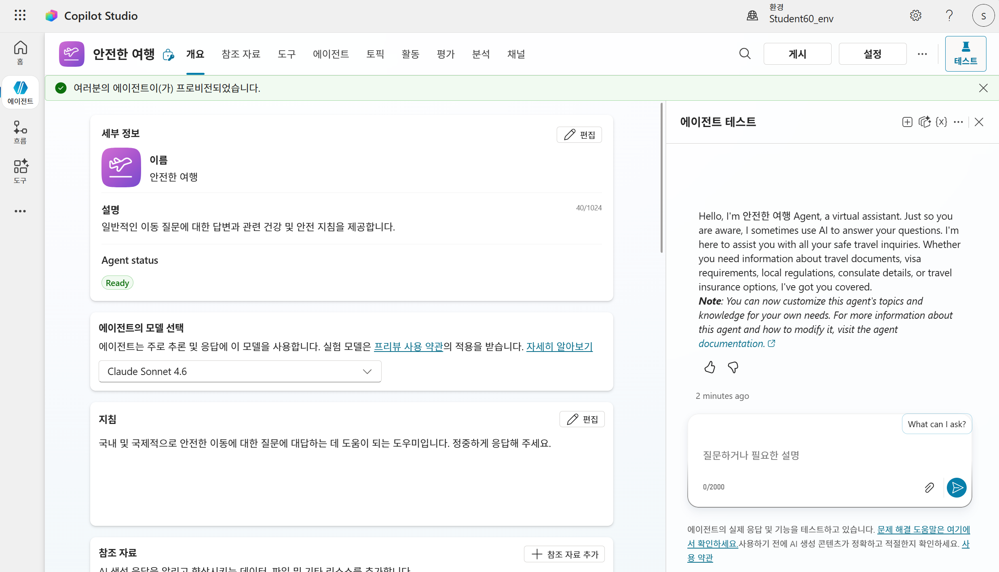

1. **참조 자료** 탭을 선택해 지식 소스로 추가된 공개 웹사이트를 검토합니다.

1. 페이지 오른쪽 위에서 **설정** 버튼을 선택합니다.
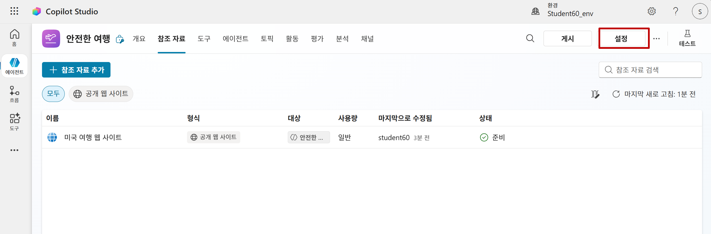

1. **오케스트레이션**이 **아니요 - 클래식 오케스트레이션을 사용하여 에이전트의 토픽에 정의된 콘텐츠와 동작에 대한 응답을 제한합니다.**로 설정되어 있는지 확인합니다.

1. Settings 페이지 오른쪽 위에서 **X**를 선택해 설정을 닫습니다.
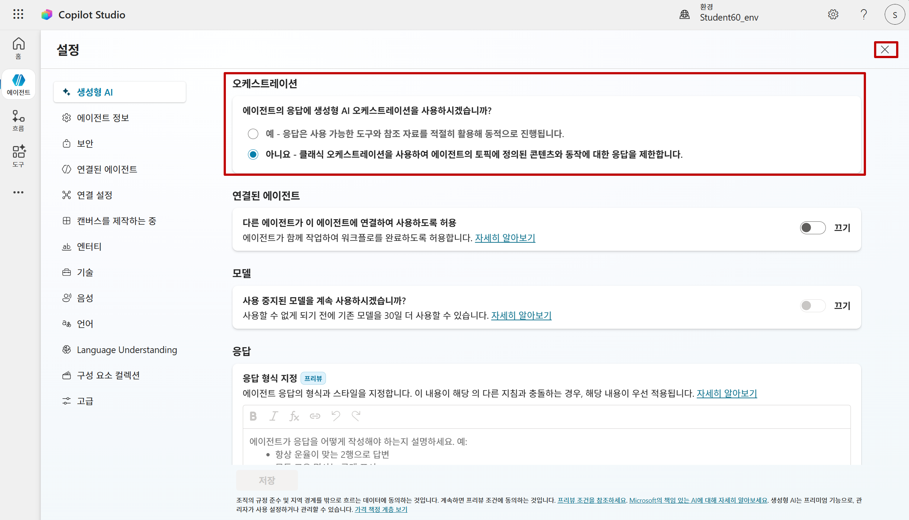

1. **토픽** 탭을 선택하고 **시스템** 필터를 선택합니다.
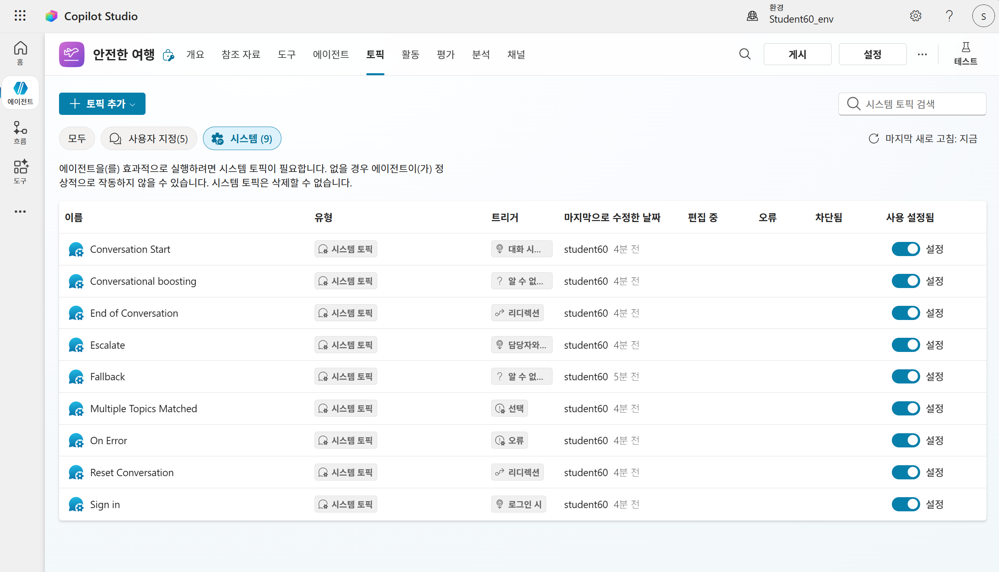

1. **Conversational Start** 토픽을 선택합니다. **Message** 노드의 내용을 검토합니다. 메시지 내용이 **Test** 창에 표시되는지 확인합니다.

   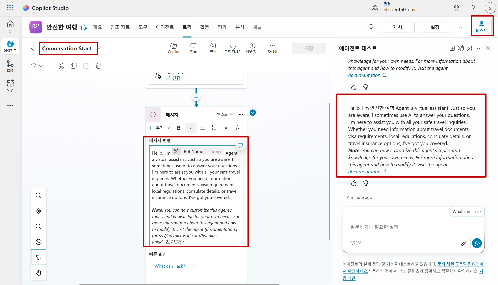


### 작업 1.2 - 에이전트 테스트

1. **테스트** 창이 보이지 않으면 페이지 오른쪽 위의 **테스트** 아이콘을 선택합니다.

1. **테스트** 창에서 변수 **{x}** 아이콘 옆 줄임표(**...**)를 선택하고 **토픽 간 추적**을 **On**으로 전환합니다.

   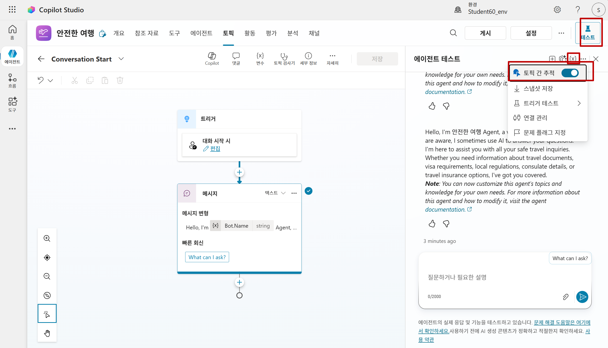

1. 다음 프롬프트를 입력합니다:

   ```prompt
   Hello
   ```

   **Greeting** 토픽이 선택되고, Greeting 토픽의 메시지 노드에서 응답이 제공되어야 합니다.
   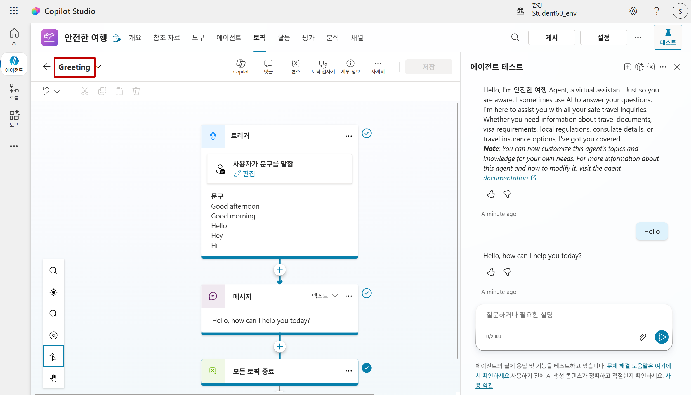

1. **테스트** 창 상단에서 **새 테스트 세션 시작** 아이콘 **+**를 선택합니다.
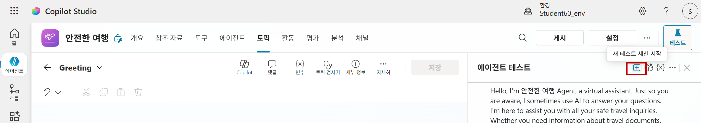

1. 다음 프롬프트를 입력합니다:

   ```prompt
   What can I ask?
   ```
   
   **What Can I Ask** 토픽이 트리거되어, 대화를 이어갈 수 있는 여러 프롬프트 옵션이 제시되어야 합니다.
   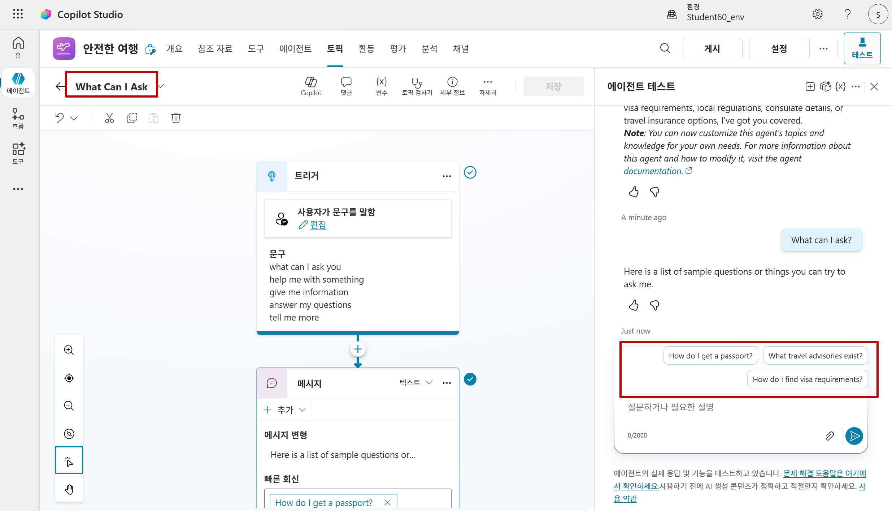

1. **How do I get a passport?** 옵션을 선택합니다.

   응답은 구성된 지식 소스를 사용해 생성되며 Conversational boosting 시스템 토픽을 참조할 수 있습니다.

   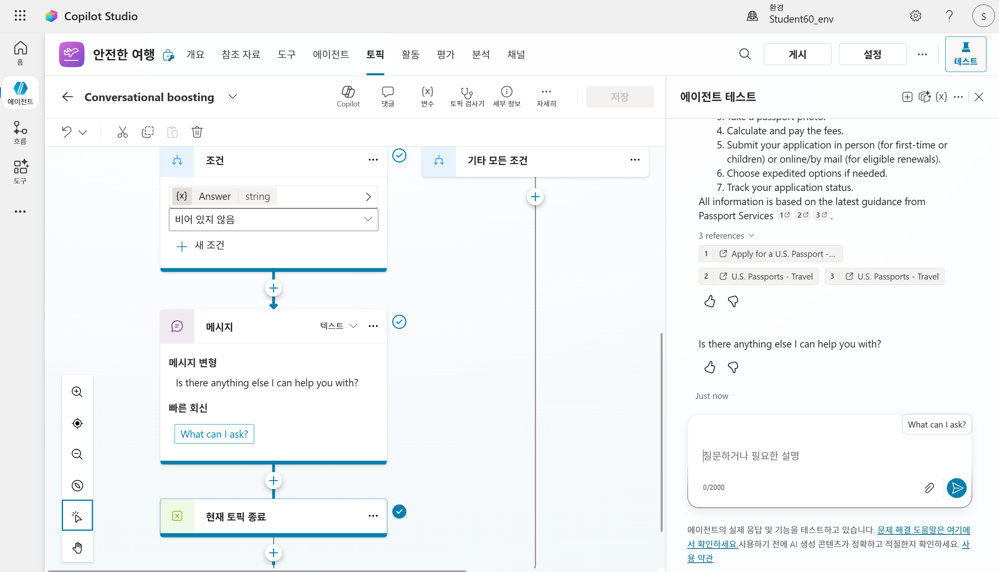

1. 다음 프롬프트를 입력합니다:

   ```prompt
   What is Copilot Studio?
   ```

   **Fallback** 토픽이 선택되고, 에이전트가 질문을 다시 표현해보라고 안내해야 합니다.
   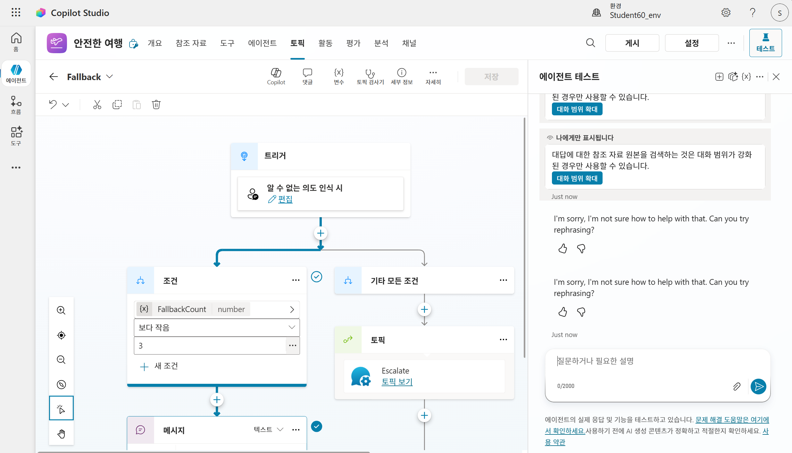
   

1. 같은 프롬프트를 두 번 더 반복합니다.
  환경 및 오케스트레이션 동작에 따라 에이전트가 Fallback 또는 Escalate 시스템 토픽을 트리거할 수 있습니다.

1. 왼쪽 탐색 메뉴에서 **에이전트**를 선택합니다. **안전한 여행** 에이전트가 목록에 표시되어야 합니다.
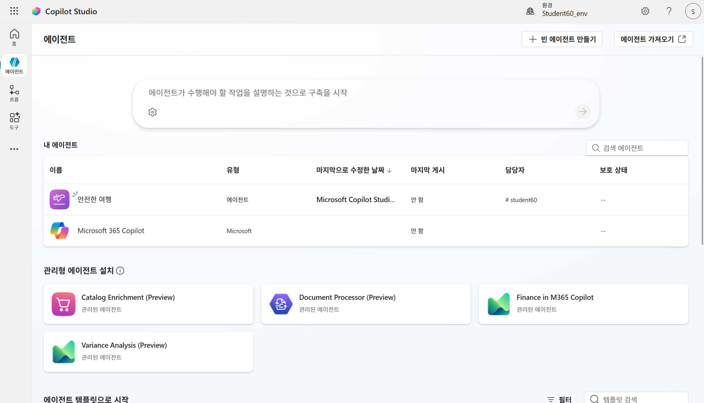

## 실습 2 - Copilot을 사용해 에이전트 만들기

이 실습에서는 정부 복지 관련 질문에 답변하는 새 에이전트를 자연어로 만듭니다.

### 작업 2.1 - 정부 복지 질문 응답용 에이전트 만들기

1. **Copilot Studio** 홈 페이지 [https://copilotstudio.microsoft.com/](https://copilotstudio.microsoft.com/)에서, 생성한 환경에 있는지 확인합니다.

1. 왼쪽 탐색 메뉴에서 **에이전트**를 선택합니다.

1. *에이전트가 수행해야 할 작업을 설명하는 것으로 구축을 시작* 텍스트 상자 왼쪽 아래에서 **에이전트 설정** 아이콘(톱니바퀴 이미지)을 선택합니다.

   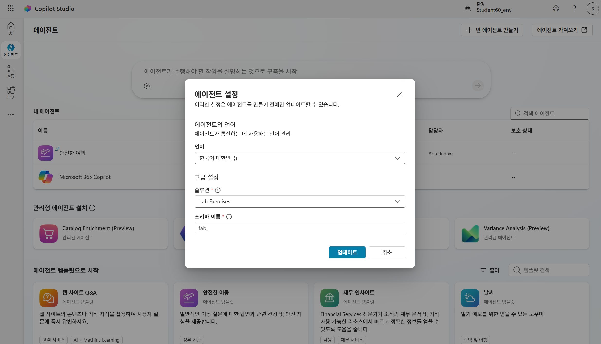

1. 에이전트 기본 언어는 **한국어 (대한민국)**로 유지합니다.

1. **솔루션** 드롭다운에서 **Lab Exercises**를 선택합니다.

1. *스키마 이름*에 `govbenefitsagent`를 입력합니다.

1. **업데이트**를 선택합니다.
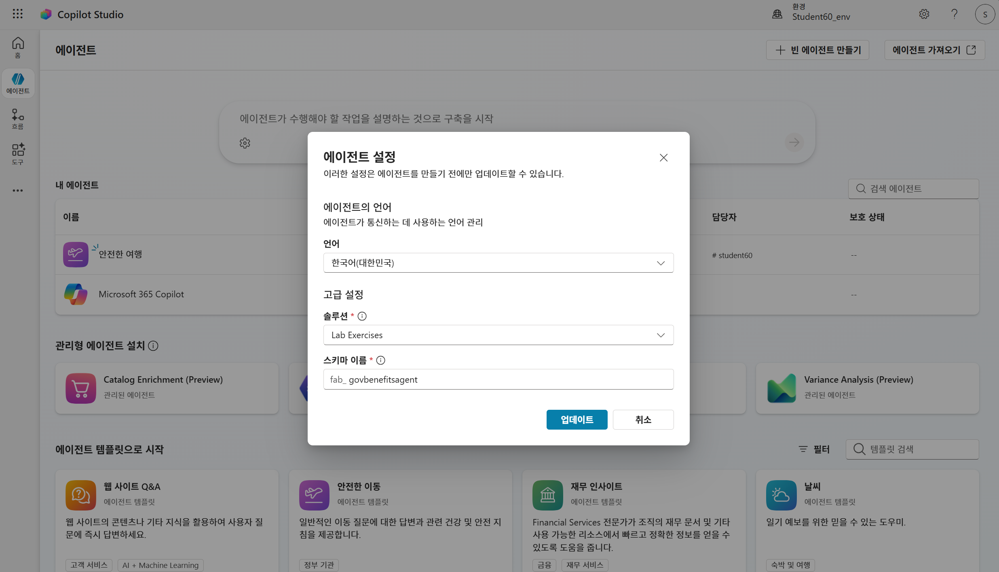

1. *에이전트가 수행해야 할 작업을 설명하는 것으로 구축을 시작* 텍스트 상자에 다음 프롬프트를 입력합니다:

   ```prompt
   당신은 대한민국 정부 혜택 청구와 관련된 질문에 도움을 주는 에이전트 입니다.
   ```

1. **전송** 아이콘을 선택합니다.
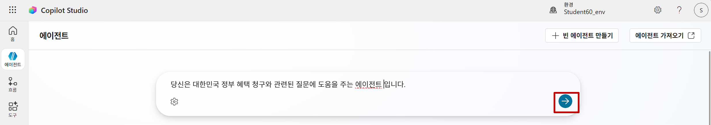

   에이전트가 생성됩니다.
   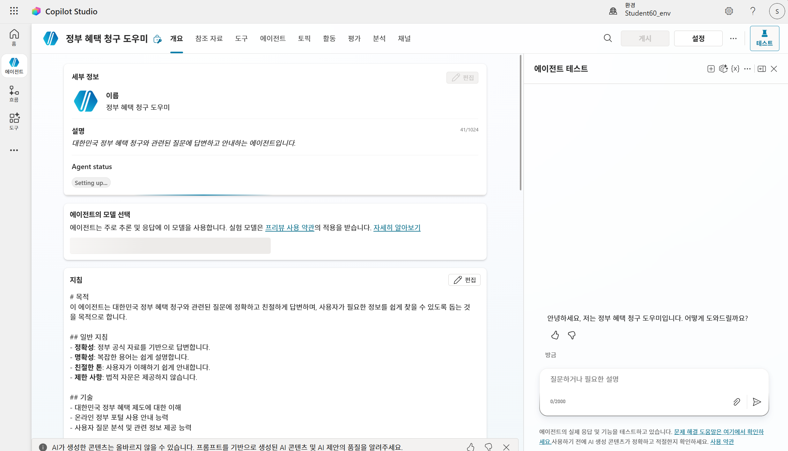

   에이전트 프로비저닝이 완료되면 에이전트 구성을 계속 진행할 수 있습니다.

### 작업 2.2 - 개요 탭 구성

1. 에이전트의 **개요** 탭을 선택합니다.

1. **세부정보** 섹션에서 **편집** 후 선택하여 다음을 업데이트 후 저장 합니다. 

- **이름**: 
   ```
   대한민국 복지 도우미
   ```
- **설명**:
   ```
   보건복지부, 한국사회보장정보원에서 제공하는 대한민국 대표 복지 프로그램에 대한 정보를 제공합니다. 국민이 받을 수 있는 다양한 복지 혜택과 관련된 질문에 답변하고 안내하는 에이전트입니다.
   ```

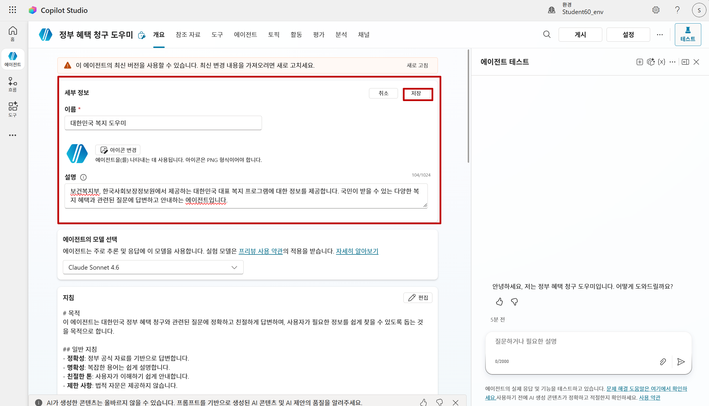

1. **지침** 섹션에서 **편집**을 선택합니다.

1. 에이전트 지침의 *## 일반 지침* 아래에 다음을 추가합니다. 이미 추가 되어 있는 경우 다음으로 건너뜁니다.:

   ```prompt
   - 법률 자문을 제공하지 않습니다.
   ```

   > [!NOTE]
   > 에이전트 지침은 에이전트 동작 방식을 안내하지만 동작을 엄격히 강제하지는 않습니다. 이후 실습에서 토픽, 지식, 제한된 지식 소스를 사용하는 생성형 답변으로 동작을 변경하는 방법을 학습합니다.

1. **추천 프롬프트** 섹션에서 **추천 프롬프트 추가**를 선택합니다.

1. **제목**에 `건강`를 입력합니다.

1. **프롬프트**에 `이용 가능한 의료 지원 프로그램은 무엇인가요?`를 입력합니다.

1. **저장**를 선택합니다.
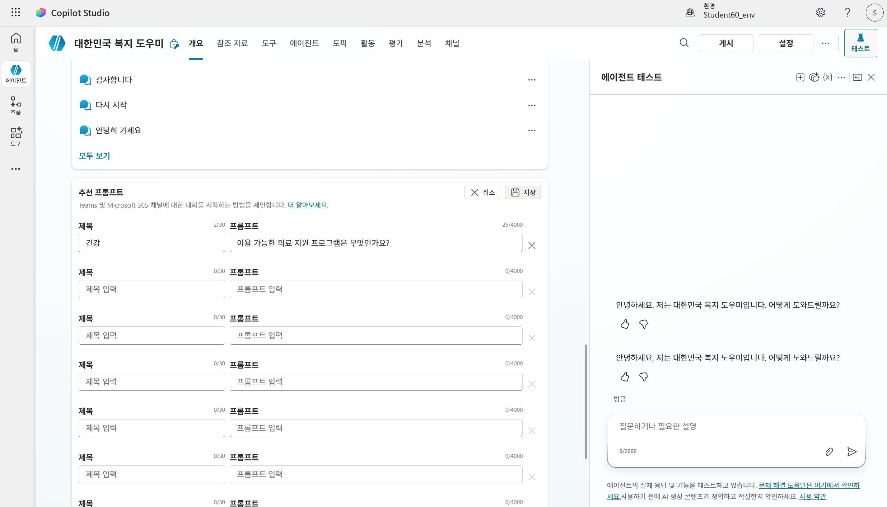

### 작업 2.3 - 공개 웹사이트를 지식 소스로 추가

1. **참조 자료** 탭을 선택합니다.

1. **+ 참조 자료 추가**를 선택합니다.
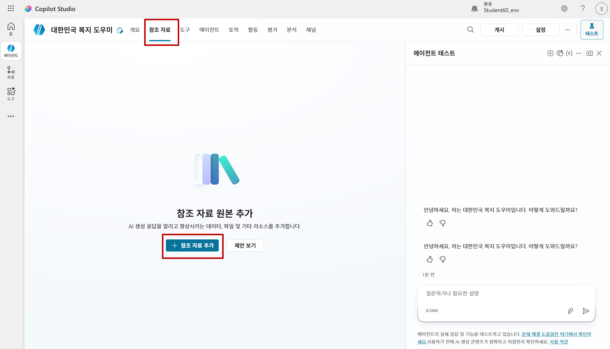

1. **공개 웹 사이트**를 선택합니다.
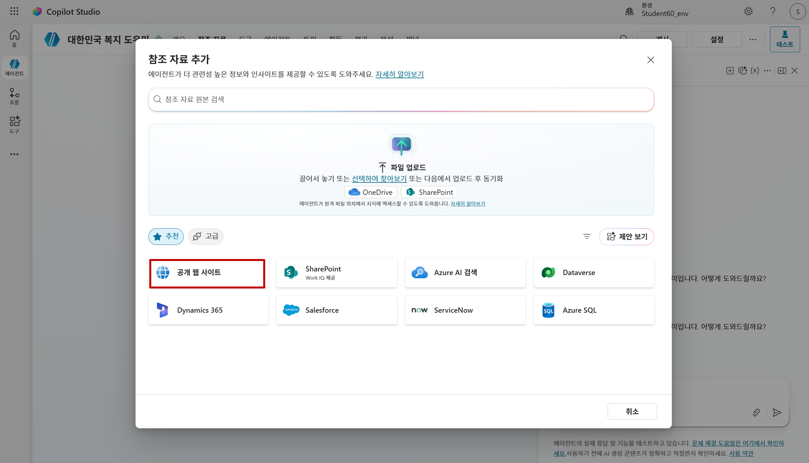

1. **공개 웹 사이트 링크** 텍스트 상자에 `https://www.bokjiro.go.kr`를 입력합니다. 이 공식 정부 공개 웹사이트는 에이전트에 유용한 복지 프로그램 정보를 포함합니다.

1. **추가**를 선택합니다.
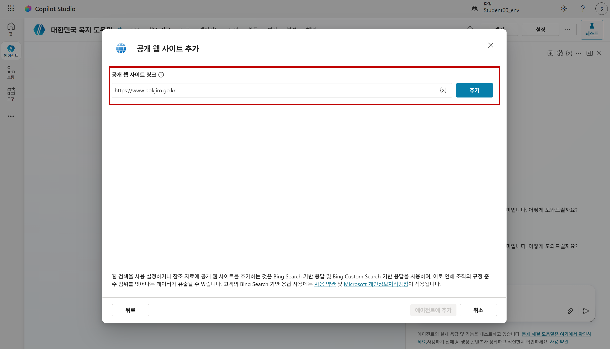
- **이름**:
```
정부 복지 정보
```
- **설명**: 
```
이 자료는 복지 혜택, 복지 시설 및 기본적인 생활비를 지원하는 정부 프로그램에 대한 정보를 담고 있습니다.
```
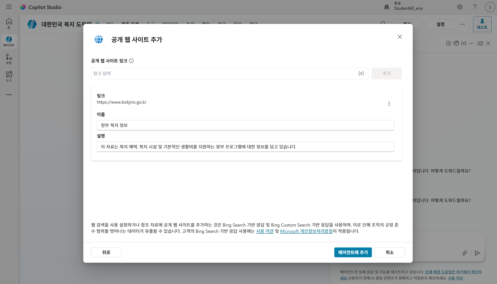
1. **에이전트에 추가**를 선택합니다.
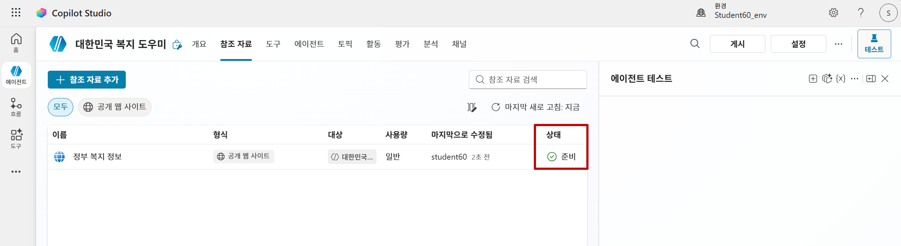

   > [!NOTE]
   > 공개 웹사이트 인덱싱에는 몇 분이 걸릴 수 있습니다. 응답이 불완전하면 몇 분 기다린 후 에이전트를 다시 테스트하세요.

### 작업 2.4 - 에이전트 설정

1. 페이지 오른쪽 위에서 **설정** 버튼을 선택합니다.
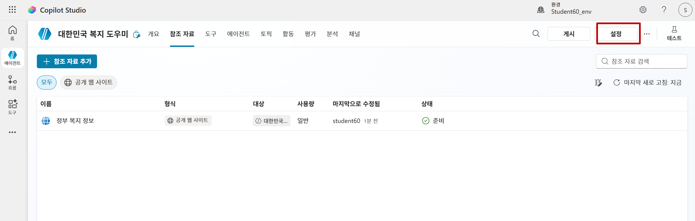

1. **오케스트레이션**이  **예 - 응답은 사용 가능한 도구와 참조 자료를 적절히 활용해 동적으로 진행됩니다.** 로 설정되어 있는지 확인합니다.

1. **응답** 섹션에 다음을 입력합니다:

   ```prompt
   - 프로세스 관련 답변은 한 문장으로 작성합니다.
   - 데이터 관련 답변은 글머리 기호를 사용하여 작성합니다.
   ```
   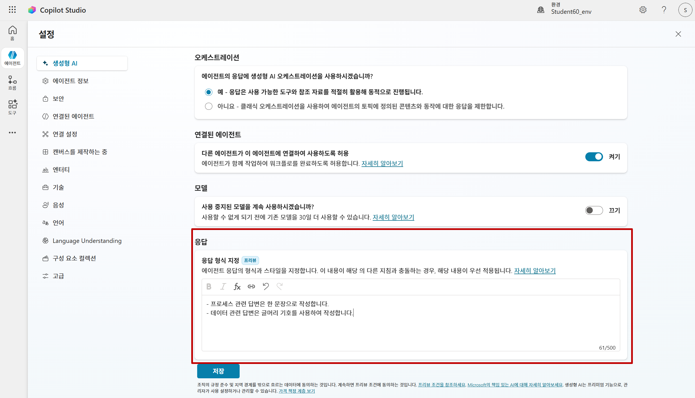
1. **지식** 섹션에서 **근거 없는 응답 허용하기**를 **끄기**로 설정합니다.

1. **지식** 섹션에서 **웹의 정보 사용**를 **끄기**으로 설정합니다.

1. **저장**를 선택합니다.
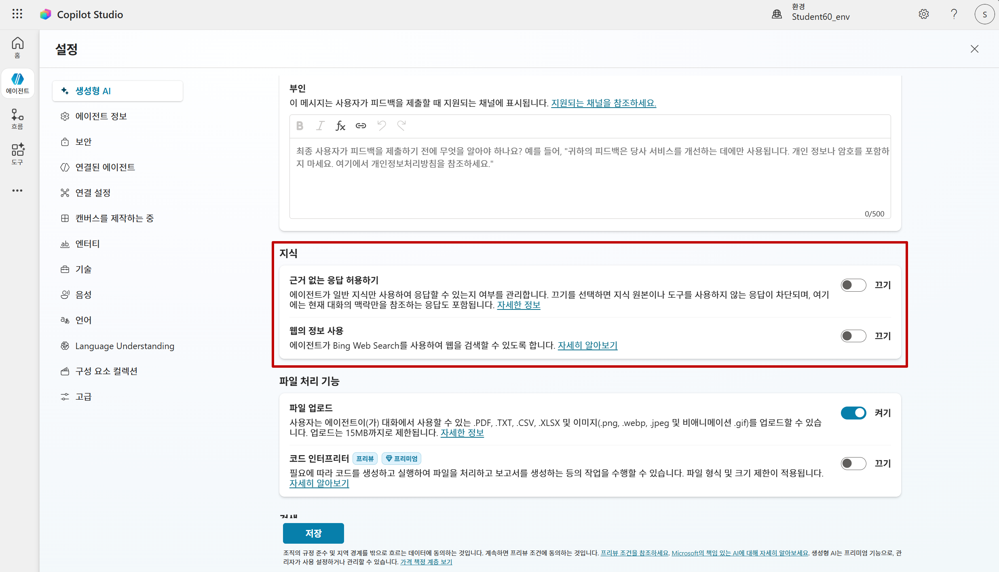

1. **설정** 페이지 왼쪽에서 **보안**을 선택합니다.

1. **인증**을 선택합니다.
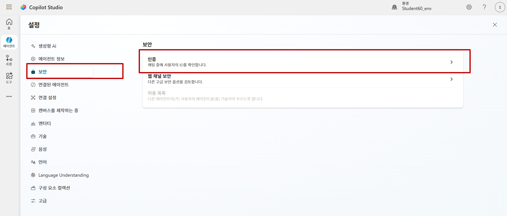

1. Demo website 채널 테스트를 단순화하기 위해 이 실습에서는 **인증 없음**을 선택합니다.
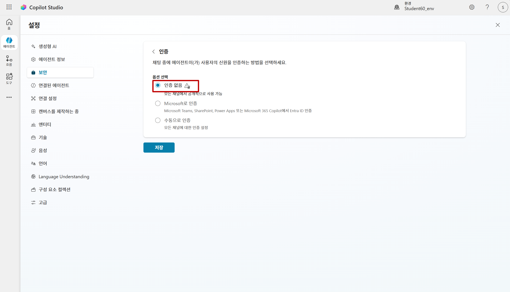

1. **저장**를 선택한 후 다시 한 번 **저장**를 선택합니다.
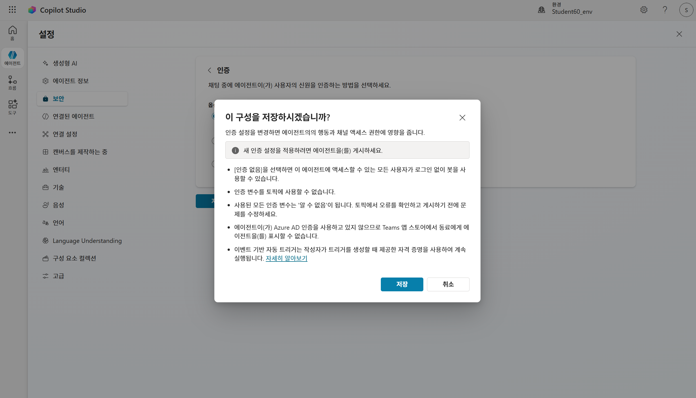

1. **설정** 페이지 오른쪽 위에서 **X**를 선택해 설정을 닫습니다.
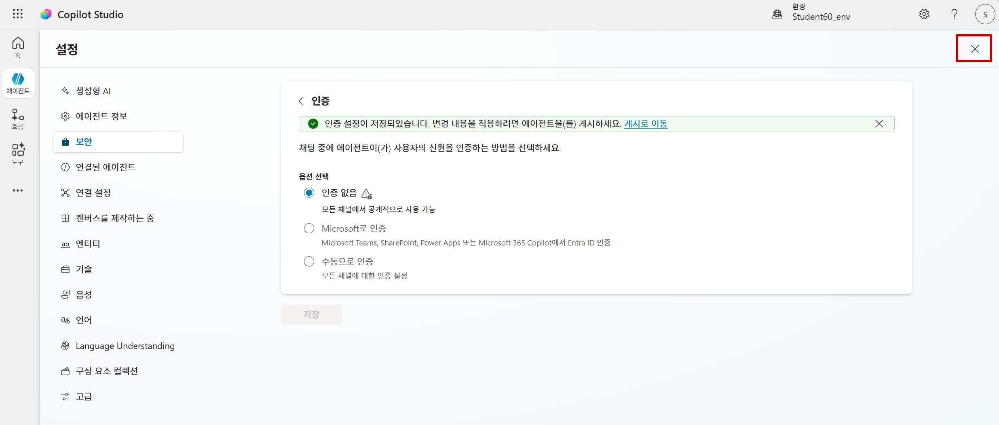

### 작업 2.5 - 에이전트 테스트

1. **테스트** 창이 보이지 않으면 페이지 오른쪽 위의 **테스트** 아이콘을 선택합니다.

1. **테스트** 창에서 변수 **{x}** 아이콘 옆 줄임표(**...**)를 선택하고 **테스트 시 활동 지도 표시**를 **On**, **토픽 간 추적**를 **Off**로 전환합니다.

   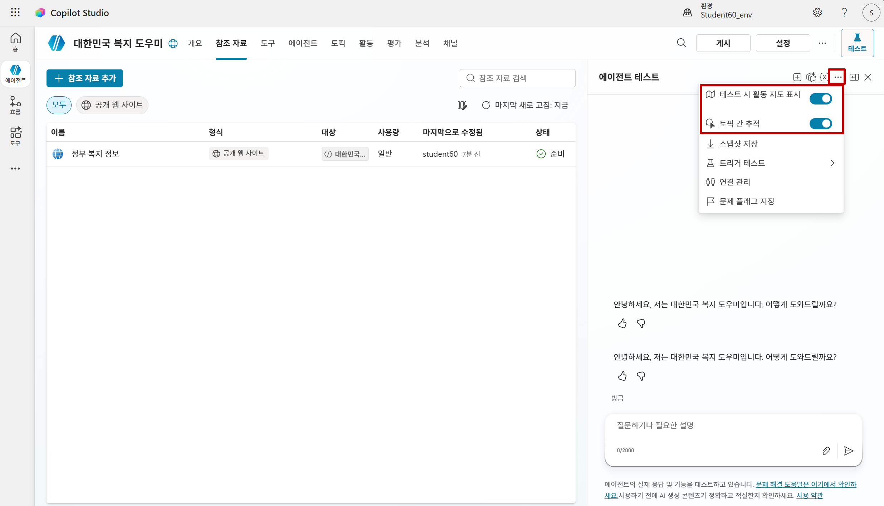

1. **테스트** 창 상단에서 **새 테스트 세션 시작** 아이콘 **+**를 선택합니다.
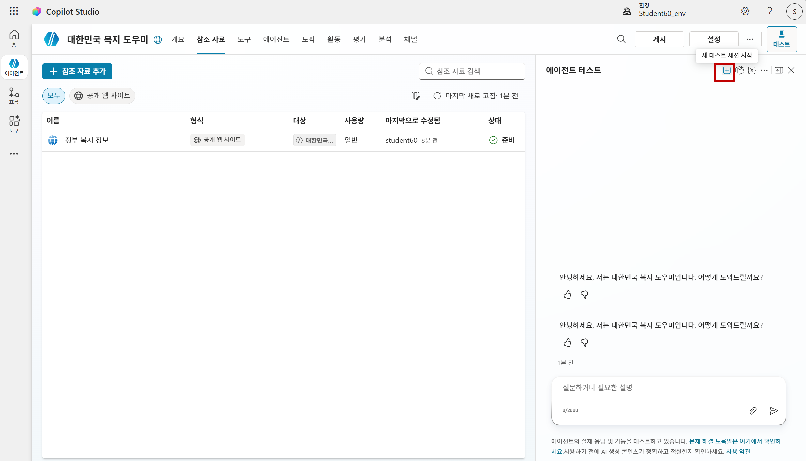

1. 다음 프롬프트를 입력합니다:

   ```prompt
   제가 받을 수 있는 복지 혜택에는 어떤 것들이 있나요?
   ```

   **활동 지도**가 표시되고, 응답 생성에 지식 소스가 사용되었음을 확인할 수 있어야 합니다.
   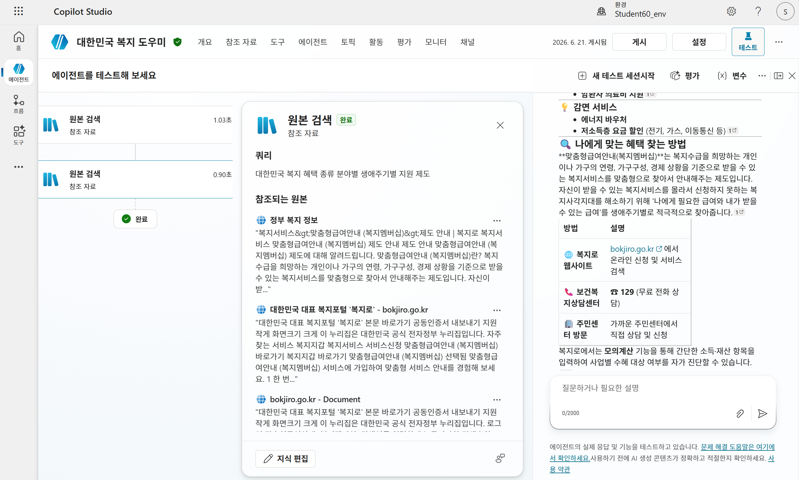

1. **테스트** 창을 닫습니다.

### 작업 2.6 - 에이전트를 데모 웹 사이트에 게시

1. 에이전트의 작업 표시줄에서 **게시** 버튼을 선택하고, 다시 **게시**를 선택합니다.
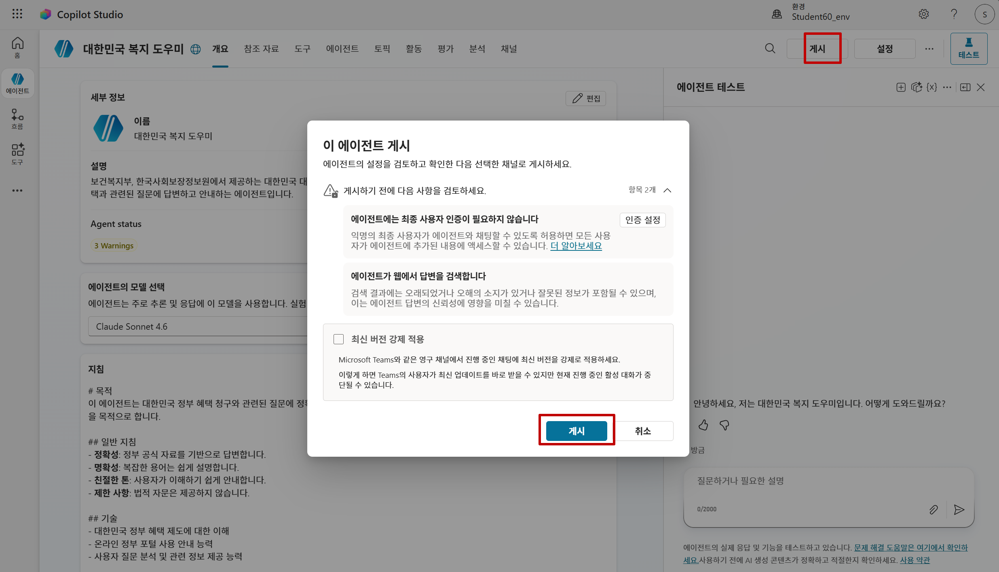

1. **채널** 탭을 선택합니다.

   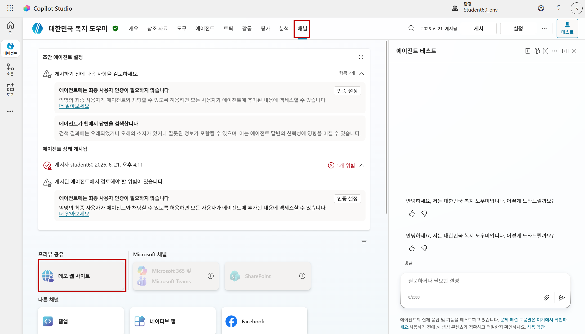

1. **데모 웹 사이트** 채널을 선택합니다. 이 채널은 에이전트 환경을 빠르게 테스트하고 미리보기하는 데 유용합니다.

1. **데모 웹 사이트** 창에서 다음 설정을 입력합니다:

   - **환영 메시지**: `정부 지원 프로그램에 대해 물어보세요`
   - **대화 스타터**:

      ```prompt
      "복지로 인기 서비스 TOP5"
      "제가 받을 수 있는 복지 프로그램은 무엇인가요?"
      "사회보장제도란 무엇인가요?"
      ```

1. **저장**를 선택합니다.

1. **데모 웹사이트 열기**를 선택합니다.
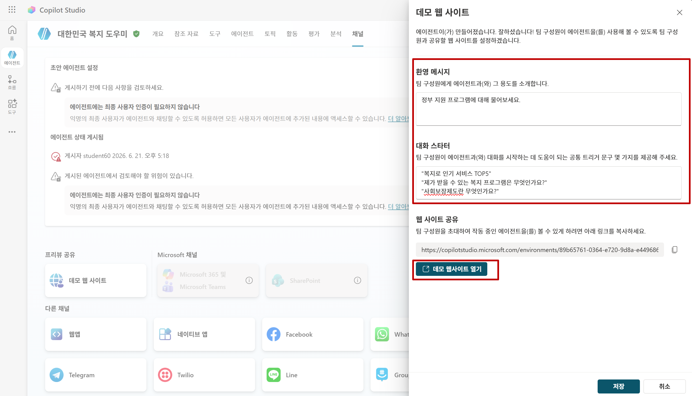

1. 다음 프롬프트를 입력합니다:

   ```prompt
   제가 받을 수 있는 복지 혜택에는 어떤 것들이 있나요?
   ```

   응답은 구성된 지식 소스 정보를 참조해야 하며, 인용 또는 출처 참조를 포함할 수 있습니다.
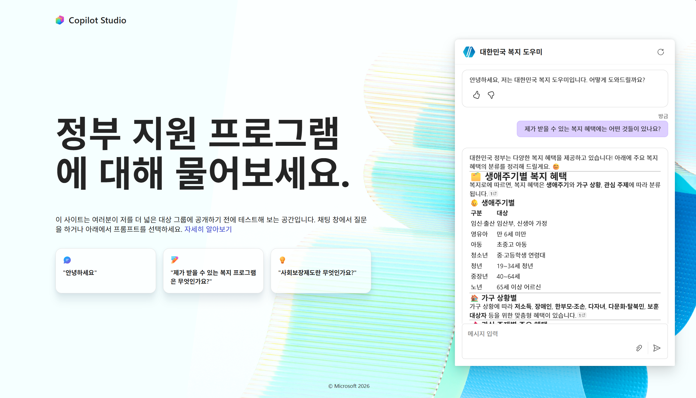
1. 몇 가지 질문을 더 시도하고 에이전트 응답을 확인합니다. 기능은 제한적일 수 있지만 복지 관련 질문에 대해 관련성 있는 답변을 제공할 수 있어야 합니다.

## 요약

실습에서는 에이전트를 만들고 지침을 통해 에이전트가 수행할 동작을 설정했습니다. 이어서 공개 웹사이트를 지식 소스로 추가하고, 그 지식을 활용해 답변을 개선할 수 있는 질문으로 에이전트를 테스트했습니다. 이러한 지침은 생성된 응답을 안내하는 역할을 하지만, 이후 실습에서는 토픽, 지식, 도구를 활용해 에이전트의 동작을 더욱 정교하게 제어하는 방법을 확인하게 됩니다.

