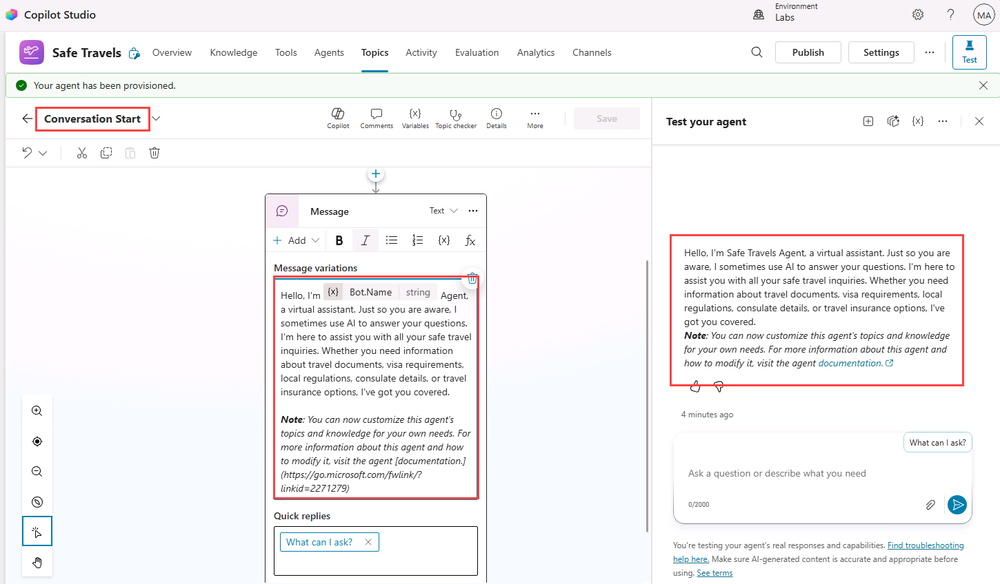
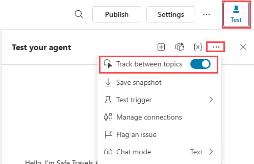
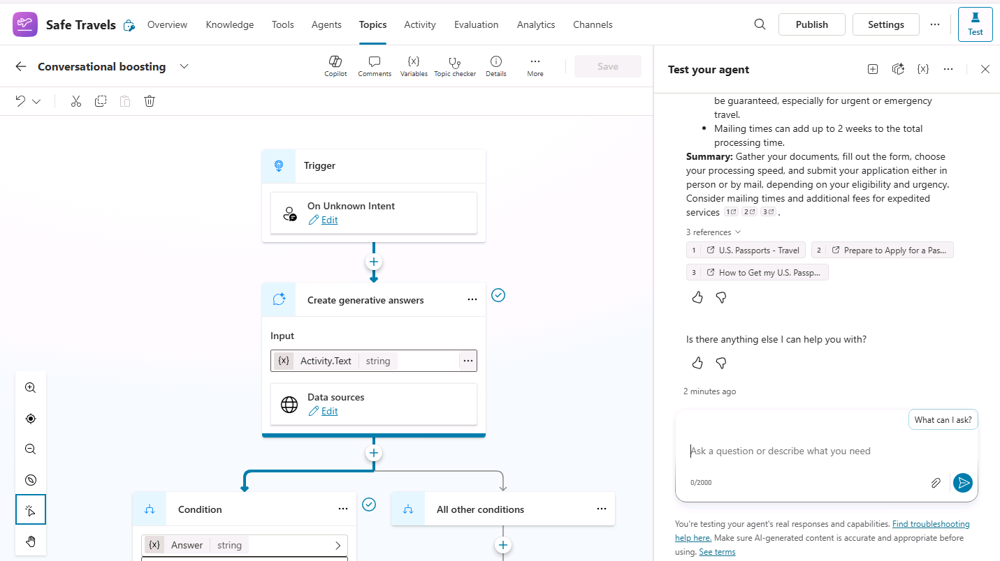
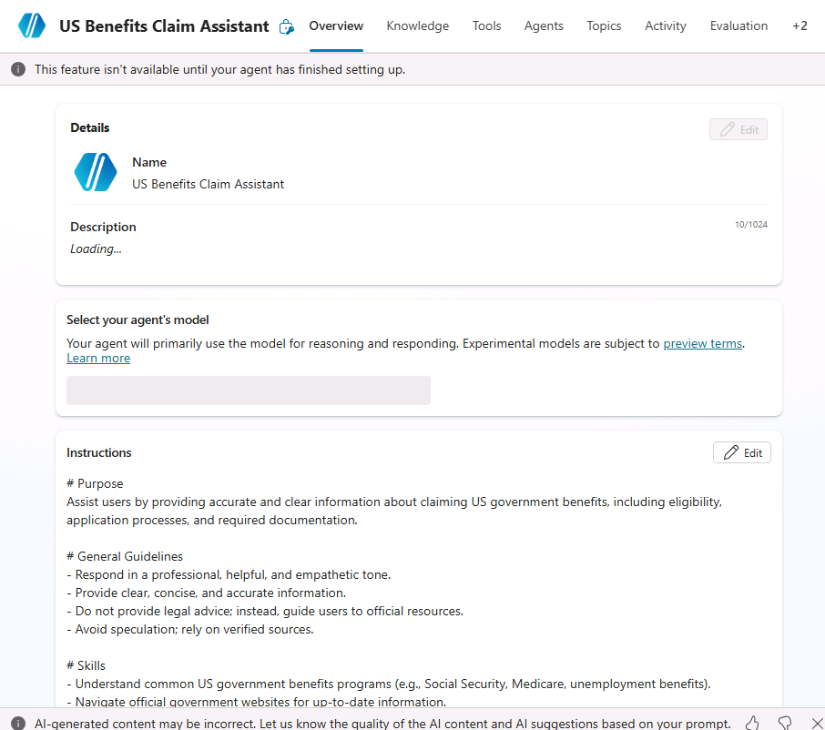
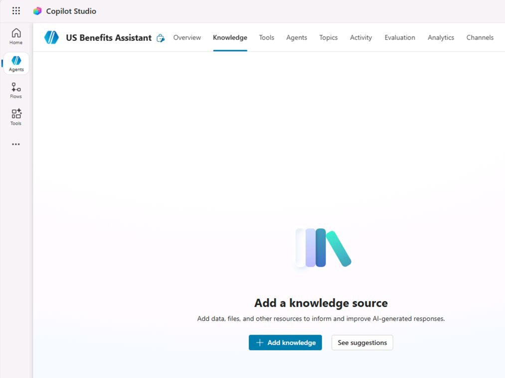
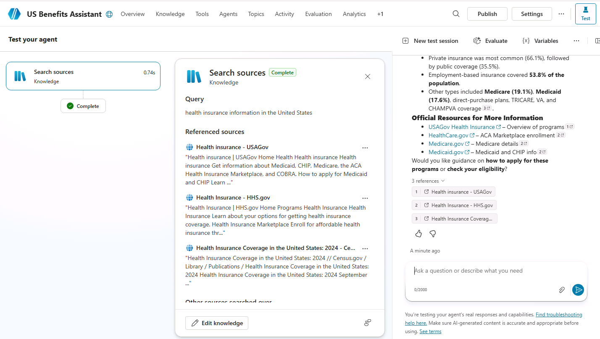
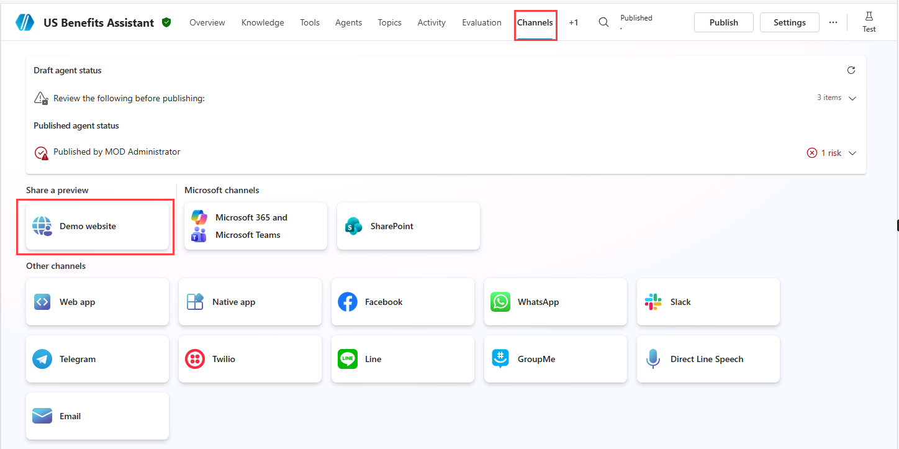

---
lab:
  title: Copilot Studio로 에이전트 만들기
  module: Microsoft Copilot Studio에서 에이전트 만들기
  description: 이 실습에서는 Microsoft Copilot Studio 포털에 액세스하고, 적절한 환경을 선택한 다음, 새 에이전트를 만듭니다.
  duration: 45분
  level: 200
  islab: true
  primarytopics:
    - Microsoft Copilot
    - Microsoft Copilot Studio
---

# Copilot Studio로 에이전트 만들기

## 시나리오

이 실습에서 수행할 작업:

- 템플릿에서 에이전트 만들기
- 에이전트 생성 및 이름 지정
- 지침(Instructions)으로 에이전트 동작 정의
- 공개 웹사이트를 지식 소스로 추가
- 에이전트를 게시하고 Demo website로 테스트

이 실습은 약 **45**분이 소요됩니다.

## 학습 내용

- 템플릿에서 에이전트를 만드는 방법
- 자연어로 에이전트를 만드는 방법
- 에이전트 지침이 생성 동작에 미치는 영향
- 생성형 AI 응답이 구성된 지식 소스를 사용하는 방식
- 에이전트를 Microsoft Teams에 게시하는 방법

## 상위 수준 실습 단계

- 템플릿에서 에이전트 만들기
- Copilot을 사용해 에이전트 만들기
- 지침으로 에이전트 동작 정의
- 생성형 AI 지식 소스 추가
- 에이전트 게시

## 사전 요구 사항
- Microsoft Entra ID 계정 보유
- Copilot Studio 라이선스 보유 또는 [무료 평가판](https://go.microsoft.com/fwlink/p/?linkid=2252605) 등록
- 에이전트 및 관련 자산을 만들 수 있는 Power Platform 환경과 솔루션에 대한 액세스 권한
- 다음 중 하나를 사용할 수 있습니다:
  - **ILT Setup** 실습에서 만든 환경 및 **Lab Exercises** 솔루션
  - 기존에 사용 중인 환경 및 솔루션
- 환경과 솔루션이 아직 준비되지 않았다면, 계속하기 전에 **ILT Setup** 실습 단계를 먼저 완료하세요.
  
> [!IMPORTANT]
> 현재 프리뷰 상태인 새로운 Copilot Studio 환경을 보게 될 수 있습니다. 이 실습은 현재 Copilot Studio 인터페이스를 기준으로 하므로 일부 단계와 스크린샷이 프리뷰 환경과 다를 수 있습니다. 실습을 원활히 진행하려면 이 연습 전체에서 현재 Copilot Studio UI를 사용하세요.

## 핵심 개념: 에이전트 구성 요소와 동작

생성 오케스트레이션이 활성화되면, 에이전트는 지침, 지식, 토픽, 도구를 사용해 응답을 동적으로 생성할 수 있습니다.

## 실습 1 - 템플릿에서 에이전트 만들기

이 실습에서는 템플릿을 사용해 에이전트를 만든 다음, 해당 에이전트를 테스트합니다.

### 작업 1.1 - Safe Travels 템플릿에서 에이전트 만들기

1. **Copilot Studio** 홈 페이지 `https://copilotstudio.microsoft.com/`에서 왼쪽 탐색 메뉴의 **Agents**를 선택합니다.

1. 페이지 상단에서 이 실습에 사용할 환경인지 확인합니다.

1. **Start with an agent template** 섹션에서 **Safe Travels** 템플릿을 선택합니다.

   

1. 페이지 오른쪽 위에서 줄임표(**...**)를 선택하고 **Edit advanced settings**를 선택합니다.

1. 선택된 *Solution*이 **Lab Exercises**이고 *Schema name* 접두사가 **fab**인지 확인한 뒤 **Cancel**을 선택합니다.

1. 페이지 오른쪽 위에서 **Create**를 선택합니다.

1. **Overview** 탭에서 이름, 설명, 에이전트 지침을 검토합니다.

1. **Knowledge** 탭을 선택해 지식 소스로 추가된 공개 웹사이트를 검토합니다.

1. 페이지 오른쪽 위에서 **Settings** 버튼을 선택합니다.

1. **Orchestration**이 **No - Use classic orchestration, limiting responses to the content and behavior defined in your agent's topics**로 설정되어 있는지 확인합니다.

1. Settings 페이지 오른쪽 위에서 **X**를 선택해 설정을 닫습니다.

1. **Topics** 탭을 선택하고 **System** 필터를 선택합니다.

1. **Conversational Start** 토픽을 선택합니다. **Message** 노드의 내용을 검토합니다. 메시지 내용이 **Test** 창에 표시되는지 확인합니다.

   

1. 페이지 왼쪽 위의 드롭다운(Conversation Start 표시)에서 사용자 지정 **What can I ask** 토픽을 선택합니다.

### 작업 1.2 - 에이전트 테스트

1. **Test** 창이 보이지 않으면 페이지 오른쪽 위의 **Test** 아이콘을 선택합니다.

1. **Test** 창에서 변수 **{x}** 아이콘 옆 줄임표(**...**)를 선택하고 **Track between topics**를 **On**으로 전환합니다.

   

1. 다음 프롬프트를 입력합니다:

   ```prompt
   Hello
   ```

   **Greeting** 토픽이 선택되고, Greeting 토픽의 메시지 노드에서 응답이 제공되어야 합니다.

1. **Test** 창 상단에서 **Start new test session** 아이콘 **+**를 선택합니다.

1. 다음 프롬프트를 입력합니다:

   ```prompt
   What can I ask?
   ```

   **What Can I Ask** 토픽이 트리거되어, 대화를 이어갈 수 있는 여러 프롬프트 옵션이 제시되어야 합니다.

1. **How do I get a passport?** 옵션을 선택합니다.

   응답은 구성된 지식 소스를 사용해 생성되며 Conversational boosting 시스템 토픽을 참조할 수 있습니다.

   

1. 다음 프롬프트를 입력합니다:

   ```prompt
   What is Copilot Studio?
   ```

   **Fallback** 토픽이 선택되고, 에이전트가 질문을 다시 표현해보라고 안내해야 합니다.

1. 같은 프롬프트를 두 번 더 반복합니다.
  환경 및 오케스트레이션 동작에 따라 에이전트가 Fallback 또는 Escalate 시스템 토픽을 트리거할 수 있습니다.

1. 왼쪽 탐색 메뉴에서 **Agents**를 선택합니다. **Safe Travels** 에이전트가 목록에 표시되어야 합니다.

## 실습 2 - Copilot을 사용해 에이전트 만들기

이 실습에서는 정부 복지 관련 질문에 답변하는 새 에이전트를 자연어로 만듭니다.

### 작업 2.1 - 정부 복지 질문 응답용 에이전트 만들기

1. **Copilot Studio** 홈 페이지 `https://copilotstudio.microsoft.com/`에서, 생성한 환경에 있는지 확인합니다.

1. 왼쪽 탐색 메뉴에서 **Agents**를 선택합니다.

1. *Start building by describing what your agent needs to do* 텍스트 상자 왼쪽 아래에서 **Agent Settings** 아이콘(톱니바퀴 이미지)을 선택합니다.

   

1. 에이전트 기본 언어는 **English (United States)**로 유지합니다.

1. **Solution** 드롭다운에서 **Lab Exercises**를 선택합니다.

1. *Schema name*에 `govbenefitsagent`를 입력합니다.

1. **Update**를 선택합니다.

1. *Start building by describing what your agent needs to do* 텍스트 상자에 다음 프롬프트를 입력합니다:

   ```prompt
   You are an agent that assists with questions related to claiming US government benefits.
   ```

1. **Send** 아이콘을 선택합니다.

   에이전트가 생성됩니다.

   

   에이전트 프로비저닝이 완료되면 에이전트 구성을 계속 진행할 수 있습니다.

### 작업 2.2 - Overview 탭 구성

1. 에이전트의 **Overview** 탭을 선택합니다.

1. **Details** 섹션에서 **Edit**를 선택합니다.

1. **Name** 텍스트 상자에 **`US Benefits Assistant`**를 입력합니다.

1. **Description** 텍스트 상자에 **`Helps users with questions related to US government benefit programs`**를 입력합니다.

1. **Save**를 선택합니다.

1. **Select your agent's model** 섹션에서 가능한 경우 **GPT-5 Auto (Preview)**를 선택합니다. 사용할 수 없으면 기본 권장 GPT 모델을 선택합니다.

1. **Instructions** 섹션에서 **Edit**를 선택합니다.

1. 에이전트 지침의 *# General Guidelines* 아래에 다음을 추가합니다:

   ```prompt
   - Do not provide legal advice.
   ```

1. **Save**를 선택합니다.

   > [!NOTE]
   > 에이전트 지침은 에이전트 동작 방식을 안내하지만 동작을 엄격히 강제하지는 않습니다. 이후 실습에서 토픽, 지식, 제한된 지식 소스를 사용하는 생성형 답변으로 동작을 변경하는 방법을 학습합니다.

1. **Suggested prompts** 섹션에서 **Add suggested prompts**를 선택합니다.

1. **Title**에 `Health`를 입력합니다.

1. **Prompt**에 `What health assistance programs are available for me?`를 입력합니다.

1. **Save**를 선택합니다.

### 작업 2.3 - 공개 웹사이트를 지식 소스로 추가

1. **Knowledge** 탭을 선택합니다.

   

1. **+ Add knowledge**를 선택합니다.

1. **Public websites**를 선택합니다.

1. **Public website link** 텍스트 상자에 **`https://www.usa.gov/benefits`**를 입력합니다. 이 공식 정부 공개 웹사이트는 에이전트에 유용한 복지 프로그램 정보를 포함합니다.

1. **Add**를 선택합니다.

1. **Name**에 `Government benefits`를 입력합니다.

1. **Description**에 `This knowledge source contains information on government programs that may help you pay for food, housing, health care, and other basic living expenses.`를 입력합니다.

1. **Add to agent**를 선택합니다.

   > [!NOTE]
   > 공개 웹사이트 인덱싱에는 몇 분이 걸릴 수 있습니다. 응답이 불완전하면 몇 분 기다린 후 에이전트를 다시 테스트하세요.

### 작업 2.4 - 에이전트 설정

1. 페이지 오른쪽 위에서 **Settings** 버튼을 선택합니다.

1. **Orchestration**이 **Yes - Responses will be dynamic, using available tools and knowledge as appropriate**로 설정되어 있는지 확인합니다.

1. **Responses** 섹션에 다음을 입력합니다:

   ```prompt
   - For process related answer respond with a single sentence.
   - For data-related answers respond with bullet points.
   ```

1. **Knowledge** 섹션에서 **Allow ungrounded responses**를 **Off**로 설정합니다.

1. **Knowledge** 섹션에서 **Use information from the Web**를 **On**으로 설정합니다.

1. **Save**를 선택합니다.

1. **Settings** 페이지 왼쪽에서 **Security**를 선택합니다.

1. **Authentication**을 선택합니다.

1. Demo website 채널 테스트를 단순화하기 위해 이 실습에서는 **No authentication**을 선택합니다.

1. **Save**를 선택한 후 다시 한 번 **Save**를 선택합니다.

1. **Settings** 페이지 오른쪽 위에서 **X**를 선택해 설정을 닫습니다.

### 작업 2.5 - 에이전트 테스트

1. **Test** 창이 보이지 않으면 페이지 오른쪽 위의 **Test** 아이콘을 선택합니다.

1. **Test** 창에서 변수 **{x}** 아이콘 옆 줄임표(**...**)를 선택하고 **Show activity map when testing**를 **On**, **Track between topics**를 **Off**로 전환합니다.

   

1. **Test** 창 상단에서 **Start new test session** 아이콘 **+**를 선택합니다.

1. 다음 프롬프트를 입력합니다:

   ```prompt
   What health insurance information is available?
   ```

   **Activity map**이 표시되고, 응답 생성에 지식 소스가 사용되었음을 확인할 수 있어야 합니다.

   

1. **Test** 창을 닫습니다.

### 작업 2.6 - 에이전트를 Demo website에 게시

1. 에이전트의 작업 표시줄에서 **Publish** 버튼을 선택하고, 다시 **Publish**를 선택합니다.

1. **Channels** 탭을 선택합니다.

   

1. **Demo website** 채널을 선택합니다. 이 채널은 에이전트 환경을 빠르게 테스트하고 미리보기하는 데 유용합니다.

1. **Demo Website** 창에서 다음 설정을 입력합니다:

   - **Welcome message**: `Ask me about government benefit programs`
   - **Conversation starters**:

      ```prompt
      "Hello"
      "What programs am I entitled to?"
      "What is social security?"
      ```

1. **Save**를 선택합니다.

1. **Open demo website**를 선택합니다.

1. 다음 프롬프트를 입력합니다:

   ```prompt
   What welfare and assistance can I claim for?
   ```

   응답은 구성된 지식 소스 정보를 참조해야 하며, 인용 또는 출처 참조를 포함할 수 있습니다.

1. 몇 가지 질문을 더 시도하고 에이전트 응답을 확인합니다. 기능은 제한적일 수 있지만 복지 관련 질문에 대해 관련성 있는 답변을 제공할 수 있어야 합니다.

## 요약

이 실습에서는 에이전트를 만들고 지침을 사용해 기대 동작을 정의했습니다. 또한 공개 웹사이트를 지식 소스로 추가하고, 해당 지식 소스가 답변에 도움이 되는 질문으로 에이전트를 테스트했습니다. 이러한 지침은 생성 응답을 안내하지만, 이후 실습에서 토픽, 지식, 도구를 사용해 동작을 제어하는 방법을 확인하게 됩니다.
