# Copilot Studio 에이전트에서 토픽 관리

## 실습 개요

| 구분 | 내용 |
|------|------|
| 난이도 | Level 200 (Developer) |
| 소요 시간 | 약 45분 |
| 대상 | Power Platform 개발자, Copilot Studio 학습자 |
| 목적 | 에이전트 토픽 생성, 노드 구성, 엔터티 및 변수를 활용한 대화 흐름 설계 |

## 시나리오

이 실습에서 수행할 작업:

- 에이전트 만들기
- 기존 토픽 관리
- Copilot으로 토픽 생성 및 편집
- 변수 범위 구성
- 토픽 수동 생성
- 노드 생성 및 편집
- 에이전트 테스트

이 실습은 약 **45**분이 소요됩니다.

## 학습 내용

- 토픽이 생성형 AI 응답을 보완하는 방식
- 구조화된 대화를 강제해야 할 때 토픽을 사용하는 경우
- 자연어로 토픽을 생성하고 개선하는 방법
- 변수를 사용하는 방법

## 상위 수준 실습 단계

- Copilot을 사용해 에이전트 만들기
- 불필요한 토픽 검토 및 비활성화
- Copilot으로 토픽 만들기
- 자연어로 토픽 내용 편집
- 토픽 동작 테스트

## 사전 요구 사항

- Microsoft Entra ID 계정 보유
- Copilot Studio 라이선스 보유 또는 [무료 평가판](https://go.microsoft.com/fwlink/p/?linkid=2252605) 등록
- 에이전트 및 관련 자산을 만들 수 있는 Power Platform 환경과 솔루션에 대한 액세스 권한
- 다음 중 하나를 사용할 수 있습니다:
  - **ILT Setup** 실습에서 만든 환경 및 **Lab Exercises** 솔루션
  - 기존에 사용 중인 환경 및 솔루션
- 환경과 솔루션이 아직 준비되지 않았다면, 계속하기 전에 **ILT Setup** 실습 단계를 먼저 완료하세요.
  
> [!IMPORTANT]
> 현재 프리뷰 상태인 새로운 Copilot Studio 환경을 보게 될 수 있습니다. 이 실습은 현재 Copilot Studio 인터페이스를 기준으로 하므로 일부 단계와 스크린샷이 프리뷰 환경과 다를 수 있습니다. 실습을 원활히 진행하려면 이 연습 전체에서 현재 Copilot Studio UI를 사용하세요.

## 핵심 개념: 에이전트 구성 요소와 동작

생성 오케스트레이션이 활성화되면, 에이전트는 지침, 지식, 토픽, 도구를 사용해 응답을 동적으로 생성할 수 있습니다.

토픽은 특히 다음이 필요할 때 유용합니다:

- 필수 정보를 단계별로 수집
- 질문 순서 제어
- 응답을 변수에 저장
- 예측 가능한 결과 보장

## 실습 1 - 에이전트 만들기

이 실습에서는 정부 복지 관련 질문에 답변하는 새 에이전트를 자연어로 만듭니다.

### 작업 1.1 - 보험 청구 검토용 에이전트 만들기

1. **Copilot Studio** 홈 페이지 `https://copilotstudio.microsoft.com/`에서, 이 실습에 사용할 환경인지 확인합니다.

1. 왼쪽 탐색 메뉴에서 **Agents**를 선택합니다.

1. *Start building by describing what your agent needs to do* 텍스트 상자 왼쪽 아래에서 **Agent Settings** 아이콘(톱니바퀴 이미지)을 선택합니다.

   

1. 에이전트 기본 언어는 **English (United States)**로 유지합니다.

1. **Solution** 드롭다운에서 **Lab Exercises** 또는 이 실습에 사용할 다른 솔루션을 선택합니다.

1. *Schema name*에 `insuranceagent`를 입력합니다.

1. **Update**를 선택합니다.

1. *Start building by describing what your agent needs to do* 텍스트 상자에 다음 프롬프트를 입력합니다:

   ```prompt
   You are an agent that assists with reviewing insurance claims including damage assessment details and repair estimates.
   ```

1. **Send** 아이콘을 선택합니다.

   에이전트 프로비저닝이 완료되면 에이전트 구성을 계속 진행할 수 있습니다.

## 실습 2 - 토픽 관리

이 실습에서는 사람 담당자에게 이관할 필요가 없으므로 Escalate 시스템 토픽을 비활성화합니다. 사용하지 않는 시스템 토픽을 비활성화하면, 생성 오케스트레이션이 응답 방식을 결정할 때 모호성을 줄일 수 있습니다.

### 작업 2.1 - 토픽 비활성화

1. **Topics** 탭을 선택합니다.

1. **System** 필터를 선택합니다.

1. **Escalate** 토픽을 찾습니다.

1. **Escalate** 토픽의 **Enabled**를 **Off**로 전환합니다.

   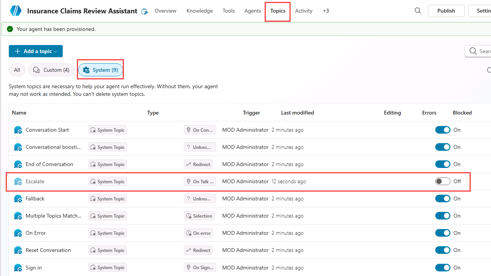

사용하지 않는 토픽을 비활성화하면 여러 토픽 또는 생성 응답이 동일한 요청을 처리할 수 있는 상황에서 모호성을 줄일 수 있습니다.

## 실습 3 - 자연어로 토픽 만들기

이 실습에서는 Copilot을 사용해 설명으로 토픽을 생성합니다. 생성형 AI가 초기 구조를 초안으로 만들고, 이후 사용자가 이를 정교화할 수 있습니다.

### 작업 3.1 - 설명으로 토픽 추가

1. **+ Add a topic**을 선택하고 **Add from description with Copilot**을 선택합니다. 새 대화 상자가 열립니다.

   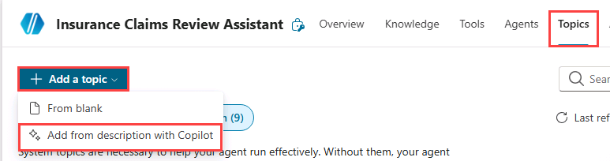

   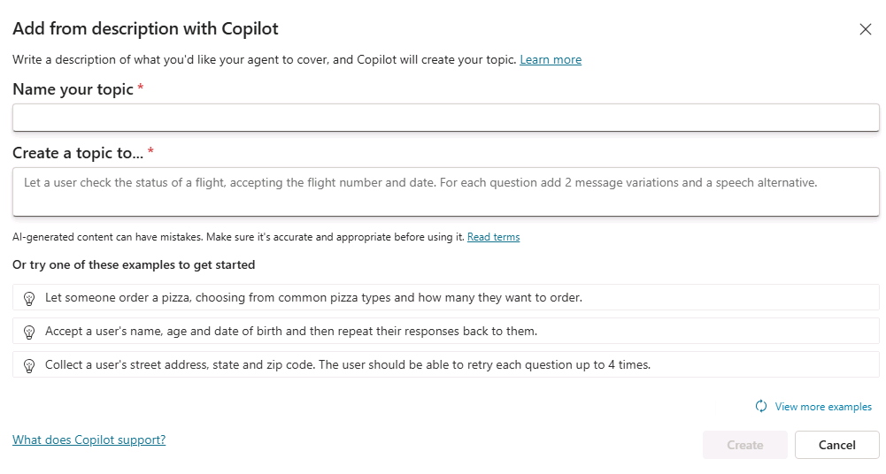

1. **Name your topic** 텍스트 상자에 **`Customer Details`**를 입력합니다.

1. **Create a topic to...** 텍스트 상자에 **`Ask the customer for their name and email address`**를 입력합니다.

1. **Create**를 선택합니다.

1. **Save**를 선택합니다.

### 작업 3.2 - 자연어로 노드 편집

1. **Test your agent** 패널이 열려 있으면 닫습니다.

1. **Customer Details** 창 오른쪽에 **Edit with Copilot** 패널이 보이지 않으면, 작성 캔버스 상단의 **Copilot** 아이콘을 선택합니다.

   

1. 두 번째 **Question** 노드 **What is your email address?**를 선택합니다.

   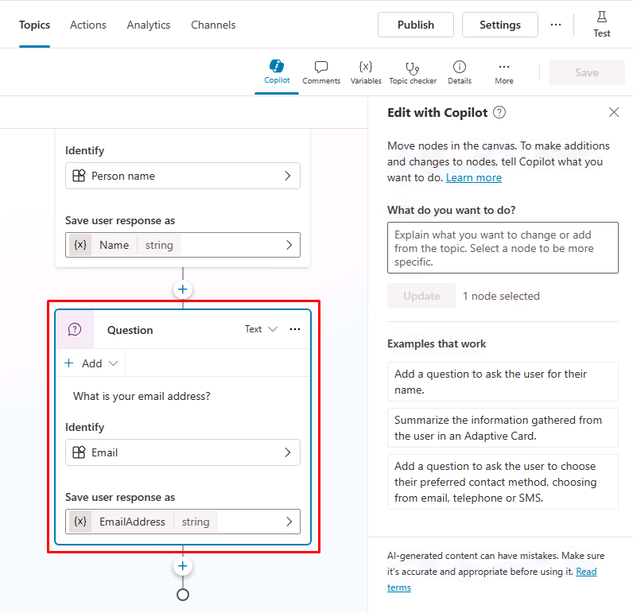

1. **Edit with Copilot** 패널의 **What do you want to do?** 필드에 다음 텍스트를 입력합니다:

   `Change "What is your email address?" to say thank you to the Name variable from the previous node and then proceed to ask the email address question.`

1. **Update**를 선택합니다.

   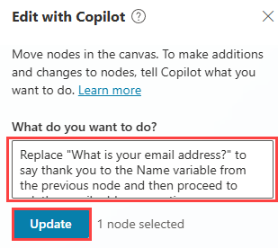

   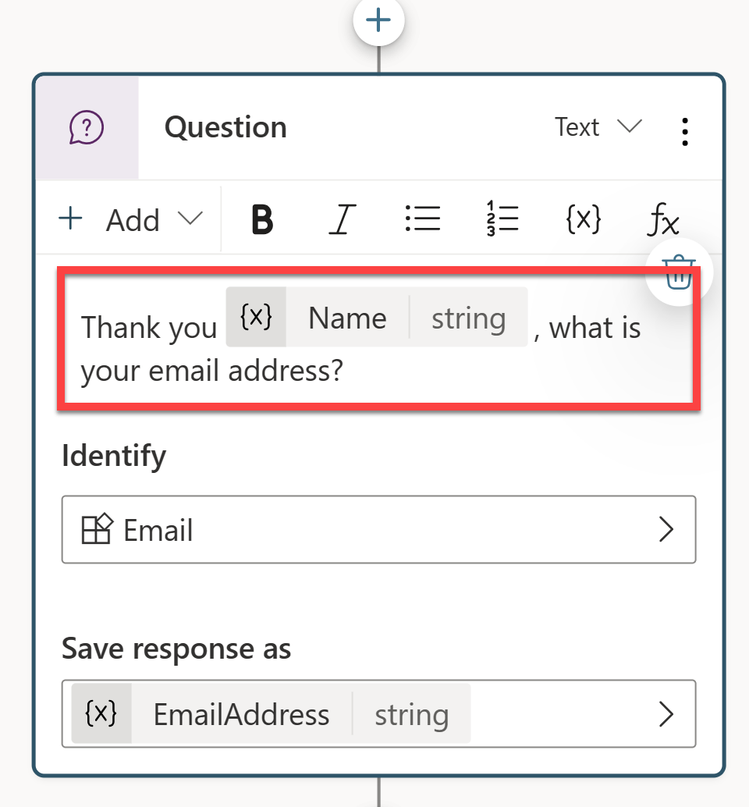

   > [!NOTE]
   > 업데이트된 메시지는 이전 질문 노드에서 수집한 **Name** 변수를 참조해야 하며, 스크린샷과 유사해야 합니다. **Edit with Copilot**이 질문 노드를 올바르게 업데이트하지 못하면 **Undo**를 선택하고 다른 프롬프트로 다시 시도하세요.

1. **Save**를 선택합니다.

### 작업 3.3 - 자연어로 적응형 카드 노드 추가

기존 노드를 수정하는 것 외에도 Copilot을 사용해 새 노드를 추가할 수 있습니다.

1. 작성 캔버스의 빈 영역을 선택해 어떤 노드도 선택되지 않도록 합니다.

1. **Edit with Copilot** 패널의 **What do you want to do?** 필드에 다음 텍스트를 입력합니다:

   `Summarize the information collected in an adaptive card`

1. **Update**를 선택합니다.

   토픽 끝에 Adaptive Card가 포함된 메시지 노드가 추가됩니다.

   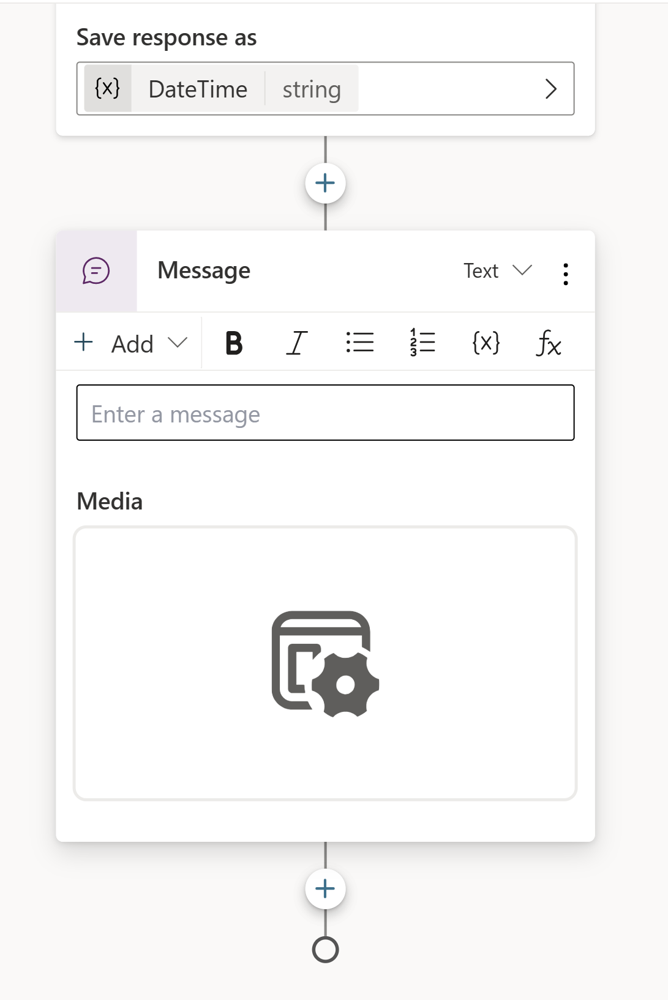

1. Adaptive Card의 **Media** 상자를 선택합니다. 페이지 오른쪽에 Adaptive Card 속성이 표시되어야 합니다.

   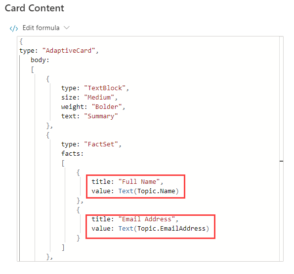

   Adaptive Card 수식은 위와 유사해야 합니다. 수식이 크게 다르면 다음 수식으로 교체할 수 있습니다:

   ```powerfx
   {
   type: "AdaptiveCard", 
       body: 
       [
           {
               type: "TextBlock",
               size: "Medium",
               weight: "Bolder",
               text: "Summary"
           },
           {
               type: "FactSet",
               facts: 
               [
                   {
                       title: "Full Name",
                       value: Text(Topic.Name)
                   },
                   {
                       title: "Email Address",
                       value: Text(Topic.EmailAddress)
                   }
               ]
           },
           {
               type: "TextBlock",
               text: "Thank you for providing the information."
           }
       ]
   }
   ```

### 작업 3.4 - 자연어로 질문 노드 추가

1. 작성 캔버스의 빈 공간을 선택해 노드가 선택되지 않도록 합니다.

1. **Copilot** 아이콘을 선택해 **Edit with Copilot** 창을 다시 엽니다.

1. **What do you want to do?** 필드에 다음 텍스트를 입력합니다:

   `Add a new multiple choice question to prompt the user if the details are correct with two options Yes or No`

1. **Update**를 선택합니다.

1. 사용자 선택 옵션이 있는 새 질문 노드가 토픽 끝에 추가됩니다.

   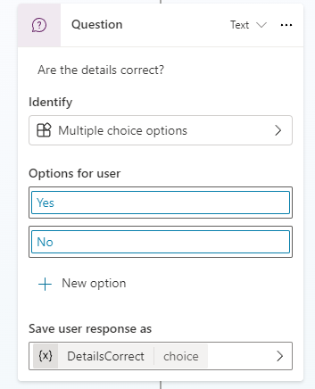

1. **Save**를 선택합니다.

## 실습 4 - 변수 범위

다른 토픽에서도 변수에 접근할 수 있도록 설정합니다.

### 작업 4.1 - 변수 범위 구성

1. **Topics** 탭을 선택합니다.

1. **Customer Details** 토픽을 선택합니다.

1. 상단 바에서 **Variables**를 선택해 **Variables** 창을 엽니다(**More** > **Variables**가 필요할 수 있음).

1. **Topic** 변수를 선택하고 펼칩니다.

1. 세 개 토픽 변수의 오른쪽 체크박스를 선택합니다. 이렇게 하면 에이전트의 다른 토픽에서도 변수를 사용할 수 있습니다.

   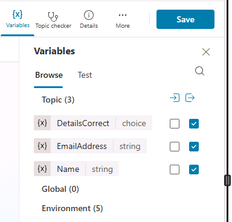

1. **Save**를 선택합니다.

## 실습 5 - 빈 토픽에서 시작해 만들기

이 실습에서는 **Estimate Repair** 토픽을 만들고 노드를 추가한 뒤, Customer Details 토픽을 호출합니다.

### 작업 5.1 - 빈 토픽에서 만들기

1. **Topics** 탭을 선택합니다.

1. **+ Add a topic**을 선택하고 **From blank**를 선택합니다.

1. **Details** 아이콘을 선택해 **Topic details** 창을 엽니다(**More** > **Details**가 필요할 수 있음).

1. **Name** 필드에 다음 텍스트를 입력합니다:

   `Estimate Repair`

1. **Model description** 필드에 다음 텍스트를 입력합니다:

   `Use this topic when a repair estimate for an insurance claim must be booked with the customer`

   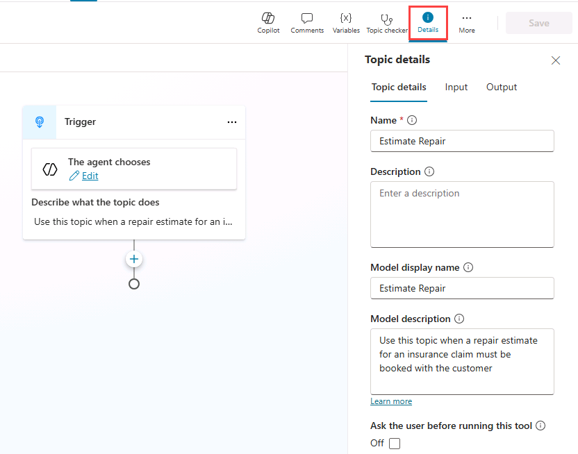

1. **Save**를 선택합니다.

### 작업 5.2 - 트리거 유형 확인

1. 토픽 상단의 **Trigger** 노드를 선택합니다. 트리거 유형이 **The agent chooses**로 설정되어 있는지 확인합니다.

   > [!NOTE]
   > 생성 오케스트레이션이 활성화되면, 에이전트는 이 설명을 사용해 토픽 사용 시점을 결정합니다.

### 작업 5.3 - 메시지 노드 추가

1. Trigger 노드 아래의 **+** 아이콘을 선택하고 **Send a message**를 선택합니다.

   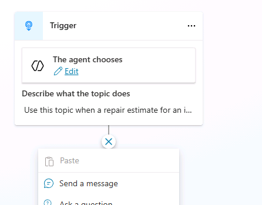

1. **Enter a message** 필드에 다음 텍스트를 입력합니다:

   `Hi, I can help you with booking a repair estimate.`

1. **Save**를 선택합니다.

### 작업 5.4 - Customer Details 토픽으로 라우팅

1. **Message** 노드 아래의 **+** 아이콘을 선택합니다.

1. **Topic management** > **Go to another topic** > **Customer Details**를 선택합니다.

   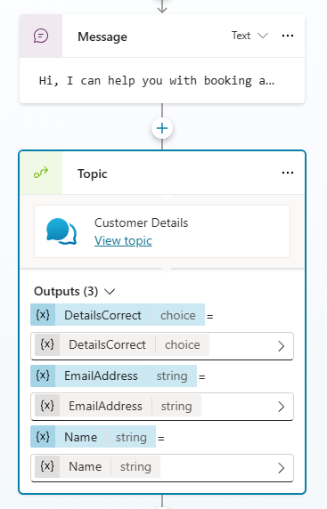

1. **Save**를 선택합니다.

### 작업 5.5 - 조건 노드 추가

1. **Topic** 노드 아래의 **+** 아이콘을 선택하고 **Add a condition**을 선택합니다.

1. **Condition** 노드에서 **DetailsCorrect** 변수를 선택합니다.

1. **is equal to**를 선택합니다.

1. **Yes**를 선택합니다.

   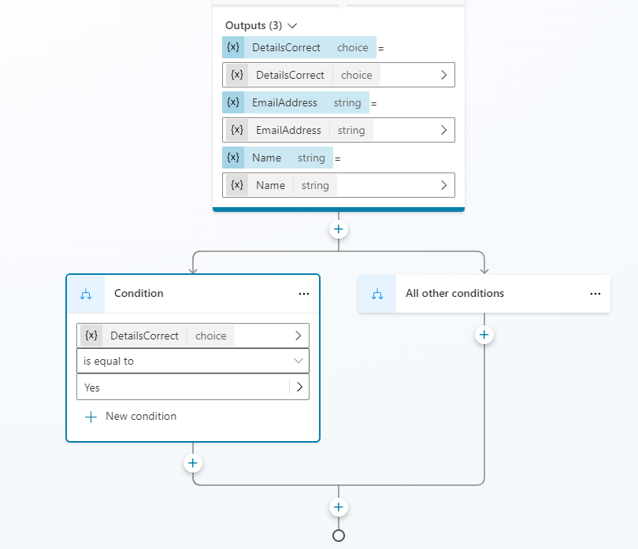

1. **Save**를 선택합니다.

### 작업 5.6 - 질문 노드 추가

1. 왼쪽 **Condition** 노드 아래의 **+** 아이콘을 선택하고 **Ask a question**을 선택합니다.

1. **Enter a message** 필드에 다음 텍스트를 입력합니다:

   `What date and time would you like to book the repair estimate?`

1. **Identify**에서 **Date and time**을 선택합니다.

1. **Save user response as**의 변수를 선택하고 **Variable name**에 **`VisitDateTime`**을 입력합니다.

1. 왼쪽 **Question** 노드 아래의 **+** 아이콘을 선택하고 **Send a message**를 선택합니다.

1. **Enter a message** 필드에 다음 텍스트를 입력합니다:

   `Great! Let me get that scheduled for you.`

1. 해당 메시지 노드 뒤에 **Topic management** > **End all topics**를 선택해 토픽 종료 노드를 추가합니다.

1. **Save**를 선택합니다.

### 작업 5.7 - 에이전트 지침 업데이트

1. **Overview** 탭을 선택합니다.

1. **Instructions** 섹션에서 **Edit**를 선택합니다.

1. 에이전트 지침의 *# Skills* 아래에 `Use the`를 입력하고 `/`를 입력해 **Estimate Repair** 토픽을 선택한 뒤, `when a repair estimate is required.`를 입력합니다.

   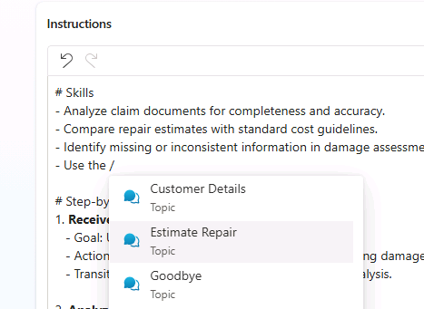

1. **Save**를 선택합니다.

## 실습 6 - 에이전트 테스트

이 실습에서는 토픽 라우팅을 테스트하고 대화가 예상된 단계별 흐름을 따르는지 확인합니다.

### 작업 6.1 - Estimate Repair 토픽 테스트

1. 페이지 오른쪽 위의 **Test** 아이콘을 선택해 **Test** 창을 엽니다.

1. **Test** 창에서 변수 **{x}** 아이콘 옆 줄임표(**...**)를 선택하고 **Show activity map when testing**를 **On**, **Track between topics**를 **Off**로 전환합니다.

   

1. **Test pane** 상단에서 **Start new test session** 아이콘 **+**를 선택합니다.

1. **Conversation Start** 메시지가 나타나면 에이전트가 대화를 시작합니다. 토픽을 트리거하려면 다음 텍스트를 입력합니다:

   `I need to book a repair estimate`

1. 대화가 고객 이름을 묻는 것으로 시작되어야 합니다.

   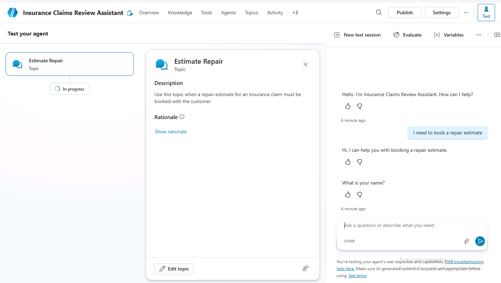

1. 이름을 입력합니다.

1. 이메일 주소를 입력합니다.

1. 정보를 입력하면, Adaptive Card가 입력한 정보를 표시하고 정보가 맞는지 묻습니다. **Yes**를 선택합니다.

   대화 흐름이 다시 **Estimate Repair** 토픽으로 돌아오는지 확인합니다.

1. **What date and time do you want to book the repair estimate?** 프롬프트에 `Tomorrow 10:00 AM`을 입력합니다.

   에이전트가 수리 견적 예약이 완료되었음을 알리는 확인 메시지를 응답해야 합니다.

## 요약

이 실습에서는 Customer Details 및 Estimate Repair 토픽을 만들고, 생성형 AI를 활성화한 상태에서 노드를 사용해 구조화된 단계별 상호작용을 구현했습니다. 또한 변수 범위를 구성해 Customer Details에서 수집한 정보를 여러 토픽에서 사용할 수 있도록 했습니다.
