# 03. Copilot Studio 에이전트에서 지식 관리

## 실습 개요

이 실습에서는 Copilot을 사용해 에이전트를 만들고, 에이전트에 지식을 추가하고, 생성형 AI를 구성합니다.

### 시나리오

이 실습에서 수행할 작업:

- 에이전트 만들기
- 파일 업로드 후 지식 소스로 사용
- 공개 웹사이트를 지식 소스로 추가
- SharePoint 엑셀 데이터를 지식 소스로 추가
- 생성 오케스트레이션 설정 구성
- 생성형 답변 노드 구성
- 에이전트를 Microsoft Teams에 게시

### 학습 내용

- 에이전트에 지식 소스를 추가하는 방법
- 생성 오케스트레이션 및 생성형 답변 동작을 구성하는 방법

### 전반적인 실습 단계

- Copilot으로 에이전트 만들기
- 지식 소스 추가
- 생성형 AI 구성
- 에이전트 게시
  
### 사전 요구 사항

- Microsoft Entra ID 계정 보유
- Copilot Studio 라이선스 보유 또는 [무료 평가판](https://go.microsoft.com/fwlink/p/?linkid=2252605) 등록
- 에이전트 및 관련 자산을 만들 수 있는 Power Platform 환경과 솔루션에 대한 액세스 권한
- 다음 중 하나를 사용할 수 있습니다:
  - **Lab00 실습 환경 준비** 실습에서 만든 환경 및 솔루션
  - 사용자가 보유한 기존 환경 및 솔루션
- 환경과 솔루션이 아직 준비되지 않았다면, 계속하기 전에 **Lab00 실습 환경 준비** 실습 단계를 먼저 완료하세요.
  
> [!IMPORTANT]
> 본 과정은 클래식 Copilot Studio 환경을 사용합니다 Copilot Studio 화면이 이 미션의 스크린샷과 다르게 보인다면, 오른쪽 위의 **새 환경(New Experience)** 를 꺼서 여기서 사용하는 **클래식 환경(classic experience)** 로 전환하세요.

## 핵심 개념: 에이전트 구성 요소와 동작

생성 오케스트레이션이 활성화되면, 에이전트는 지침, 지식, 토픽, 도구를 사용해 응답을 동적으로 생성할 수 있습니다. 다양한 유형의 지식 소스를 사용해 에이전트를 근거화할 수 있으며, 여러 설정이 생성 응답 방식에 영향을 줍니다.


## 실습 1 - 에이전트 만들기

이 실습에서는 가상의 기업에서 비용 정책 관련 질문에 답변하는 새 에이전트를 자연어로 만듭니다.

### 작업 1.1 - 비용 청구용 에이전트 만들기

1. **Copilot Studio** 홈 페이지 [https://copilotstudio.microsoft.com/](https://copilotstudio.microsoft.com/)로 이동합니다.

1. 페이지 상단에서 이 실습에 사용할 환경인지 확인합니다.

1. 왼쪽 탐색 메뉴에서 **에이전트** 를 선택합니다.

1. *에이전트가 수행해야 할 작업을 설명하는 것으로 구축을 시작* 텍스트 상자에 다음 프롬프트를 입력합니다:

   ```prompt
   당신은 직원들의 경비 청구, 특히 경비 정책 및 절차에 관한 질문을 지원하는 담당자입니다.
   ```

1. **전송** 아이콘을 선택합니다.
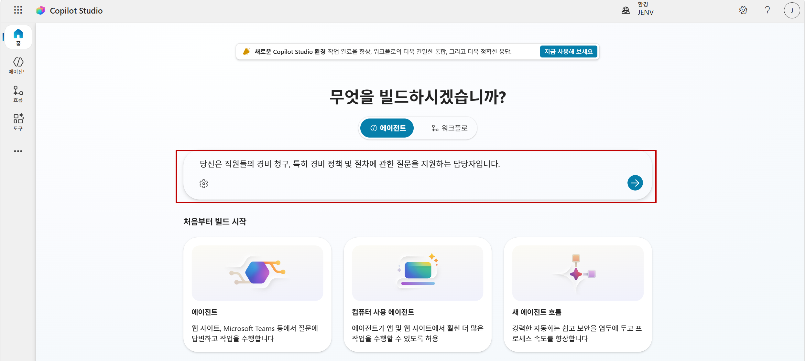
에이전트 프로비저닝이 완료되면 에이전트 구성을 계속 진행할 수 있습니다.

## 실습 2 - 지식으로 에이전트 근거화

이 실습에서는 에이전트를 근거화하기 위해 지식 소스를 추가합니다.

### 작업 2.1 - 문서를 지식 소스로 추가

1. `경비 정책 문서(경비처리 가이드.docx)`에는 가상의 기업 비용 정책 세부 정보가 포함되어 있습니다.

1. 실습 3에서 만든 에이전트가 있는 **Copilot Studio** 브라우저 탭으로 돌아가서 에이전트가 프로비저닝이 완료되었는지 확인합니다.

1. **참조 자료** 탭을 선택하여 에이전트에 정의된 지식 소스를 확인합니다(현재는 없어야 함).

   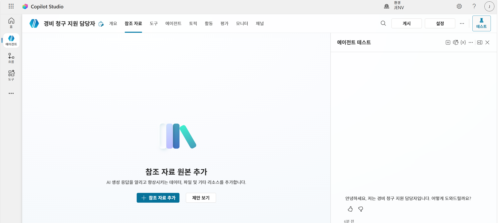

1. **+ 참조 자료 추가** 를 선택하고, 에이전트에 추가할 수 있는 다양한 지식 소스 유형을 확인합니다.

   

1. **SharePoint** 섹션에서 **항목 찾아보기** 를 사용해 앞에서 경비처리 가이드 문서를 선택하고 **에이전트에 추가** 를 선택합니다.

   
   

### 작업 2.2 - 공개 웹사이트를 지식 소스로 추가

1. Copilot Studio 에이전트에서 **참조 자료** 탭을 선택합니다.

1. **+ 참조 자료 추가** 를 선택합니다.
   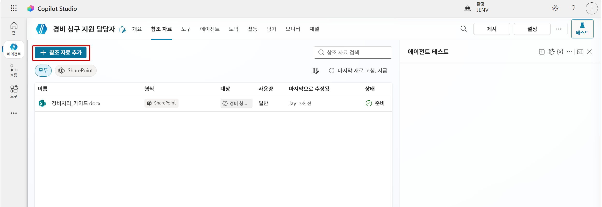

1. **공개 웹 사이트** 를 선택합니다.


1. **공개 웹 사이트** 텍스트 상자에 `https://taxlaw.nts.go.kr/`를 입력합니다. 이 국세청 법령정보시스템은 에이전트에 유용한 세금 신고 시 경비·여비·식비·접대비 등 처리 기준 정보를 포함합니다.

1. **추가** 를 선택합니다.

1. **이름**에 `경비, 접대비 및 차량 관련 비용 | 국세법령정보시스템`를 입력합니다.

1. **설명**에 `이 자료는 출장 경비 환급에 관한 정보를 담고 있습니다.`를 입력합니다.
   
   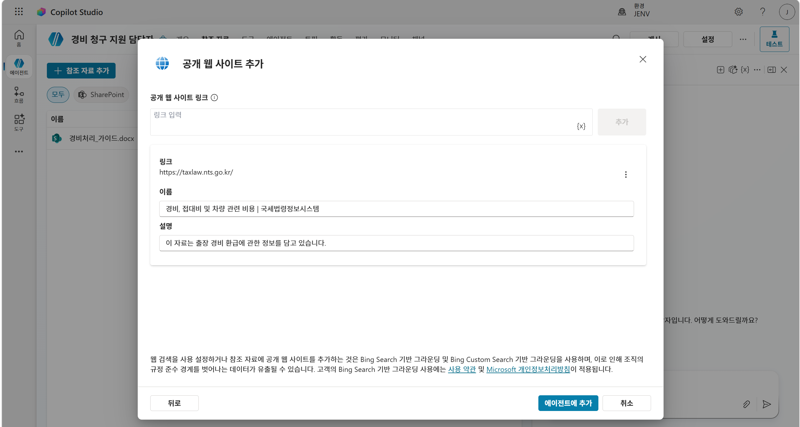
1. **에이전트에 추가** 를 선택합니다.
> [!NOTE]
> 공개 웹사이트 인덱싱에는 몇 분이 걸릴 수 있습니다. 응답이 불완전하면 몇 분 기다린 후 에이전트를 다시 테스트하세요.

### 작업 2.3 - SharePoint 엑셀 데이터를 지식 소스로 추가
시스템에서 내려받은 자료를 SharePoint에 업로드한 후, 에이전트에 지식 소스로 추가합니다.

1. Copilot Studio 에이전트에서 **참조 자료** 탭을 선택합니다.

1. **+ 참조 자료 추가** 를 선택합니다.

1. **SharePoint** 를 선택합니다.
   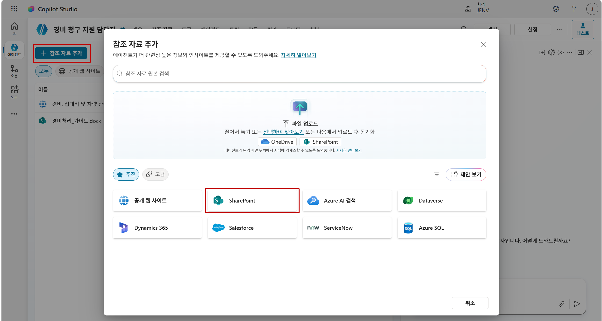

1. SharePoint 포털에서 **경비청구_테이블** 엑셀 파일을 선택합니다.
   

1. **에이전트에 추가** 를 선택합니다.

   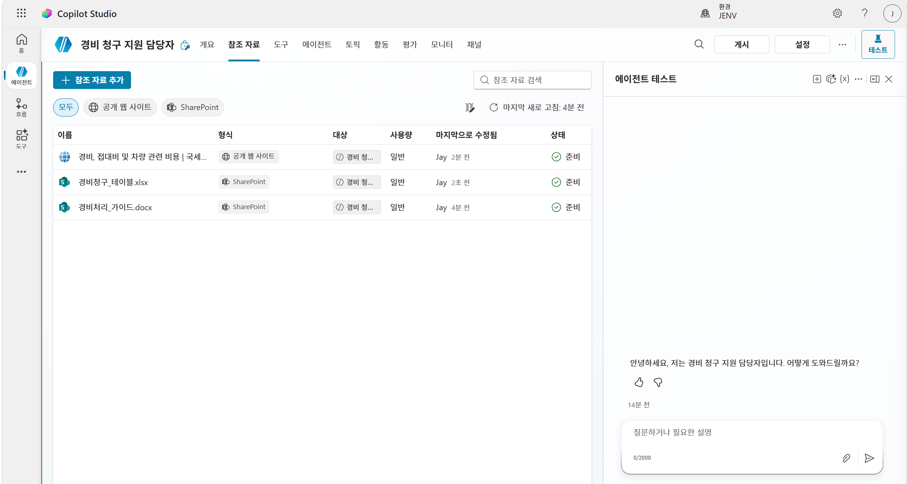


### 작업 2.4 - 그라운딩 테스트

1. 페이지 오른쪽 위의 **테스트** 아이콘을 선택해 테스트 창을 엽니다.

1. **테스트** 창에서 변수 **{x}** 아이콘 옆 줄임표(**...**)를 선택하고 **테스트 시 활동 지도 표시** 를 **On**, **토픽 간 추적** 를 **Off** 로 전환합니다.
   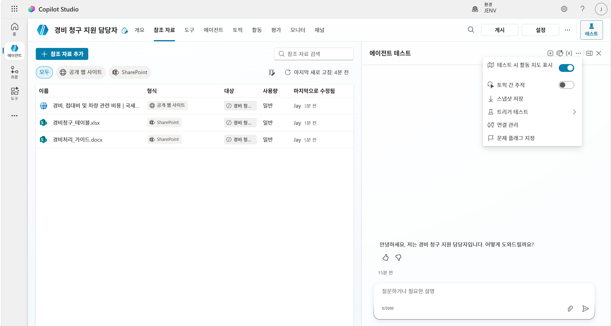

1. **테스트** 창 상단에서 **새 테스트 세션 시작** 아이콘 **+** 를 선택합니다.

1. 다음 프롬프트를 입력합니다:

   ```
   어떤 경비를 공제받을 수 있나요?
   ```

1. 응답은 업로드한 경비처리_가이드 문서를 근거로 생성되어야 하며, 다른 구성된 지식 소스를 참조할 수도 있습니다.
   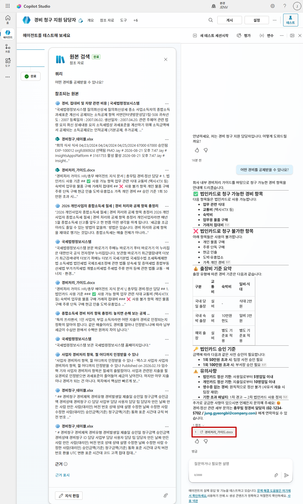

1. **테스트** 창 상단에서 **새 테스트 세션 시작** 아이콘 **+** 를 선택합니다.

1. 다음 프롬프트를 입력합니다:

   ```
   각 항목별 총 경비 청구액은 얼마인가요?
   ```


1. 에이전트는 모든 지식 소스를 검색하고 **경비청구_테이블** 을 사용해 응답을 생성해야 합니다.
   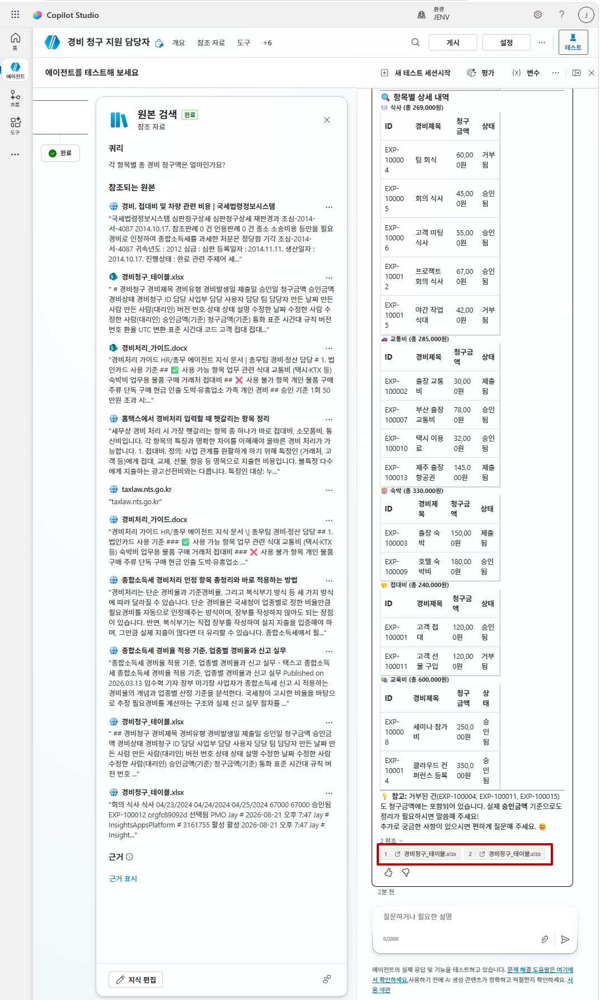


1. **테스트** 창 상단에서 **새 테스트 세션 시작** 아이콘 **+** 를 선택합니다.

1. 다음 프롬프트를 입력합니다:

   ```
   근로자가 업무수행을 위하여 해외출장시 지급기준에 따라 받은 출장비의 성격과 지급기준에 따라 지급받은 금액이 근로소득으로 과세되는지 여부를 알려주세요.
   ```
   

1. 에이전트는 모든 지식 소스를 검색하고 공개 웹사이트를 사용해 응답을 생성해야 합니다.
   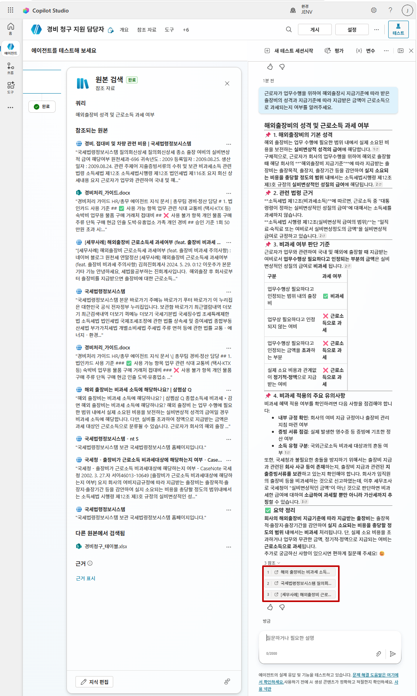

  

## 실습 3 - 생성형 AI 설정

이 실습에서는 에이전트 및 생성형 답변 노드의 생성형 AI를 구성합니다.

### 작업 3.1 - 에이전트 지식 설정 구성

1. 에이전트 페이지 오른쪽 위에서 **설정** 버튼을 선택합니다.


1. **오케스트레이션**이 **예 - 응답은 사용 가능한 도구와 참조 자료를 적절히 활용해 동적으로 진행됩니다.** 로 설정되어 있는지 확인합니다.


1. **지식** 섹션에서 **근거 없는 응답 허용하기** 를 **끄기** 로 설정합니다.

1. **지식** 섹션에서 **웹의 정보 사용** 를 **끄기** 로 설정합니다.

   

1. **저장** 를 선택합니다.

1. 설정 페이지 오른쪽 위에서 **X** 를 선택해 설정을 닫습니다.

1. 이전 실습의 프롬프트로 에이전트를 테스트합니다. SharePoint 파일은 지식 소스로 사용되지만 응답 생성 시 공개 웹사이트는 사용되지 않습니다.

### 작업 3.2 - 생성형 답변 노드 구성

1. **토픽** 탭을 선택합니다.

1. **시스템** 토픽으로 필터링합니다.

1. **대화형 부스팅(생성형 답변 사용)** 토픽을 엽니다.
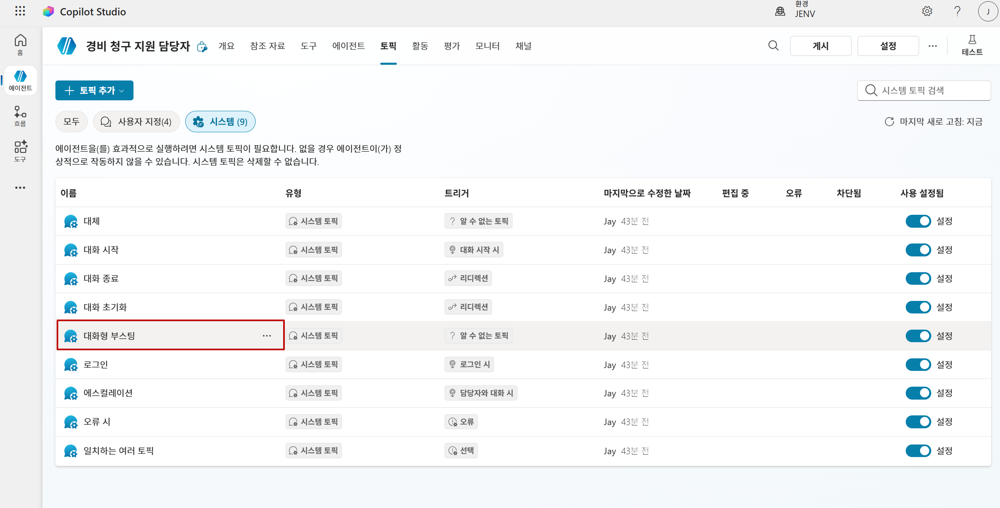

1. **Copilot으로 대화를 늘려보세요** 대화 상자가 표시되면 **완료** 를 선택합니다.
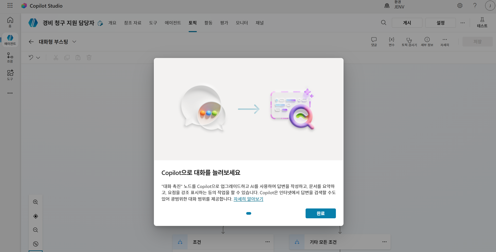

1. **대화형 부스팅(생성형 답변 사용)** 노드에서 **데이터 원본**의 **편집** 을 선택합니다.
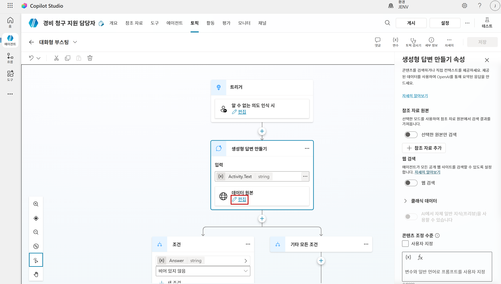

1. **선택한 원본만 검색** 를 선택하고 활성화한 후, **경비처리_가이드** 지식 소스를 선택합니다.
1. **웹 검색** 을 허용합니다.
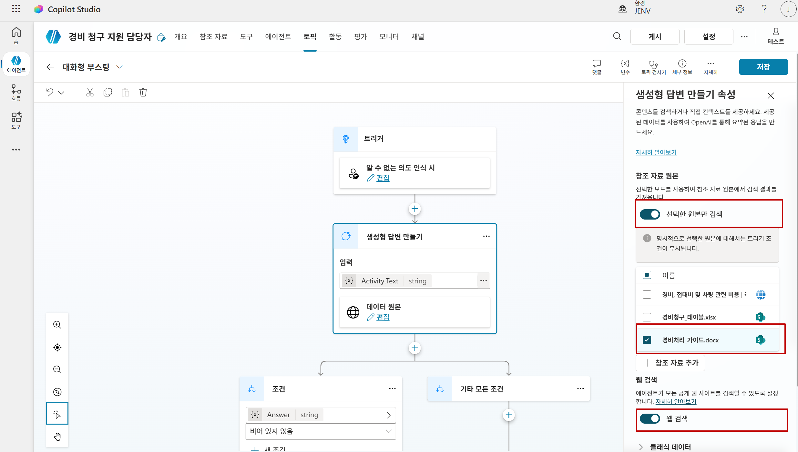

1. **저장** 를 선택합니다.

1. **개요** 탭을 선택합니다.

1. 페이지 오른쪽 위의 **테스트** 아이콘을 선택해 테스트 창을 엽니다.

1. **Test** 창에서 변수 **{x}** 아이콘 옆 줄임표(**...**)를 선택하고 **테스트 시 활동 지도 표시** 를 **Off**, **토픽 간 추적** 를 **On**으로 전환합니다.


1. **테스트** 창 상단에서 **새 테스트 세션 시작** 아이콘 **+** 를 선택합니다.

1. 다음 프롬프트를 입력합니다:

   ```
   현재 세법 상 사업용 차량 경비 비용 처리 기준 알려주세요
   ```
   ```
   근로소득세 계산 방법을 알려주세요
   ```
1. 지식 소스는 직접 답을 제공하지 않지만, 에이전트가 생성형 답변으로 웹 검색을 사용해 응답을 생성합니다.

   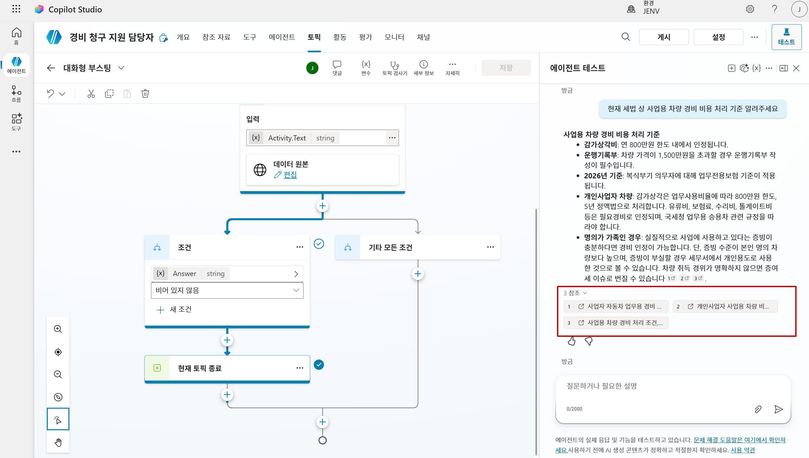
   
### 작업 3.3 - 대체 토픽

1. **토픽** 탭을 선택합니다.

1. **시스템** 토픽으로 필터링합니다.

1. **대화형 부스팅** 토픽을 엽니다.
   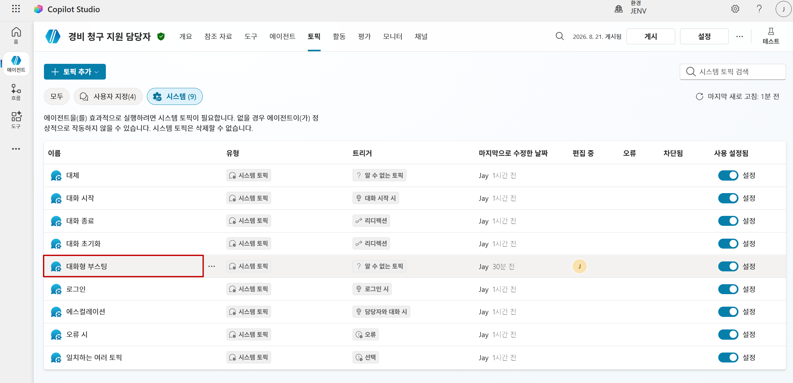

1. **생성형 답변 만들기** 노드를 선택에서 **데이터 원본**의 **편집** 을 선택합니다.

1. **웹 검색** 을 비활성화한 후 **저장** 을 선택합니다.
   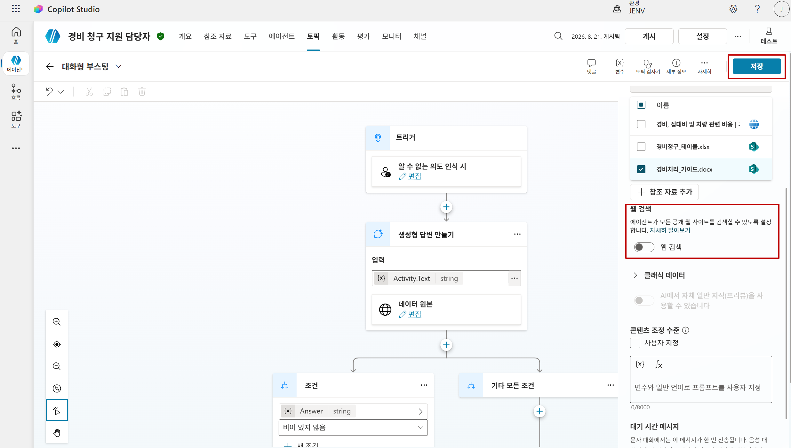

1. **개요** 탭을 선택하고 페이지 오른쪽 위의 **테스트** 아이콘을 선택해 테스트 창을 엽니다.

1. **테스트** 창에서 변수 **{x}** 아이콘 옆 줄임표(**...**)를 선택하고 **테스트 시 활동 지도 표시**가 **Off**, **토픽 간 추적**가 **On**인지 확인합니다.
   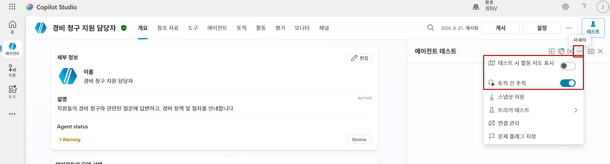

1. **테스트** 창 상단에서 **새 테스트 세션 시작** 아이콘 **+** 를 선택합니다.

1. 다음 프롬프트를 입력합니다:

   ```
   미국 달러와 유로의 현재 환율은 무엇인가요?
   ```

1. 지식 소스와 생성형 답변 모두 응답을 제공하지 못합니다. 적절한 근거 기반/생성 응답이 없으면 대화가 **대체** 토픽으로 라우팅될 수 있습니다.

   

## 실습 4 - 에이전트를 Microsoft Teams에 게시

이 실습에서는 먼저 Microsoft Entra ID 인증이 활성화되어 있는지 확인한 뒤, 에이전트를 Microsoft Teams에 게시합니다.

### 작업 4.1 - Microsoft Entra ID 인증

1. 에이전트 페이지 오른쪽 위에서 **설정** 버튼을 선택합니다.


1. **설정** 페이지 왼쪽에서 **보안** 을 선택합니다.

1. **인증** 을 선택합니다.


1. 아직 선택되지 않았다면 **Microsoft로 인증** 를 선택합니다.


1. **저장** 를 선택한 후 다시 **저장** 를 선택합니다.

1. **설정** 페이지 오른쪽 위에서 **X** 를 선택해 설정을 닫습니다.

### 작업 4.2 - 에이전트 게시

1. 에이전트 페이지에서 **게시** 를 선택하고 확인을 위해 다시 **게시** 를 선택합니다.


### 작업 4.3 - Microsoft Teams 채널
> [!NOTE]
> 이 실습에서 Teams 게시는 테스트 및 학습 목적입니다. 프로덕션 배포에는 추가적인 거버넌스, 보안, 앱 승인 프로세스가 필요할 수 있습니다.

1. **채널** 탭을 선택합니다.

1. **Microsoft 365 and Microsoft Teams** 타일을 선택합니다.
   

1. **채널 추가** 를 선택합니다.
   

1. **Teams에서 에이전트 보기** 를 선택합니다.
   

1. **이 사이트에서 Microsoft Teams을 열려고 합니다** 대화 상자에서 **취소** 를 선택합니다.

1. **웹 응용 프로그램을 대신 사용합니다.** 를 선택합니다.


1. Teams에 에이전트를 추가하려면 **추가** 를 선택합니다.
      

1. **열기** 를 선택하고 Teams에서 에이전트가 로드될 때까지 기다립니다.
   

1. Microsoft Teams에서 게시된 에이전트를 테스트합니다.
   ```
   출장 시 식비 처리 한도 알려줘
   ```
   

1. **Microsoft 365에서 에이전트 보기** 를 선택합니다.
   

1. M365 챗에서 에이전트를 테스트합니다.
   ```
   출장비 처리 방법 알려줘
   ```
   
## 요약

이 실습에서는 에이전트에 지식 소스를 추가하고, 프롬프트 응답 생성 시 지식 소스가 언제 어떻게 사용되는지에 대해 생성형 AI 설정이 미치는 영향을 확인했습니다.

