# Copilot Studio 에이전트에서 지식 관리

## 실습 개요

| 구분 | 내용 |
|------|------|
| 난이도 | Level 200 (Developer) |
| 소요 시간 | 약 60분 |
| 대상 | Power Platform 개발자, Copilot Studio 학습자 |
| 목적 | Dataverse 테이블 생성 및 에이전트 지식 소스 추가, 생성형 AI 구성 |

## 시나리오

이 실습에서 수행할 작업:

- Dataverse 테이블 만들기
- 에이전트 만들기
- 파일 업로드 후 지식 소스로 사용
- 공개 웹사이트를 지식 소스로 추가
- Dataverse 테이블을 지식 소스로 추가
- 생성 오케스트레이션 설정 구성
- Create generative answers 노드 구성
- 에이전트를 Microsoft Teams에 게시

이 실습은 약 **60**분이 소요됩니다.

## 학습 내용

- 에이전트에 지식 소스를 추가하는 방법
- 생성 오케스트레이션 및 생성형 답변 동작을 구성하는 방법

## 상위 수준 실습 단계

- Copilot으로 Dataverse 테이블 만들기
- Copilot으로 에이전트 만들기
- 지식 소스 추가
- 생성형 AI 구성
- 에이전트 게시
  
## 사전 요구 사항

- Microsoft Entra ID 계정 보유
- Copilot Studio 라이선스 보유 또는 [무료 평가판](https://go.microsoft.com/fwlink/p/?linkid=2252605) 등록
- 에이전트 및 관련 자산을 만들 수 있는 Power Platform 환경과 솔루션에 대한 액세스 권한
- 다음 중 하나를 사용할 수 있습니다:
  - **ILT Setup** 실습에서 만든 환경 및 **Lab Exercises** 솔루션
  - 기존에 사용 중인 환경 및 솔루션
- 환경과 솔루션이 아직 준비되지 않았다면, 계속하기 전에 **ILT Setup** 실습 단계를 먼저 완료하세요.
  
> [!IMPORTANT]
> 현재 프리뷰 상태인 새로운 Copilot Studio 환경을 보게 될 수 있습니다. 이 실습은 현재 Copilot Studio 인터페이스를 기준으로 하므로 일부 단계와 스크린샷이 프리뷰 환경과 다를 수 있습니다. 실습을 원활히 진행하려면 이 연습 전체에서 현재 Copilot Studio UI를 사용하세요.

## 핵심 개념: 에이전트 구성 요소와 동작

생성 오케스트레이션이 활성화되면, 에이전트는 지침, 지식, 토픽, 도구를 사용해 응답을 동적으로 생성할 수 있습니다. 다양한 유형의 지식 소스를 사용해 에이전트를 근거화할 수 있으며, 여러 설정이 생성 응답 방식에 영향을 줍니다.

## 실습 1 - Dataverse에 테이블 만들기

이 실습에서는 에이전트의 지식 소스로 사용할 Dataverse 테이블을 만듭니다.

### 작업 1.1 - 비용 청구용 테이블 만들기

1. 웹 브라우저에서 `https://make.powerapps.com/`의 **Power Apps Maker portal**로 이동하고, 필요 시 로그인합니다. 환영 메시지는 건너뜁니다.

1. 페이지 상단에서 이 실습에 사용할 환경인지 확인합니다.

   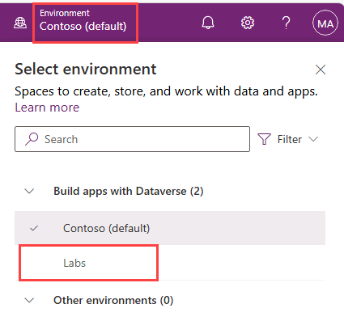

1. **Maker portal** 왼쪽 탐색 메뉴에서 **Tables**를 선택합니다.

   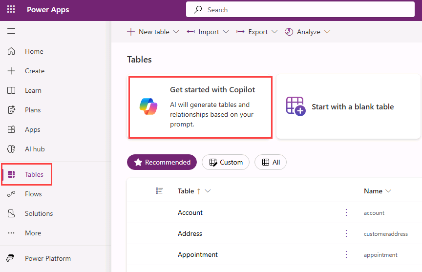

1. **Get started with Copilot** 타일을 선택합니다.

1. **Get started with Copilot** 대화 상자에서 **Table options** 아이콘을 선택하고 **One table**을 선택합니다.

   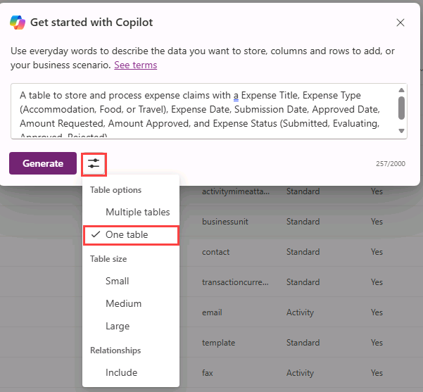

1. *Describe the tables you want Copilot to build* 텍스트 상자에 다음 프롬프트를 입력합니다:

   ```prompt
   A table to store and process expense claims with an Expense Title, Expense Type (Accommodation, Meals, Entertainment or Travel), Expense Date, Submission Date, Approved Date, Amount Requested, Amount Approved, and Expense Status (Submitted, Evaluating, Approved, Rejected).
   ```

1. **Generate**를 선택합니다.
  
    > [!NOTE]
    > 생성된 테이블 스키마는 이 실습 스크린샷과 약간 다를 수 있습니다. 열 이름 또는 형식의 사소한 차이는 정상입니다.

1. 테이블이 생성됩니다. 테이블 이름을 메모해 둡니다.

   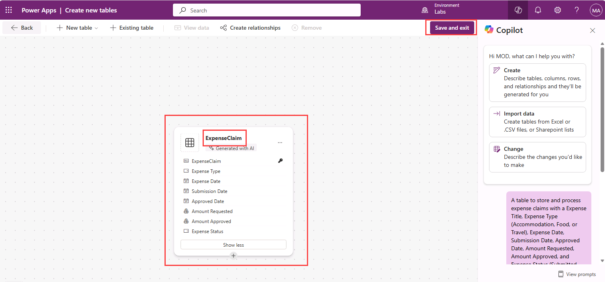

1. **Save and exit**를 선택하고, 다시 **Save and exit**를 선택합니다.

## 실습 2 - 에이전트 만들기

이 실습에서는 가상의 기업에서 비용 정책 관련 질문에 답변하는 새 에이전트를 자연어로 만듭니다.

### 작업 2.1 - 비용 청구용 에이전트 만들기

1. **Copilot Studio** 홈 페이지 `https://copilotstudio.microsoft.com/`로 이동합니다.

1. 페이지 상단에서 이 실습에 사용할 환경인지 확인합니다.

1. 왼쪽 탐색 메뉴에서 **Agents**를 선택합니다.

1. *Start building by describing what your agent needs to do* 텍스트 상자 왼쪽 아래에서 **Agent Settings** 아이콘(톱니바퀴 이미지)을 선택합니다.

   

1. 에이전트 기본 언어는 **English (United States)**로 유지합니다.

1. **Solution** 드롭다운에서 **Lab Exercises** 또는 이 실습에 사용할 다른 솔루션을 선택합니다.

1. *Schema name*에 `expenseagent`를 입력합니다.

1. **Update**를 선택합니다.

1. *Start building by describing what your agent needs to do* 텍스트 상자에 다음 프롬프트를 입력합니다:

   ```prompt
   You are an agent that helps employees with expense claims including questions around expense policy and procedures.
   ```

1. **Send** 아이콘을 선택합니다.

   에이전트 프로비저닝이 완료되면 에이전트 구성을 계속 진행할 수 있습니다.

## 실습 3 - 지식으로 에이전트 근거화

이 실습에서는 에이전트를 근거화하기 위해 지식 소스를 추가합니다.

### 작업 3.1 - 문서를 지식 소스로 추가

1. 새 브라우저 탭을 열고 `https://github.com/MicrosoftLearning/mslearn-copilotstudio/raw/main/expenses/Expenses_Policy.docx`로 이동해 [expenses policy document](https://raw.githubusercontent.com/MicrosoftLearning/mslearn-copilotstudio/main/expenses/Expenses_Policy.docx)를 로컬에 다운로드합니다. 이 문서에는 가상의 기업 비용 정책 세부 정보가 포함되어 있습니다.

1. 실습 3에서 만든 에이전트가 있는 **Copilot Studio** 브라우저 탭으로 돌아갑니다.

1. **Knowledge** 탭을 선택하여 에이전트에 정의된 지식 소스를 확인합니다(현재는 없어야 함).

   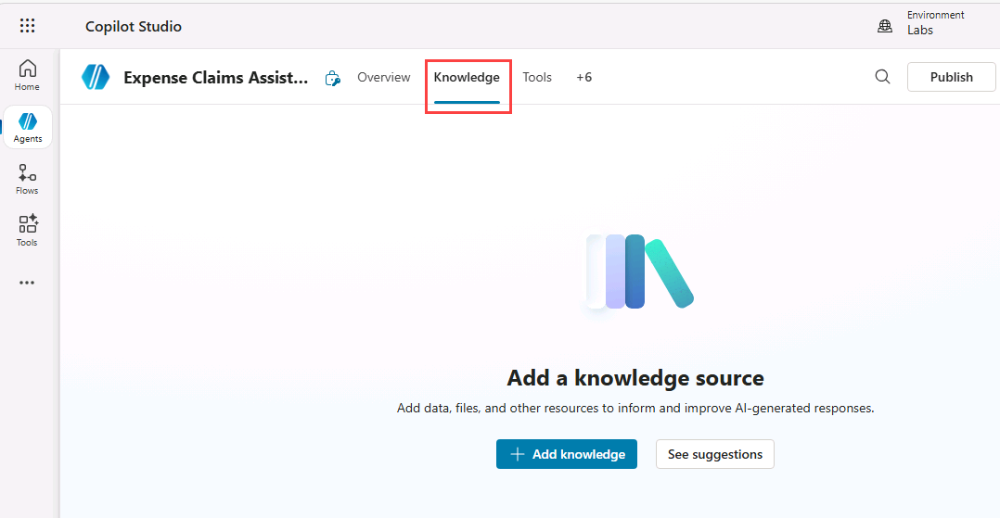

1. **+ Add knowledge**를 선택하고, 에이전트에 추가할 수 있는 다양한 지식 소스 유형을 확인합니다.

   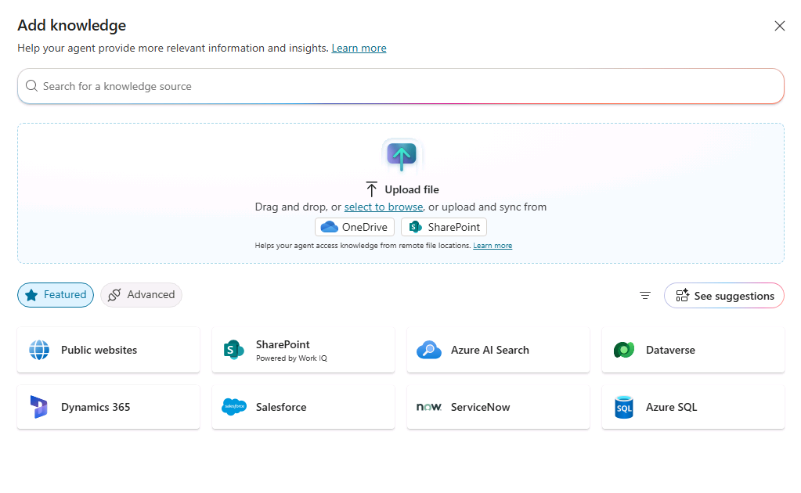

1. **Upload file** 섹션에서 **select to browse**를 사용해 앞에서 다운로드한 expense policy 문서를 업로드하고 **Add to agent**를 선택합니다.

   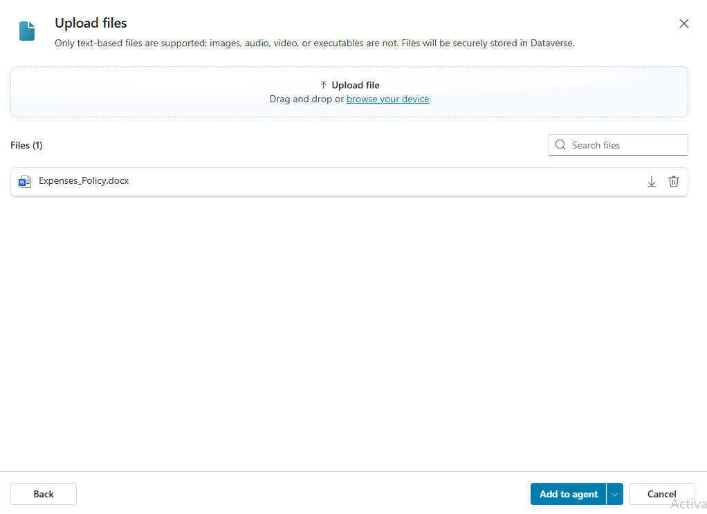

> [!NOTE]
> 파일 업로드 후 Copilot Studio가 인덱싱을 시작합니다. 10분 이상 소요될 수 있으므로 다음 실습 후 다시 확인합니다.

### 작업 3.2 - 공개 웹사이트를 지식 소스로 추가

1. Copilot Studio 에이전트에서 **Knowledge** 탭을 선택합니다.

1. **+ Add knowledge**를 선택합니다.

1. **Public websites**를 선택합니다.

1. **Public website link** 텍스트 상자에 **`https://www.irs.gov/publications/p463`**를 입력합니다. 이 공식 정부 공개 웹사이트는 에이전트에 유용한 여행 경비 상환 정보를 포함합니다.

1. **Add**를 선택합니다.

1. *Name*에 `Travel, Gift, and Car Expenses | Internal Revenue Service`를 입력합니다.

1. *Description*에 `This knowledge source contains information on reimbursement of travel expenses.`를 입력합니다.

1. **Add to agent**를 선택합니다.
> [!NOTE]
> 공개 웹사이트 인덱싱에는 몇 분이 걸릴 수 있습니다. 응답이 불완전하면 몇 분 기다린 후 에이전트를 다시 테스트하세요.

### 작업 3.3 - Dataverse 테이블을 지식 소스로 추가

1. Copilot Studio 에이전트에서 **Knowledge** 탭을 선택합니다.

1. **+ Add knowledge**를 선택합니다.

1. **Dataverse**를 선택합니다.

1. 실습 2에서 생성한 *Expenses* 테이블을 검색해 선택합니다.

   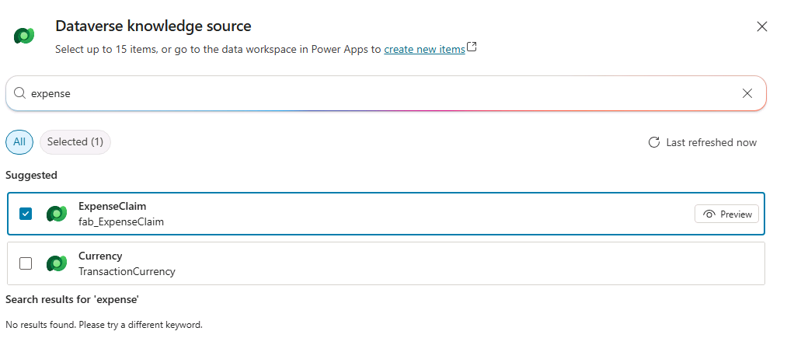

1. **Add to agent**를 선택합니다.

   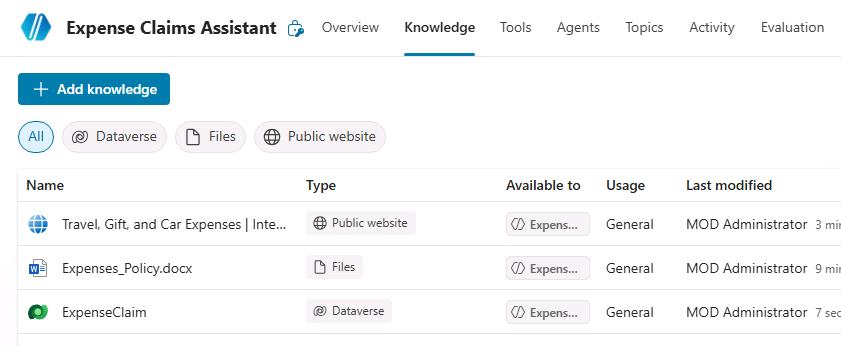

### 작업 3.4 - Dataverse 지식 소스 구성

1. Copilot Studio 에이전트에서 **Knowledge** 탭을 선택합니다.

1. Dataverse 테이블의 줄임표(**⋮**)를 선택하고 **Edit**를 선택합니다.

   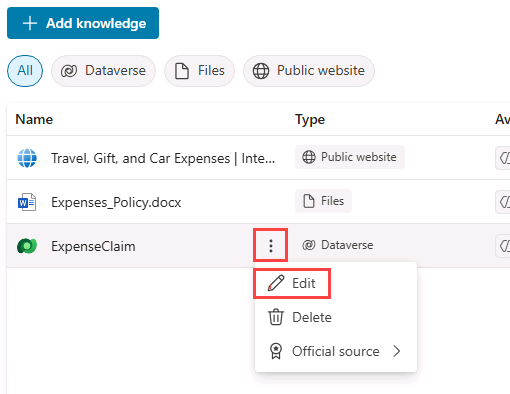

1. **Details** 탭에서 *Name*에 `Expense Claims data`를 입력합니다.

1. **Synonyms** 탭을 선택합니다.

1. **Expense Type** 행에서 **+ Add synonyms**를 선택합니다.

1. `Expense label`을 입력하고 **Add**를 선택합니다.

1. `Expense category`를 입력하고 **Add**를 선택합니다.

   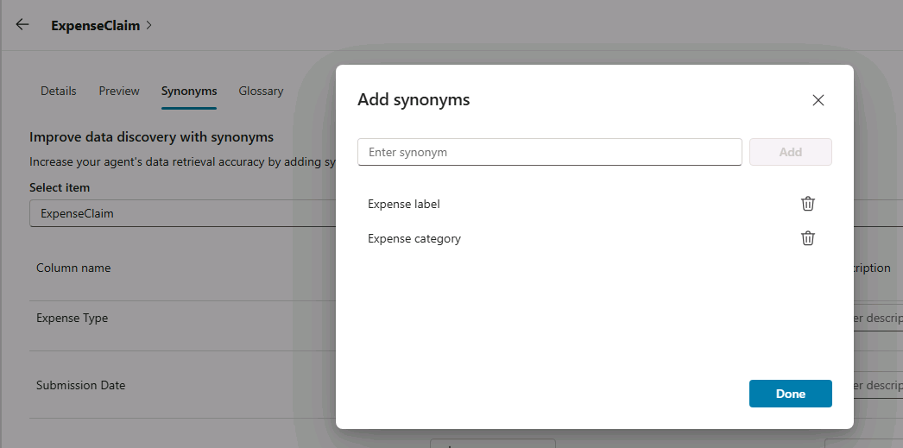

1. **Done**을 선택합니다.

1. **Glossary** 탭을 선택합니다.

1. *Enter term*에 `Incidental expenses`를 입력합니다.

1. *Enter description*에 `Minor, necessary business costs that arise in addition to a primary expense such as tips or fees.`를 입력합니다.

1. **Save**를 선택합니다.

### 작업 3.5 - 파일 인덱싱 상태 확인

업로드한 파일 인덱싱이 완료되었는지 확인합니다. 인덱싱이 아직 진행 중이면 몇 분 기다린 뒤 페이지를 새로 고치고 계속 진행합니다.

1. **Knowledge** 탭을 선택합니다.

1. 파일 업로드의 **Status**를 확인합니다. 아직 **In progress**이면 **Ready**가 될 때까지 몇 분 간격으로 새로 고칩니다.

### 작업 3.6 - 근거화 테스트

1. 페이지 오른쪽 위의 **Test** 아이콘을 선택해 테스트 창을 엽니다.

1. **Test** 창에서 변수 **{x}** 아이콘 옆 줄임표(**...**)를 선택하고 **Show activity map when testing**를 **On**, **Track between topics**를 **Off**로 전환합니다.

   

1. **Test** 창 상단에서 **Start new test session** 아이콘 **+**를 선택합니다.

1. 다음 프롬프트를 입력합니다:

   `What can I claim for expenses?`

1. 응답은 업로드한 expense policy 문서를 근거로 생성되어야 하며, 다른 구성된 지식 소스를 참조할 수도 있습니다.

   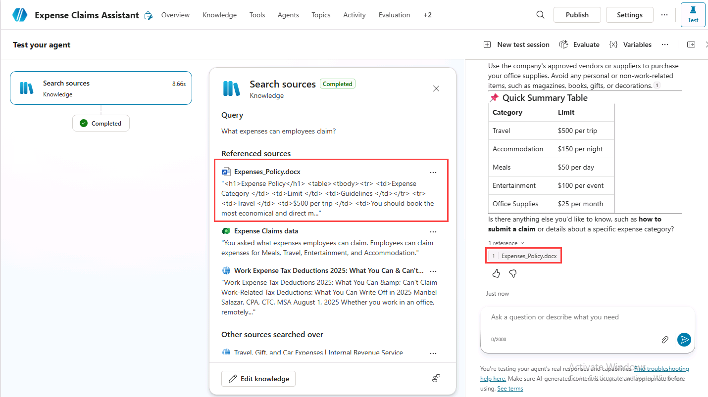

1. **Test** 창 상단에서 **Start new test session** 아이콘 **+**를 선택합니다.

1. 다음 프롬프트를 입력합니다:

   `What is the total amount of all expense claims for each category?`

1. 에이전트는 모든 지식 소스를 검색하고 Dataverse 테이블을 사용해 응답을 생성해야 합니다.

   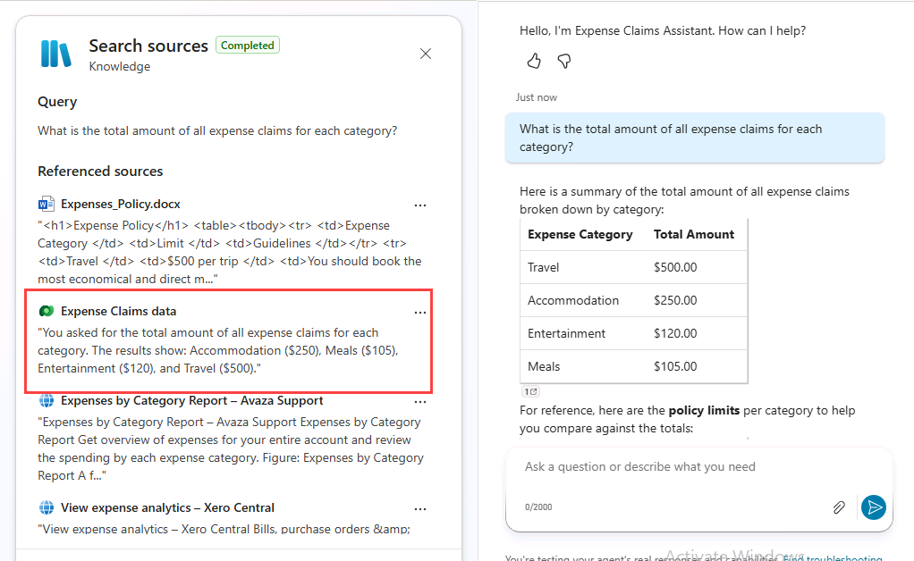

1. **Test** 창 상단에서 **Start new test session** 아이콘 **+**를 선택합니다.

1. 다음 프롬프트를 입력합니다:

   `What is the standard deduction for incidental expenses?`

1. 에이전트는 모든 지식 소스를 검색하고 공개 웹사이트를 사용해 응답을 생성해야 합니다.

   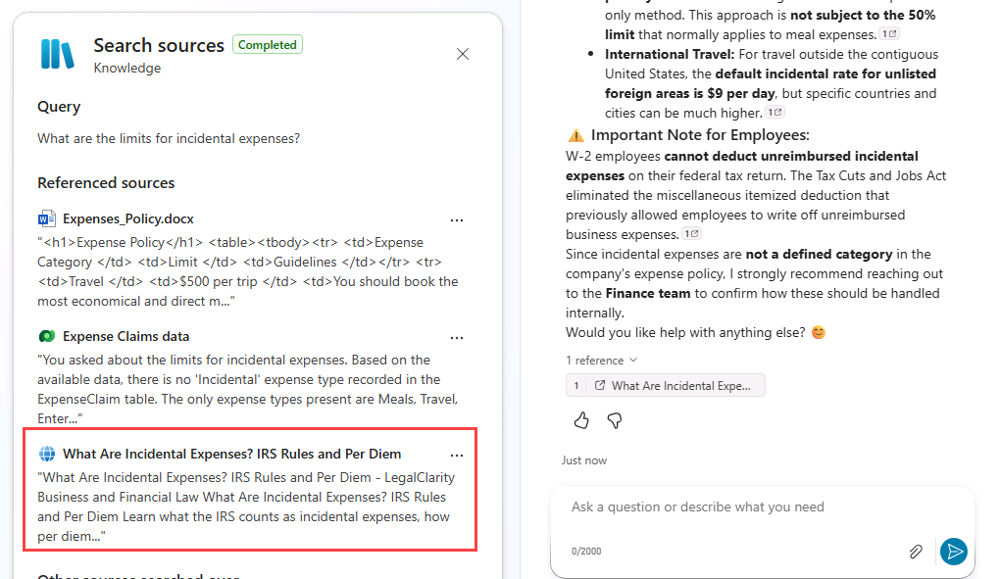

## 실습 4 - 생성형 AI 설정

이 실습에서는 에이전트 및 generative answers 노드의 생성형 AI를 구성합니다.

### 작업 4.1 - 에이전트 지식 설정 구성

1. 에이전트 페이지 오른쪽 위에서 **Settings** 버튼을 선택합니다.

1. **Orchestration**이 **Yes - Responses will be dynamic, using available tools and knowledge as appropriate**로 설정되어 있는지 확인합니다.

1. **Knowledge** 섹션에서 **Allow ungrounded responses**를 **Off**로 설정합니다.

1. **Knowledge** 섹션에서 **Use information from the Web**를 **Off**로 설정합니다.

   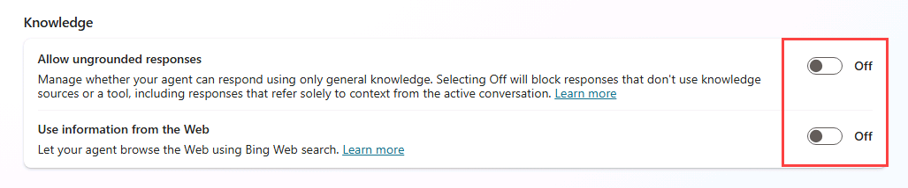

1. **Save**를 선택합니다.

1. Settings 페이지 오른쪽 위에서 **X**를 선택해 설정을 닫습니다.

1. 이전 실습의 프롬프트로 에이전트를 테스트합니다. 파일과 Dataverse 지식 소스는 사용되지만 응답 생성 시 공개 웹사이트는 사용되지 않습니다.

### 작업 4.2 - generative answers 노드 구성

1. **Topics** 탭을 선택합니다.

1. **System** 토픽으로 필터링합니다.

1. **Conversational boosting** 토픽을 엽니다.

1. **Boost your conversations with copilots** 대화 상자가 표시되면 **Done**을 선택합니다.

1. **Create generative answers** 노드를 선택합니다.

   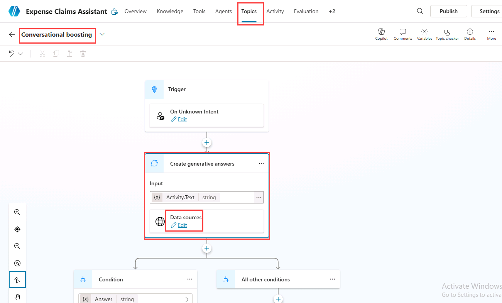

1. **Data sources**의 **Edit**를 선택합니다.

1. **Search only selected sources.**를 선택하고 활성화합니다.

1. **Public website** 지식 소스를 선택합니다.

1. **Web search**를 선택하고 활성화합니다.
  활성화하면 Web search가 공개 웹 정보를 사용해 구성된 지식 소스를 보완하여 생성 답변을 제공합니다.
   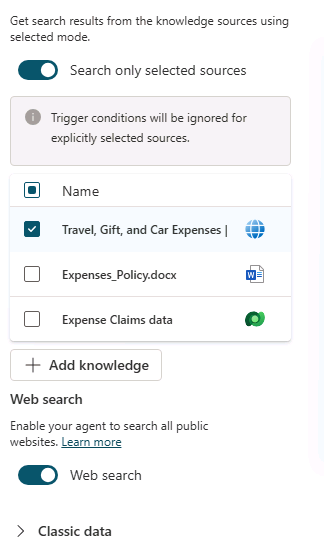

1. **Save**를 선택합니다.

1. **Overview** 탭을 선택합니다.

1. 페이지 오른쪽 위의 **Test** 아이콘을 선택해 테스트 창을 엽니다.

1. **Test** 창에서 변수 **{x}** 아이콘 옆 줄임표(**...**)를 선택하고 **Show activity map when testing**를 **Off**, **Track between topics**를 **On**으로 전환합니다.

1. **Test** 창 상단에서 **Start new test session** 아이콘 **+**를 선택합니다.

1. 다음 프롬프트를 입력합니다:

   `What is the federal per diem rate?`

1. 지식 소스는 직접 답을 제공하지 않지만, 에이전트가 생성형 답변으로 웹 검색을 사용해 응답을 생성합니다.

   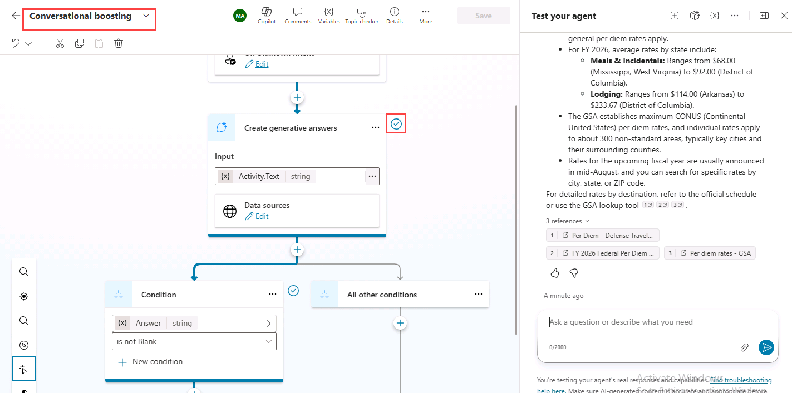

### 작업 4.3 - Fallback 토픽

1. **Topics** 탭을 선택합니다.

1. **System** 토픽으로 필터링합니다.

1. **Conversational boosting** 토픽을 엽니다.

1. **Create generative answers** 노드를 선택합니다.

1. **Data sources**의 **Edit**를 선택합니다.

1. **Web search**를 비활성화합니다.

1. **Save**를 선택합니다.

1. **Overview** 탭을 선택합니다.

1. 페이지 오른쪽 위의 **Test** 아이콘을 선택해 테스트 창을 엽니다.

1. **Test** 창에서 변수 **{x}** 아이콘 옆 줄임표(**...**)를 선택하고 **Show activity map when testing**가 **Off**, **Track between topics**가 **On**인지 확인합니다.

1. **Test** 창 상단에서 **Start new test session** 아이콘 **+**를 선택합니다.

1. 다음 프롬프트를 입력합니다:

   `What is the federal per diem rate?`

1. 지식 소스와 생성형 답변 모두 응답을 제공하지 못합니다. 적절한 근거 기반/생성 응답이 없으면 대화가 Fallback 토픽으로 라우팅될 수 있습니다.

   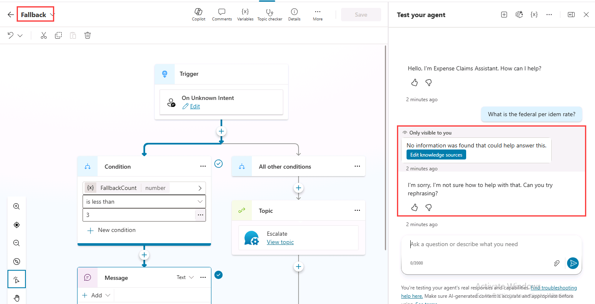

## 실습 5 - 에이전트를 Microsoft Teams에 게시

이 실습에서는 먼저 Microsoft Entra ID 인증이 활성화되어 있는지 확인한 뒤, 에이전트를 Microsoft Teams에 게시합니다.

### 작업 5.1 - Microsoft Entra ID 인증

1. 에이전트 페이지 오른쪽 위에서 **Settings** 버튼을 선택합니다.

1. **Settings** 페이지 왼쪽에서 **Security**를 선택합니다.

1. **Authentication**을 선택합니다.

1. 아직 선택되지 않았다면 **Authenticate with Microsoft**를 선택합니다.

1. **Save**를 선택한 후 다시 **Save**를 선택합니다.

1. **Settings** 페이지 오른쪽 위에서 **X**를 선택해 설정을 닫습니다.

### 작업 5.2 - 에이전트 게시

1. 에이전트 페이지에서 **Publish**를 선택하고 확인을 위해 다시 **Publish**를 선택합니다.

### 작업 5.3 - Microsoft Teams 채널
> [!NOTE]
> 이 실습에서 Teams 게시는 테스트 및 학습 목적입니다. 프로덕션 배포에는 추가적인 거버넌스, 보안, 앱 승인 프로세스가 필요할 수 있습니다.

1. **Channels** 탭을 선택합니다.

   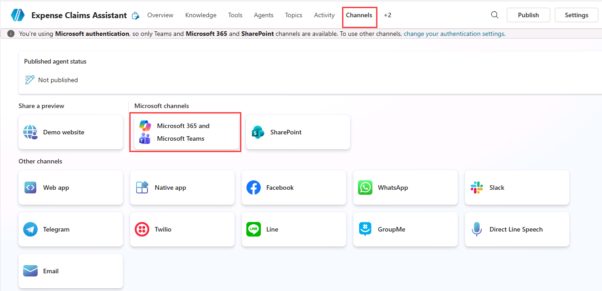

1. **Microsoft 365 and Microsoft Teams** 타일을 선택합니다.

1. **Make agent available in Microsoft 365 Copilot** 선택을 해제합니다.

1. **Add channel**을 선택합니다.

   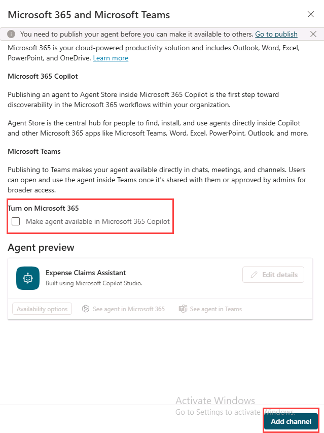

1. **See agent in Teams**를 선택합니다.

1. **This site is trying to open Microsoft Teams (work or school)** 대화 상자에서 **Cancel**을 선택합니다.

1. 팝업에서 **Cancel**을 선택하고 **Use the web app instead**를 선택합니다.

1. Teams에 에이전트를 추가하려면 **Add**를 선택합니다.

   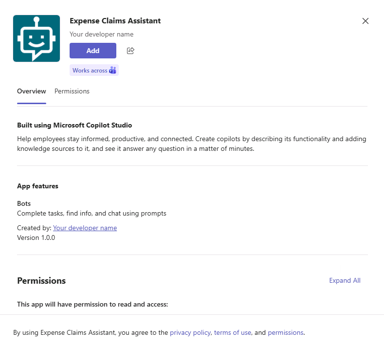

1. **Open**을 선택하고 Teams에서 에이전트가 로드될 때까지 기다립니다.

1. Microsoft Teams에서 게시된 에이전트를 테스트합니다.

    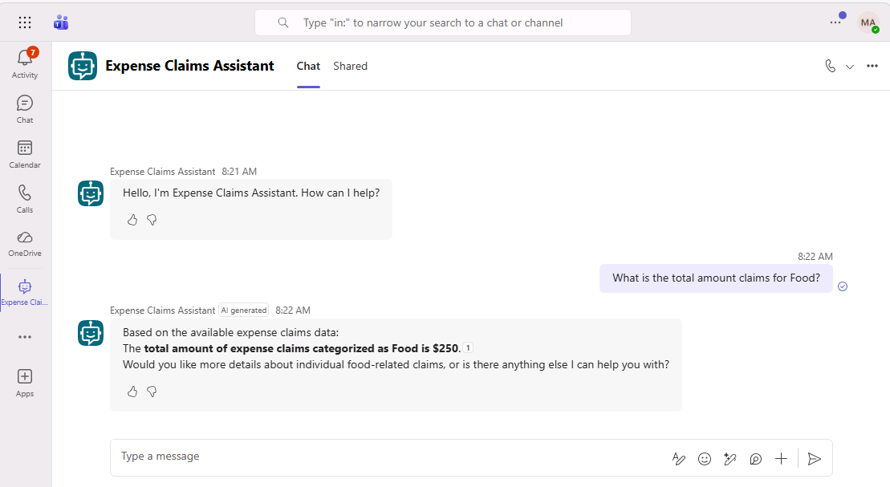

## 요약

이 실습에서는 에이전트에 지식 소스를 추가하고, 프롬프트 응답 생성 시 지식 소스가 언제 어떻게 사용되는지에 대해 생성형 AI 설정이 미치는 영향을 확인했습니다.
