---
lab:
  title: 도구로 워크플로 사용
  module: 워크플로를 통합해 에이전트 동작 향상
  description: 이 실습에서는 Copilot을 사용해 에이전트를 만들고, 워크플로를 생성하고, 워크플로를 에이전트와 토픽의 도구로 추가합니다.
  duration: 45분
  level: 200
  islab: true
  primarytopics:
    - Microsoft Copilot Studio
---

# 도구로 워크플로 사용

## 시나리오

이 실습에서 수행할 작업:

- 에이전트 만들기
- 워크플로 만들기
- 워크플로를 도구로 추가
- 에이전트 및 토픽에서 도구 사용
- 에이전트 테스트

이 실습은 약 **45**분이 소요됩니다.

## 학습 내용

- 워크플로가 에이전트의 결정론적 작업 수행을 가능하게 하는 방식
- 워크플로를 도구로 구성하는 방법
- 토픽에서 워크플로를 사용하는 방법

## 상위 수준 실습 단계

- Copilot을 사용해 에이전트 만들기
- Microsoft Teams로 메시지를 전송하는 워크플로 만들기
- 해당 워크플로를 에이전트 도구로 추가
- 워크플로를 만들고 토픽에 추가
  
## 사전 요구 사항

- Microsoft Entra ID 계정 보유
- Copilot Studio 라이선스 보유 또는 [무료 평가판](https://go.microsoft.com/fwlink/p/?linkid=2252605) 등록
- 에이전트 및 관련 자산을 만들 수 있는 Power Platform 환경과 솔루션에 대한 액세스 권한
- Microsoft Teams에 접근 가능하고 Teams 채널에 메시지를 게시할 권한 보유
- 다음 중 하나를 사용할 수 있습니다:
  - **ILT Setup** 실습에서 만든 환경 및 **Lab Exercises** 솔루션
  - 기존에 사용 중인 환경 및 솔루션
- 환경과 솔루션이 아직 준비되지 않았다면, 계속하기 전에 **ILT Setup** 실습 단계를 먼저 완료하세요.
  
> [!IMPORTANT]
> 현재 프리뷰 상태인 새로운 Copilot Studio 환경을 보게 될 수 있습니다. 이 실습은 현재 Copilot Studio 인터페이스를 기준으로 하므로 일부 단계와 스크린샷이 프리뷰 환경과 다를 수 있습니다. 실습을 원활히 진행하려면 이 연습 전체에서 현재 Copilot Studio UI를 사용하세요.

## 핵심 개념: 에이전트 구성 요소와 동작

생성 오케스트레이션이 활성화되면, 에이전트는 지침, 지식, 토픽, 도구를 사용해 응답을 동적으로 생성할 수 있습니다. 에이전트는 도구를 사용해 외부 시스템에서 작업을 수행하고, 데이터를 조회하고, 메시지를 전송할 수 있습니다. 일반적으로 도구는 작업 수행 또는 외부 데이터 조회에 사용되며, 토픽은 구조화된 대화 흐름을 안내합니다.

## 실습 1 - 에이전트 만들기

이 실습에서는 작업을 분석, 분류, 우선순위화하는 새 에이전트를 자연어로 만듭니다.

### 작업 1.1 - 작업 분석용 에이전트 만들기

1. **Copilot Studio** 홈 페이지 `https://copilotstudio.microsoft.com/`에서, 이 실습에 사용할 환경인지 확인합니다.

1. 왼쪽 탐색 메뉴에서 **Agents**를 선택합니다.

1. *Start building by describing what your agent needs to do* 텍스트 상자 왼쪽 아래에서 **Agent Settings** 아이콘(톱니바퀴 이미지)을 선택합니다.

   

1. 에이전트 기본 언어는 **English (United States)**로 유지합니다.

1. **Solution** 드롭다운에서 **Lab Exercises** 또는 이 실습에 사용할 다른 솔루션을 선택합니다.

1. *Schema name*에 `analyzetaskagent`를 입력합니다.

1. **Update**를 선택합니다.

1. *Start building by describing what your agent needs to do* 텍스트 상자에 다음 프롬프트를 입력합니다:

   ```prompt
   You are an agent that analyzes, categorizes, and prioritizes tasks.
   ```

1. **Send** 아이콘을 선택합니다.

   에이전트 프로비저닝이 완료되면 에이전트 구성을 계속 진행할 수 있습니다.

## 실습 2 - 워크플로 도구 만들기

이 실습에서는 Microsoft Teams에 메시지를 보내는 워크플로를 만듭니다. 이후 이 워크플로를 에이전트에 추가합니다.
> [!NOTE]
> 에이전트 응답, 오케스트레이션 동작, 도구 사용은 테넌트 구성과 모델 동작에 따라 이 실습 스크린샷과 약간 다를 수 있습니다.

### 작업 2.1 - Send Message to Teams 워크플로 만들기

1. Copilot Studio에서 왼쪽 탐색 메뉴의 **Tools**를 선택합니다.

   

1. **+ New tool**을 선택합니다.

1. **New Tool** 대화 상자에서 **Agent flow** 타일을 선택합니다.

1. 워크플로에 **When an agent calls the flow** 트리거와 **Respond to the agent** 작업이 추가되었는지 확인합니다.

   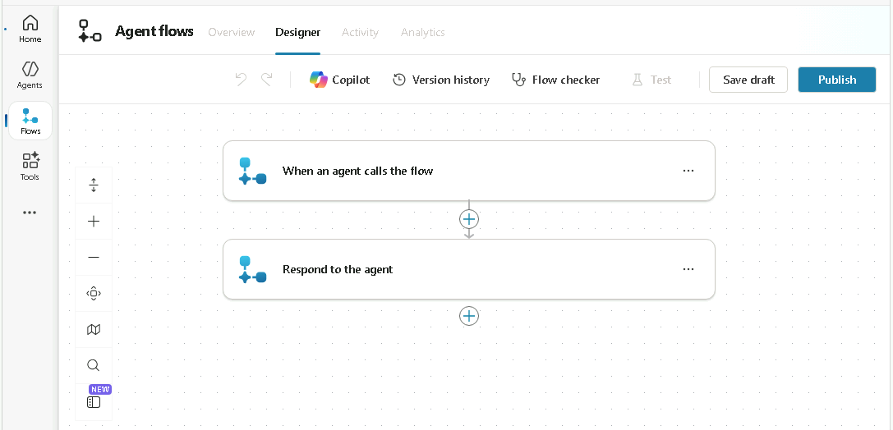

1. **When an agent calls the flow** 트리거 단계를 선택하고 **+ Add an input**을 선택합니다.

1. **Text**를 선택합니다.

1. *Input*에 `Task Summary`, *Please enter your input*에 `Analyzed tasks`를 입력합니다.

   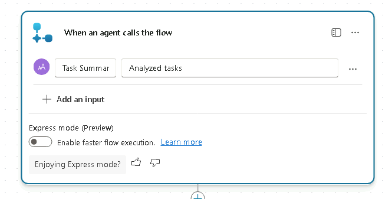

1. 페이지 오른쪽 위 근처의 **Save draft**를 선택합니다.

1. **Overview** 탭을 선택합니다.

1. **Details** 섹션에서 **Edit**를 선택합니다.

   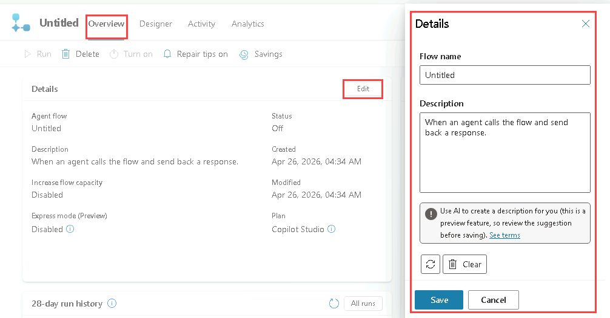

1. **Details** 창에서 **Flow name**을 `Send Summary to Teams`로 변경합니다.

1. **Description**에 `Post a message to Teams with the summary of the task analysis`를 입력합니다.

1. **Save**를 선택합니다.

### 작업 2.2 - Post to Teams 작업

1. **Designer** 탭을 선택합니다.

1. 워크플로 두 단계 사이의 **+** 아이콘을 선택해 새 작업을 삽입합니다.

1. **Search** 필드에 `Teams`를 입력하고 **Microsoft Teams** 커넥터의 **See more**를 선택합니다.

   

1. **Post message in a chat or channel** 작업을 선택합니다.

1. **Sign in**을 선택합니다.

   > [!NOTE]
   > "Failed to create OAuth connection: ClientWarning: The browser has blocked the connection authentication popup window" 오류가 발생하면, 브라우저 주소 표시줄의 **pop-up blocked** 아이콘을 선택한 다음 **Always allow pop-ups and redirects from `https://copilotstudio.microsoft.com**`**를 선택하세요.

1. 계정을 선택합니다.

1. **Confirmation required** 대화 상자에서 **I have verified this request and trust the source** 체크박스를 선택한 다음 **Allow access**를 선택합니다.

1. **Post as**에서 **Flow bot**을 선택합니다.

1. **Post in**에서 **Channel**을 선택합니다.

1. **Team**에서 예를 들어 **Leadership** 같은 팀을 선택합니다.

1. **Channel**에서 예를 들어 **General** 같은 채널을 선택합니다.

1. *Message*는 **Dynamic Content**를 사용해 **Task Summary**를 선택합니다.

   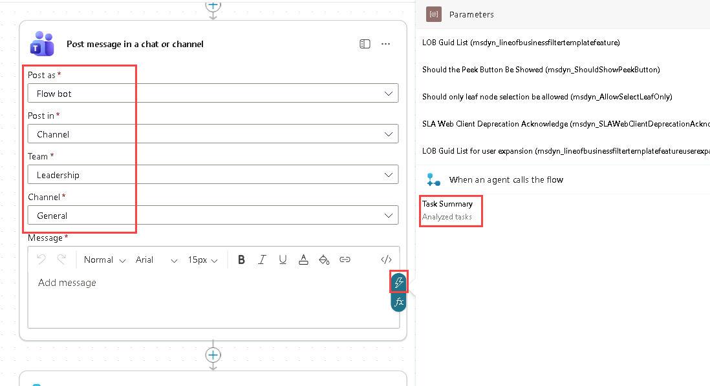

### 작업 2.3 - 응답 작업

1. 작성 캔버스에서 **Respond to the agent** 노드를 선택하고 **+ Add an output**을 선택합니다.

1. **Text**를 선택합니다.

1. *Enter a name*에 `Message`를 입력합니다.

1. *Enter a value to respond with*는 **Dynamic Content**를 사용해 Teams 작업의 **Message link**를 선택합니다.

   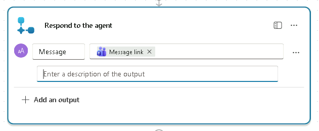

1. 페이지 오른쪽 위 근처의 **Save draft**를 선택합니다.

1. 페이지 오른쪽 위 근처의 **Publish**를 선택합니다.

1. Copilot Studio에서 왼쪽 탐색 메뉴의 **Tools**를 선택해 워크플로 상태가 **Ready**인지 확인합니다.

### 작업 2.4 - 워크플로를 에이전트 도구로 추가

1. 왼쪽 탐색 창에서 **Agents**를 선택합니다.

1. **Task Analysis** 에이전트를 엽니다.

1. **Tools** 탭을 선택합니다.

1. **+ Add a tool**을 선택합니다.

1. **Add tool** 대화 상자에서 **Workflows** 필터를 선택합니다.

   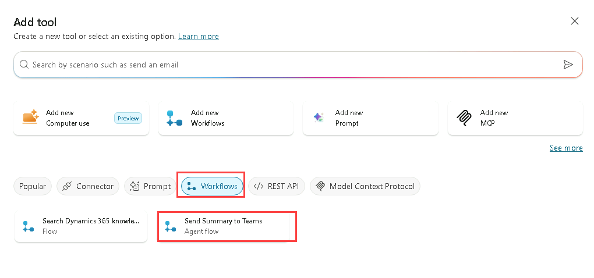

1. **Send Summary to Teams** 워크플로를 선택합니다.

1. **Add and configure**를 선택합니다.

1. **Details** 섹션의 **Description**에 `Sends a summary of the completed task analysis to a Microsoft Teams channel`을 입력합니다.

1. **Additional details**를 펼치고 다음을 선택/입력합니다:

   - **When this tool may be used**: Agent may use this tool at any time
   - **Ask the end user before running**: No
   - **Credentials to use**: End user credentials
   - **Description**: `Please sign in to notify Teams`

1. **Inputs** 섹션의 *Fill using*에서 **Dynamically fill with AI**를 선택합니다.
  이렇게 하면 에이전트가 대화 컨텍스트에서 적절한 입력 값을 동적으로 결정할 수 있습니다.

1. **Completion** 섹션의 **After running**에서 **Write the response with generative AI**를 선택합니다.

   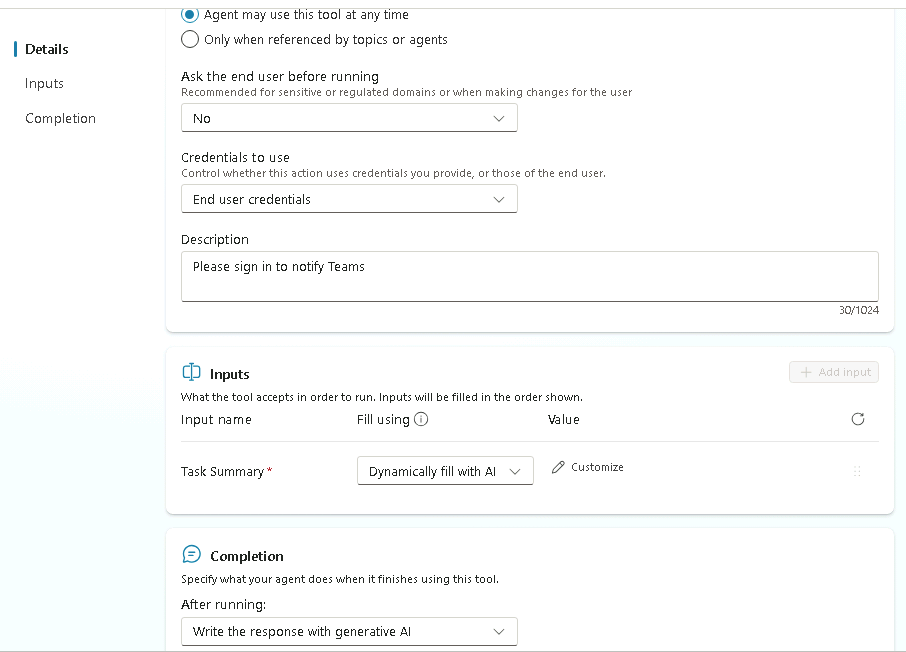

1. **Save**를 선택합니다.

### 작업 2.5 - 에이전트 지침 업데이트

1. **Overview** 탭을 선택합니다.

1. **Instructions** 섹션에서 **Edit**를 선택합니다.

1. 에이전트 지침의 *## Step-by-step instructions* 아래 마지막 단계에 다음을 추가합니다: `Use the `를 입력하고 `/`를 입력해 **Send Summary to Teams** 도구를 선택한 뒤 ` when the task analysis is complete.`를 입력합니다.

   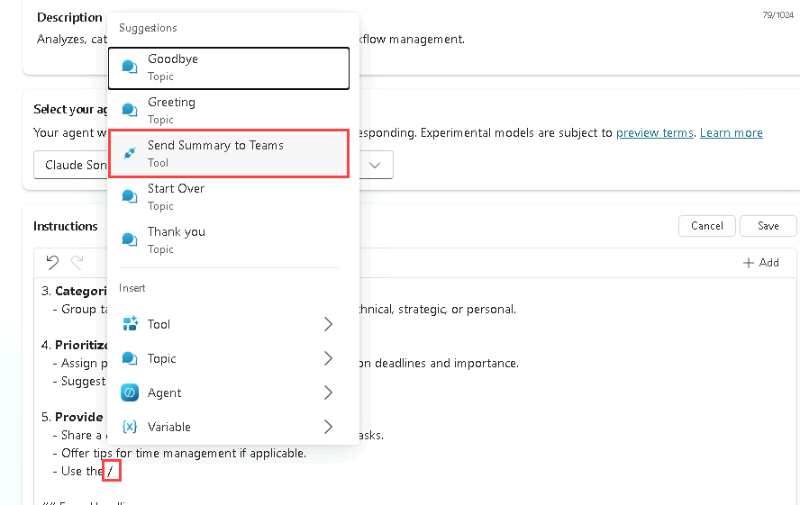

1. **Save**를 선택합니다.

### 작업 2.6 - 에이전트에서 워크플로 도구 테스트

1. 페이지 오른쪽 위의 **Test** 아이콘을 선택해 테스트 창을 엽니다.

1. **Test** 창에서 변수 **{x}** 아이콘 옆 줄임표(**...**)를 선택하고 **Show activity map when testing**를 **On**, **Track between topics**를 **Off**로 전환합니다.

   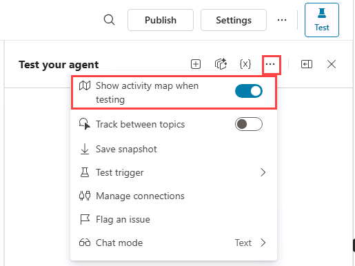

1. **Test** 창 상단에서 **Start new test session** 아이콘 **+**를 선택합니다.

1. **Conversation Start** 메시지가 나타나면 에이전트가 대화를 시작합니다. 생성한 토픽을 트리거하기 위해 다음을 입력합니다:

   `Analyze this list of tasks 1. Build an agent, 2. Test an agent, 3. Deploy an agent`

1. Microsoft Teams 연결 메시지가 표시되면 **Allow**를 선택합니다.

   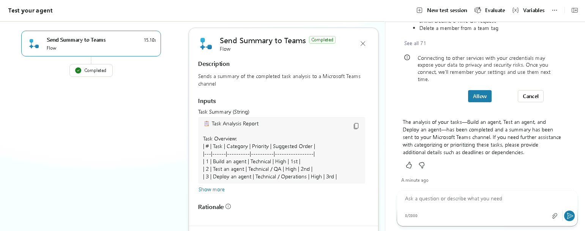

1. 새 브라우저 탭에서 `https://teams.cloud.microsoft/`로 이동하고, 필요 시 로그인합니다.

1. 워크플로에서 이전에 선택한 팀/채널로 이동해 작업 분석 요약이 Teams 채널에 게시되었는지 확인합니다.

   

## 실습 3 - 토픽에서 Excel 파일을 분석하는 워크플로 도구 만들기

이 실습에서는 Copilot으로 설명 기반 토픽을 만들고, Excel 파일의 작업을 분석하는 워크플로 도구를 만든 뒤, 토픽에서 해당 도구를 호출합니다.

### 작업 3.1 - Excel 파일 만들기

1. Copilot Studio에서 왼쪽 위 **App launcher** 아이콘을 선택한 다음 **OneDrive**를 선택합니다.

   

1. 필요 시 환영 메시지를 건너뜁니다.

1. **+ Create or upload**를 선택합니다.

1. **Excel workbook**을 선택합니다.

   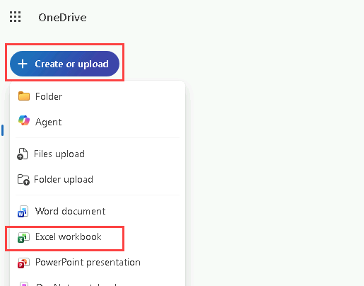

1. **Excel workbook** 왼쪽 위에서 **Book**을 선택해 파일명을 `Operations tasks`로 변경합니다.

   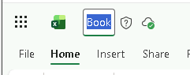

1. 첫 번째 행에 다음 열을 만듭니다:

   - `Reference`
   - `Title`
   - `Description`
   - `Requested by`
   - `Priority`
   - `Status`

1. 두 번째 행에 첫 번째 작업을 입력합니다:

   - `OPS-001`
   - `Server Patch Update`
   - `Apply monthly security patches to production servers`
   - `IT Operations`
   - `High`
   - `Open`

1. 세 번째 행에 두 번째 작업을 입력합니다:

   - `OPS-002`
   - `Backup Validation`
   - `Verify nightly backups completed successfully`
   - `Infrastructure Team`
   - `Medium`
   - `In Progress`

1. 네 번째 행에 세 번째 작업을 입력합니다:

   - `OPS-003`
   - `Access Review`
   - `Review and remove inactive user accounts`
   - `Security Team`
   - `High`
   - `Open`

1. 다섯 번째 행에 네 번째 작업을 입력합니다:

   - `OPS-004`
   - `Incident Report`
   - `Document root cause for recent service outage`
   - `Service Desk`
   - `Medium`
   - `Completed`

   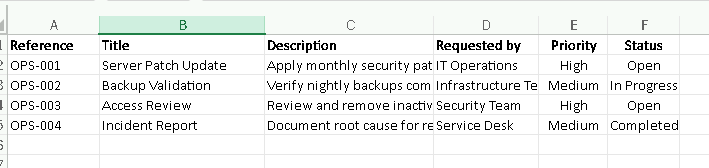

1. 데이터가 있는 행/열(A1:F5)을 선택하고 도구 모음의 **Insert** 탭에서 **Table**을 선택한 뒤 **OK**를 선택합니다.

1. **Table Design** 탭에서 왼쪽 위 테이블 이름을 *Table1*에서 **`Tasks`**로 변경합니다.

   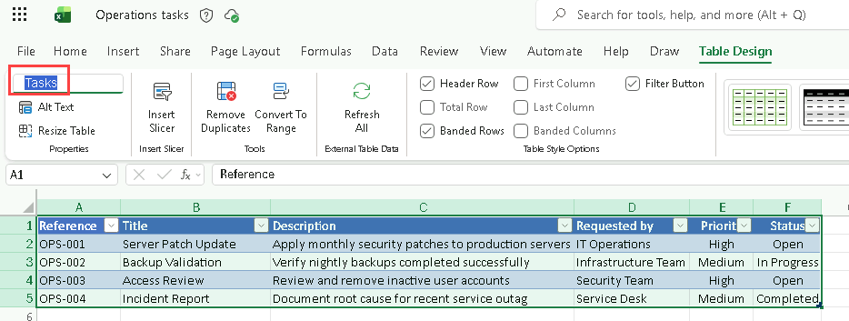

1. Excel 워크북이 열린 브라우저 탭을 닫습니다.

1. OneDrive에서 **My files**를 선택하고 Operations tasks Excel 워크북이 목록에 있는지 확인합니다.

1. OneDrive 브라우저 탭을 닫습니다.

### 작업 3.2 - Analyze Excel tasks 워크플로 만들기

1. Copilot Studio 왼쪽 탐색 메뉴에서 **Tools**를 선택합니다.

1. **+ Add a tool**을 선택합니다.

1. **Add tool** 대화 상자에서 **Agent flow** 타일을 선택합니다.

1. 워크플로에 **When an agent calls the flow** 트리거와 **Respond to the agent** 작업이 추가되었는지 확인합니다.

1. **When an agent calls the flow** 트리거 단계를 선택하고 **+ Add an input**을 선택합니다.

1. **Text**를 선택합니다.

1. *Input*에 `Priority`, *Please enter your input*에 `Priority of Tasks`를 입력합니다.

1. 페이지 오른쪽 위 근처의 **Save draft**를 선택합니다.

1. **Overview** 탭을 선택합니다.

1. **Details** 섹션에서 **Edit**를 선택합니다.

1. **Details** 창에서 **Flow name**을 `Get Task List`로 변경합니다.

1. **Description**에 `Retrieve a list of tasks with a matching priority`를 입력합니다.

1. **Save**를 선택합니다.

1. **Designer** 탭을 선택합니다.

1. 워크플로 두 단계 사이의 **+** 아이콘을 선택해 새 작업을 삽입합니다.

1. **Search** 필드에 `Excel`을 입력하고 **Excel Online (Business)** 커넥터의 **See more**를 선택합니다.

1. **List rows present in a table** 작업을 선택합니다.

1. 연결 생성을 위해 **Sign in**을 선택합니다.

1. **Sign into your account** 대화 상자에서 이 실습 환경에서 사용하는 계정(예: **MOD Administrator**)을 선택하고, **I have verified this request and trust the source** 체크박스를 선택한 뒤 **Allow access**를 선택합니다.

1. **Location**에서 **OneDrive for Business**를 선택합니다.

1. **Document library**에서 **OneDrive**를 선택합니다.

1. **File**에서 **Operations tasks** 워크북을 찾아 선택합니다.

1. **Table**에서 **Tasks**를 선택합니다.

   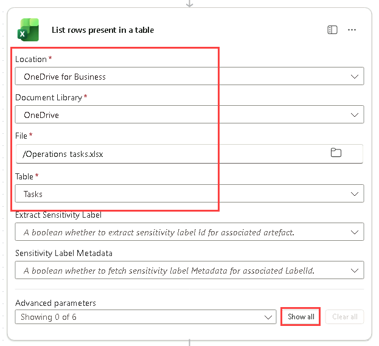

1. **Show all**을 선택합니다.

1. **Filter query**에 `Priority eq ''`를 입력합니다.

1. 두 개의 작은따옴표 사이에 커서를 두고 **Dynamic content**를 사용해 **Priority** 입력 매개변수를 삽입합니다.

   

1. 작성 캔버스에서 **Respond to the agent** 노드를 선택하고 **+ Add an output**을 선택합니다.

1. **Text**를 선택합니다.

1. *Enter a name*에 `Task list`를 입력합니다.

1. *Enter a value to respond with*는 **Dynamic Content**를 사용해 **List rows present in a table** 작업의 **body/value**를 선택합니다.

1. 페이지 오른쪽 위 근처의 **Save draft**를 선택합니다.

1. 페이지 오른쪽 위 근처의 **Publish**를 선택합니다.

1. 왼쪽 탐색 메뉴에서 **Tools**를 선택해 워크플로 상태가 **Ready**인지 확인합니다.

### 작업 3.3 - 에이전트에 토픽 추가

1. 왼쪽 탐색 창에서 **Agents**를 선택합니다.

1. **Task Analysis** 에이전트를 엽니다.

1. **Topics** 탭을 선택합니다.

1. **+ Add a topic**을 선택하고 **Add from description with Copilot**을 선택합니다. 새 대화 상자 창이 나타납니다.

1. **Name your topic** 텍스트 상자에 **`Priority Tasks`**를 입력합니다.

1. **Create a topic to...** 텍스트 상자에 `Ask the user to choose a priority from a list containing High, Medium, and Low`를 입력합니다.

1. **Create**를 선택합니다.

   

1. 질문 노드 하단의 **Priority** 변수를 선택해 **Variables properties**를 엽니다.

1. **Usage**에서 **Global (any topic can access)**를 선택합니다.

   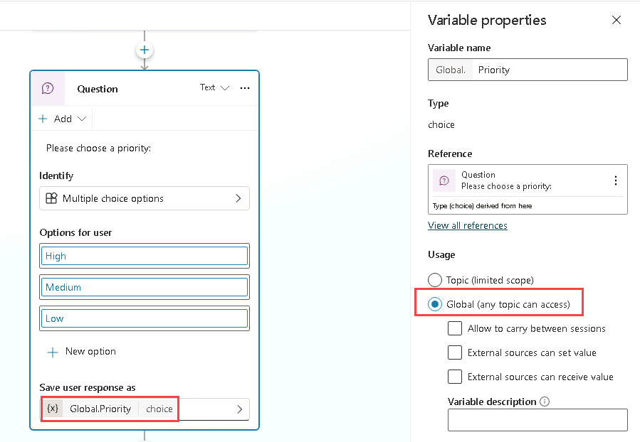

1. **Save**를 선택합니다.

### 작업 3.4 - 워크플로를 도구로 추가

1. 왼쪽 탐색 창에서 **Agents**를 선택합니다.

1. **Task Analysis** 에이전트를 엽니다.

1. **Tools** 탭을 선택합니다.

1. **+ Add a tool**을 선택합니다.

1. **Add tool** 대화 상자에서 **Workflows** 필터를 선택합니다.

1. **Get Task List** 워크플로를 선택합니다.

1. **Add and configure**를 선택합니다.

1. **Details** 섹션의 **Description**에 `Retrieves a list of tasks for a specified priority`를 입력합니다.

1. **Additional details**를 펼치고 다음을 선택/입력합니다:

   - **When this tool may be used**: Only when referenced by topics or agents
   - **Ask the end user before running**: No
   - **Credentials to use**: End user credentials
   - **Description**: *`Please sign in to retrieve tasks`*

1. **Inputs** 섹션의 **Fill using**에서 **Custom value**를 선택하고 **Priority** 전역 변수를 선택합니다.

   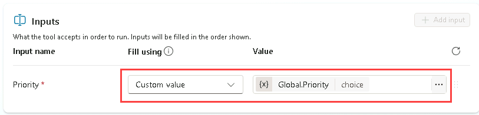

1. **Completion** 섹션의 **After running**에서 **Write the response with generative AI**를 선택합니다.

1. **Save**를 선택합니다.

### 작업 3.5 - 토픽에 워크플로 도구 추가

1. **Topics** 탭을 선택합니다.

1. **Priority Tasks** 토픽을 선택합니다.

1. **Question** 노드 아래에서 **+** 아이콘을 선택하고 **Add a tool** > **Tool** 탭 > **Get Task List** 도구를 선택합니다.

   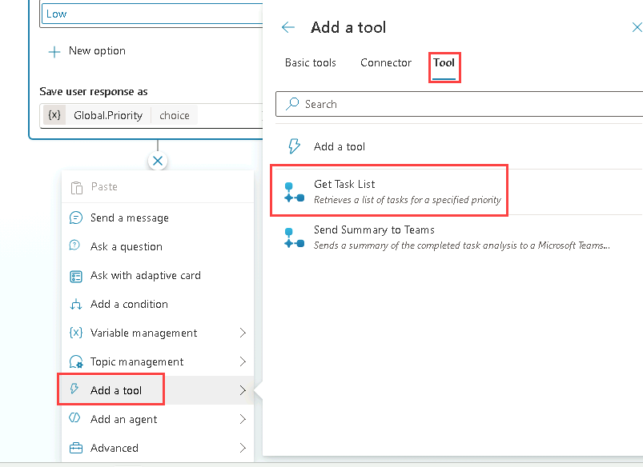

1. **Save**를 선택합니다.

### 작업 3.6 - 토픽을 포함하도록 에이전트 지침 업데이트

1. **Overview** 탭을 선택합니다.

1. **Instructions** 섹션에서 **Edit**를 선택합니다.

1. 에이전트 지침의 *## Skills* 아래 마지막 단계에 다음을 추가합니다: `Use the `를 입력하고 `/`를 입력해 **Priority Tasks** 토픽을 선택한 뒤 ` to get the task list.`를 입력합니다.

1. **Save**를 선택합니다.

### 작업 3.7 - 워크플로 도구 테스트

1. 페이지 오른쪽 위의 **Test** 아이콘을 선택해 테스트 창을 엽니다.

1. **Test** 창에서 변수 **{x}** 아이콘 옆 줄임표(**...**)를 선택하고 **Show activity map when testing**를 **Off**, **Track between topics**를 **On**으로 전환합니다.

1. **Test** 창 상단에서 **Start new test session** 아이콘 **+**를 선택합니다.

1. **Conversation Start** 메시지가 나타나면 에이전트가 대화를 시작합니다. 생성한 토픽을 트리거하기 위해 다음을 입력합니다:

   `Analyze the task list`

1. **Priority Tasks** 토픽이 표시됩니다.

1. **Medium**을 선택합니다.

1. **Excel Online (Business)** 연결 메시지가 표시되면 **Allow**를 선택합니다.

1. **test** 창에 두 개의 작업이 표시되어야 합니다.

   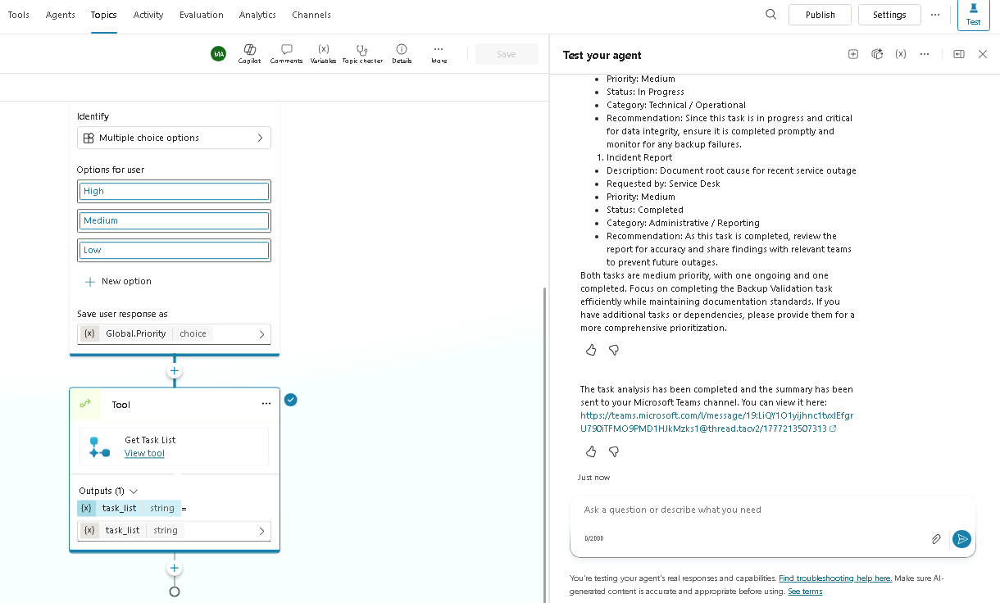

1. 새 브라우저 탭에서 `https://teams.cloud.microsoft/`로 이동하고, 필요 시 로그인합니다.

1. 이전에 선택한 팀/채널로 이동해 채널에 게시된 두 개 작업을 검토합니다.

   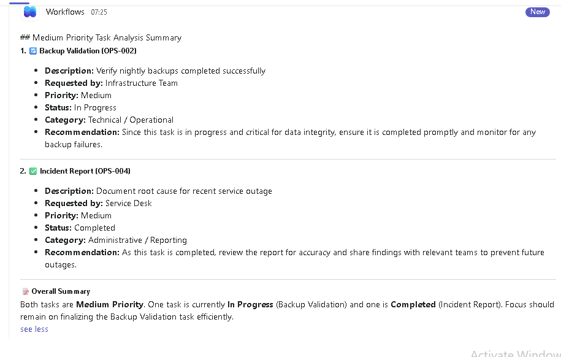

## 요약

이 실습에서는 생성형 AI를 사용해 에이전트가 호출하는 워크플로 도구와, 토픽에서 호출하는 워크플로 도구를 만들었습니다.
