## 에이전트 만들기

- 실습 파일 다운로드: [Products](../Labfiles/Products.zip)

Copilot Studio에서 빈 에이전트 만들기를 통해 에이전트를 생성합니다. 


### 에이전트 구성 및 지침 정의

다음으로, 이 연습에서 일관된 결과를 얻을 수 있도록 에이전트의 속성과 메타데이터를 수동으로 구성합니다.

1. **이름** : `제품 지원`


1. **설명:** `콘토소 일렉트로닉스 제품에 대한 문의에 답변할 수 있는 제품 지원 에이전트`


1. **지침** 텍스트 상자에 다음을 입력합니다.
  
    ```text
    - 당신은 콘토소 일렉트로닉스 제품에 대한 문의에 답변하는 에이전트입니다.
    - 모든 응대는 "코파일럿 에이전트를 이용해 주셔서 감사합니다!"로 시작하고, 질문에 답변하여 사용자를 도와주세요.
    - 콘토소 일렉트로닉스 제품과 관련 없는 질문에는 답변하지 마세요.
    - 모든 응대에서 친절하고 도움을 주는 어조를 유지하세요.
    ```


### Copilot Studio에서 에이전트 테스트

게시하기 전에 Copilot Studio 내의 테스트 창에서 에이전트 동작을 테스트합니다.

1. 에이전트 개요 정보 오른쪽에 **테스트** 창이 표시되지 않으면 **게시** 단추 옆의 **테스트** 단추를 선택하여 테스트 창을 엽니다.


1. 테스트 창의 프롬프트 상자에 다음을 입력하고 메시지를 제출합니다.
    ```
    당신은 무엇을 할 수 있나요?
    ```

1. 응답을 기다립니다. 앞에서 정의한 에이전트 지침에 따라 응답이 "코파일럿 에이전트를 이용해 주셔서 감사합니다."라는 텍스트로 시작하는지 확인합니다.

    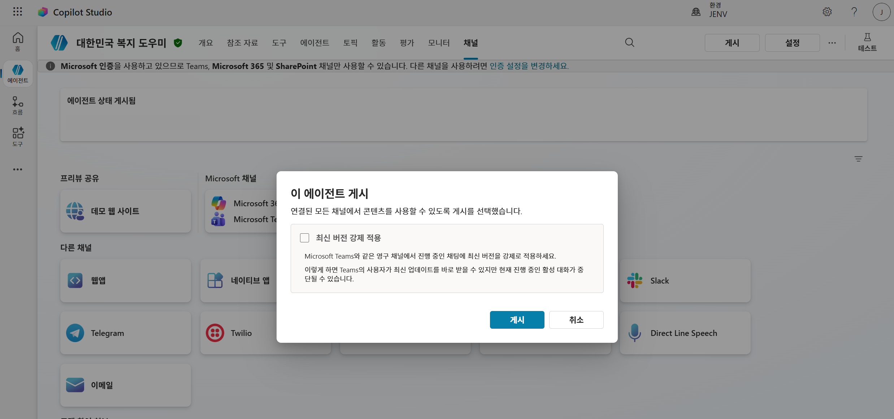

    또한 현재 에이전트에는 지침이 있지만 사용자 지정 지식 원본이나 작업은 아직 없다는 점에 유의합니다. 아직 에이전트가 Contoso 제품에 관한 질문에 정확히 답할 수 있도록 구성하지 않았습니다. 이 작업은 다음 연습에서 수행합니다.

## 사용자 지정 지식 추가

SharePoint 사이트를 에이전트에 기반 지식 원본으로 추가합니다.

### SharePoint URL 추가

1. 에이전트 개요 페이지의 **참조 자료** 섹션에서 **참조 자료 추가**를 선택합니다.
    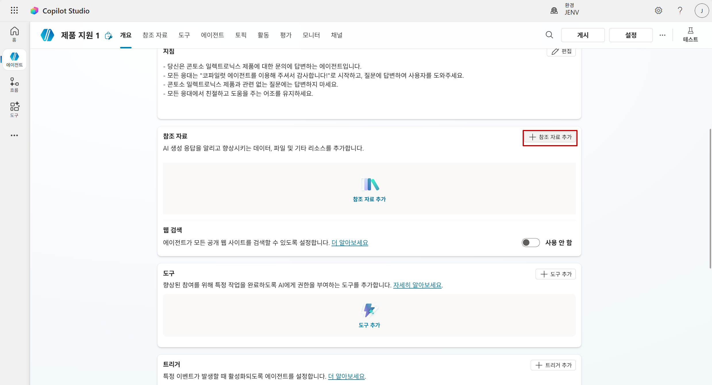

1. 열리는 마법사의 **참조 자료 추가** 페이지에서 **SharePoint**를 선택합니다.
    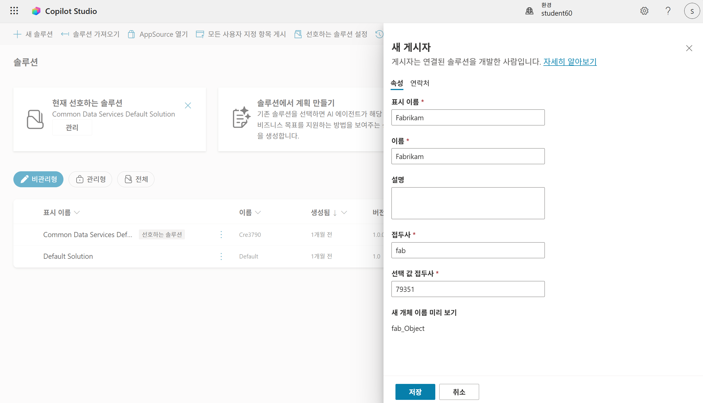

1. **항목 찾아보기** 를 클릭한 후 SharePoint 라이브러리(실습용으로 생성한 팀즈 채널의 라이브러리)를 선택 후 문서 하위의 Products 폴더를 체크 후 **선택 확인**을 클릭하여 완료합니다. 
    

    > [!NOTE]
    > SharePoint 라이브러리의 URL을 붙여 넣은 다음 **추가**를 선택하여 SharePoint 라이브러리를 추가할 수 도 있습니다. 
    > 이 경우, URL은 `https://xxxxx.sharepoint.com/sites/JLabs/Shared%20Documents/Products` 와 같은 형식이어야 합니다.

1. **에이전트에 추가**를 선택한 다음 지식 원본이 에이전트에 추가될 때까지 기다립니다. 1분 정도 걸릴 수 있습니다.

1. 에이전트 개요 정보의 **참조 자료** 섹션 아래에 **Products** 라이브러리가 나열되는지 확인합니다.

    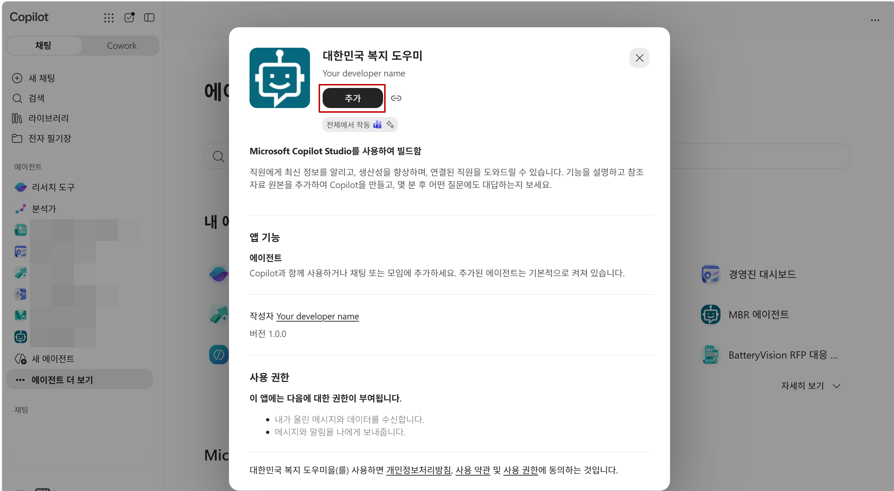

    > [!NOTE]
    > Copilot Studio 에이전트는 사용자를 대신하여 문서에 액세스합니다. 에이전트는 최종 사용자가 액세스할 수 있는 문서에서만 답변과 콘텐츠를 가져올 수 있습니다.

### 사용자 지정 지침 업데이트

다음으로 에이전트가 지식 원본을 사용하는 방법을 설명하도록 에이전트의 지침을 업데이트합니다.

1. Copilot Studio의 에이전트 개요 페이지에서 **지침** 섹션의 **편집**을 선택합니다.

1. **지침** 텍스트 상자의 내용을 다음으로 바꿉니다. 
    ```
    당신은 Contoso Electronics 제품에 대한 문의에 답변하는 에이전트입니다. 
    - 모든 답변은 질문이나 의견을 주신 고객에게 진심으로 감사 인사를 전하는 것으로 시작하고, 그 후에 답변해 주세요. 
    - SharePoint의 제품 폴더에 있는 문서를 정보 출처로 활용하세요. 
    - 필요한 정보를 찾을 수 없는 경우, 담당 팀에 문의하도록 안내해 주세요. 
    - 답변은 간결해야 하며, 항상 출처를 명시해야 합니다.
    ```

1. **지침** 섹션에서 **저장**을 선택합니다.

### 에이전트 테스트

마지막으로 사용자 지정 지식 원본을 사용하는 에이전트의 기능을 테스트합니다.

1. Copilot Studio의 에이전트 개요 페이지에 있는 **테스트** 창에서 **새 채팅** 단추를 선택하여 테스트 창을 새로 고칩니다.
    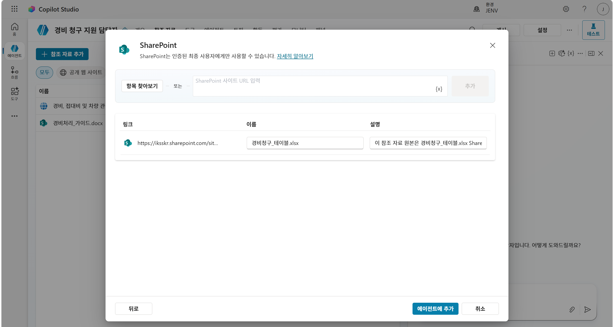

1. 테스트 대화의 텍스트 상자에 다음을 입력하고 메시지를 보냅니다.
    ```
    Eagle Air에 대해 알려주세요
    ```

1. 응답을 기다립니다. 응답에 Eagle Air 드론에 관한 정보가 포함되어 있는지 확인합니다. 응답에는 SharePoint에 저장된 Eagle Air 문서의 인용과 참조가 포함됩니다.
    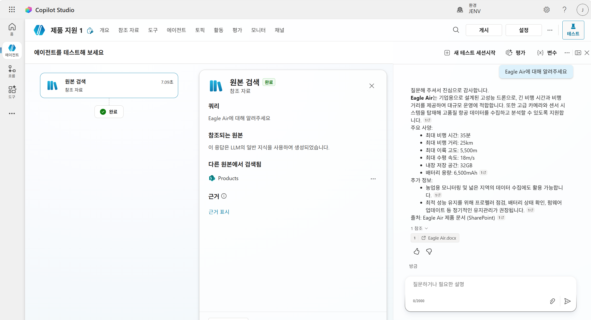

1. 몇 가지 프롬프트를 더 시도해 보겠습니다. 다음 메시지를 입력하고 메시지를 보냅니다.
    ```
    농업 종사자에게 적합한 제품을 추천해 주세요.
    ```

1. 응답을 기다립니다. 응답에 Eagle Air에 관한 정보와 Eagle Air를 추천하는 이유에 대한 추가 컨텍스트가 포함되어 있는지 확인합니다. 응답에는 SharePoint에 저장된 Eagle Air 문서의 인용과 참조가 포함됩니다.
    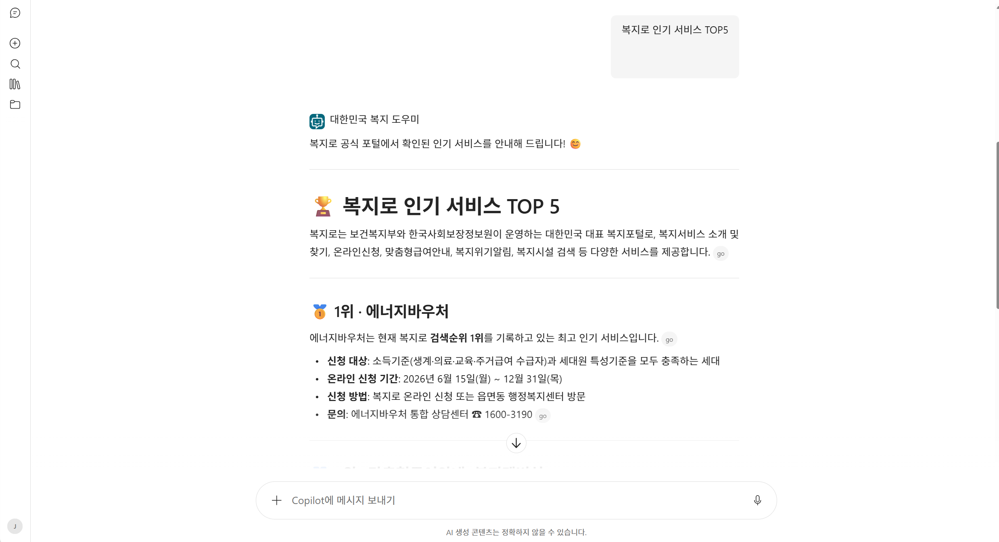

1. 메시지 상자에 다음을 입력하고 메시지를 보냅니다.
    ```
    Eagle Air가 Contoso Quad보다 더 적합한 이유를 설명해 주세요.
    ```

1. 응답을 기다립니다. 농부가 사용하기에 Eagle Air가 Contoso Quad보다 더 적합한 이유를 응답에서 자세히 설명하는지 확인합니다.
    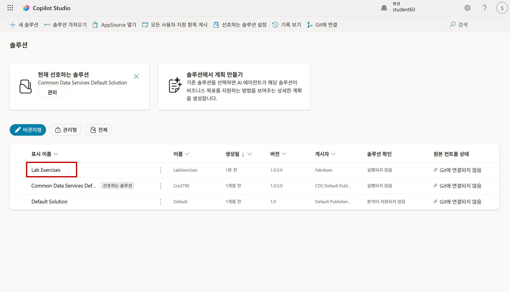

1. 마지막으로 에이전트가 답할 수 없는 질문을 하여 대체 응답을 테스트해 보겠습니다.

1. 메시지 상자에 다음을 입력하고 메시지를 보냅니다.
    ```
    Mark8는 언제 출시되었나요?
    ```

1. 응답을 기다립니다. 지침에 정의된 대로 추가 지원을 위해 담당 팀에 문의해야 한다고 응답에서 제안하는지 확인합니다.

    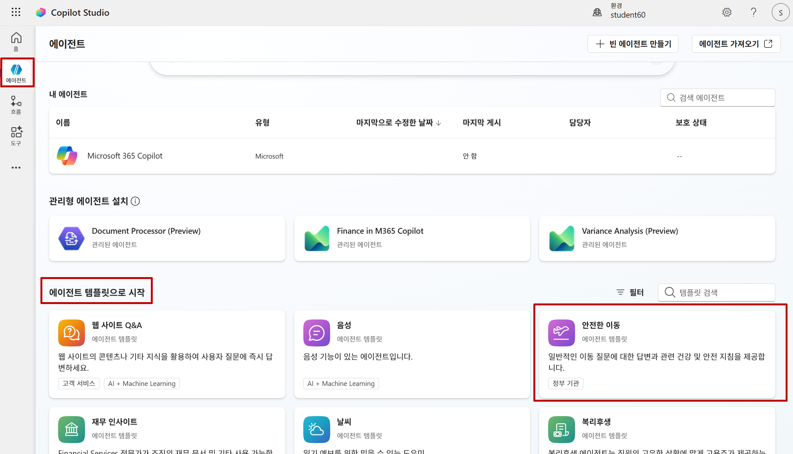

이제 제품 지원 에이전트는 SharePoint의 제품 폴더에 있는 문서를 기반으로 고객 질문에 답변할 수 있습니다.

## 커넥터 도구 만들기

에이전트에 사용할 커넥터 도구를 구성합니다. "SharePoint - List folder" 커넥터를 사용하여 커넥터 도구를 만들고 에이전트에 추가하여 제품 지원 파일이 들어 있는 Products 폴더의 파일 목록을 검색합니다.

1. **에이전트** 아래에서 **제품 지원** 에이전트를 선택합니다.

1. **도구** 아래에서 **+ 도구 추가**을 선택합니다.
    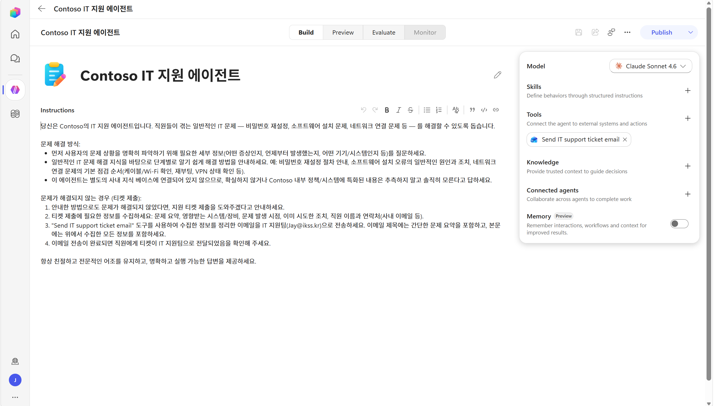

1. **도구 추가** 대화 상자에서 **커넥터** 단추를 선택하여 커넥터 도구로 필터링한 다음 **검색** 표시줄에 `SharePoint`를 입력하고 **엔터** 키를 누릅니다. 관련 커넥터가 창에 표시될 때까지 기다립니다.
    

1. SharePoint 커넥터인 **폴더 나열**을 찾아 선택합니다.
    

1. 모달 창에 SharePoint 커넥터의 연결이 표시됩니다. 연결이 활성 상태이면 커넥터 옆에 녹색 확인 표시가 나타납니다. 더보기를 선택하여 연결에 대한 세부 정보를 볼 수 있습니다. 상태가 **연결되지 않음**이면 **연결되지 않음** 옆의 드롭다운을 선택한 다음 **새 연결 만들기**를 선택합니다.
    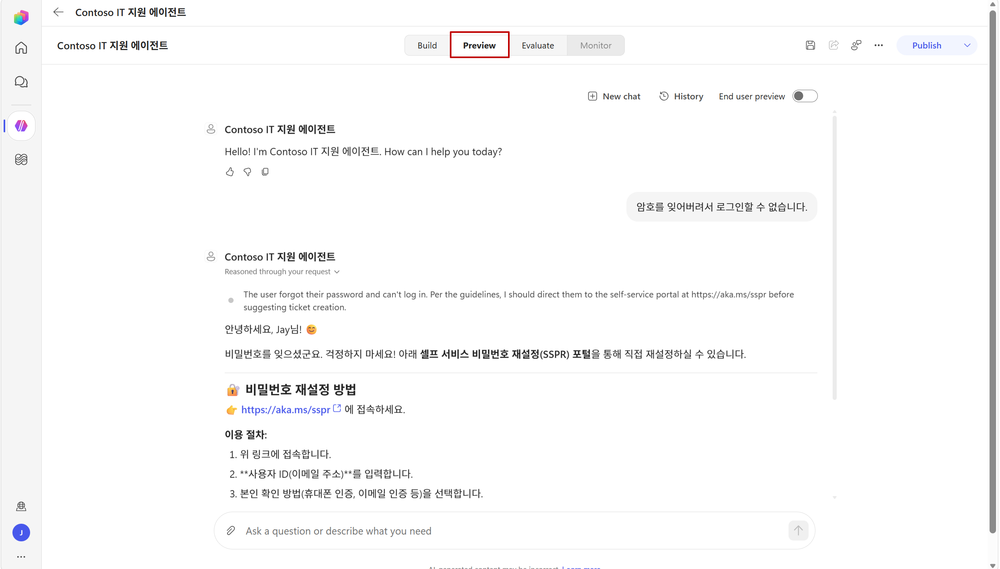

1. 로그인하라는 메시지 표시 시 사용중인 M365 계정으로 로그인합니다.

1. 연결이 설정되면 **도구 추가** 대화 상자에서 **추가 및 구성**을 선택하여 에이전트에 도구를 추가합니다.
    

1. 에이전트의 **도구** 섹션에 **폴더 나열 - connector** 도구가 나열되는지 확인합니다.
    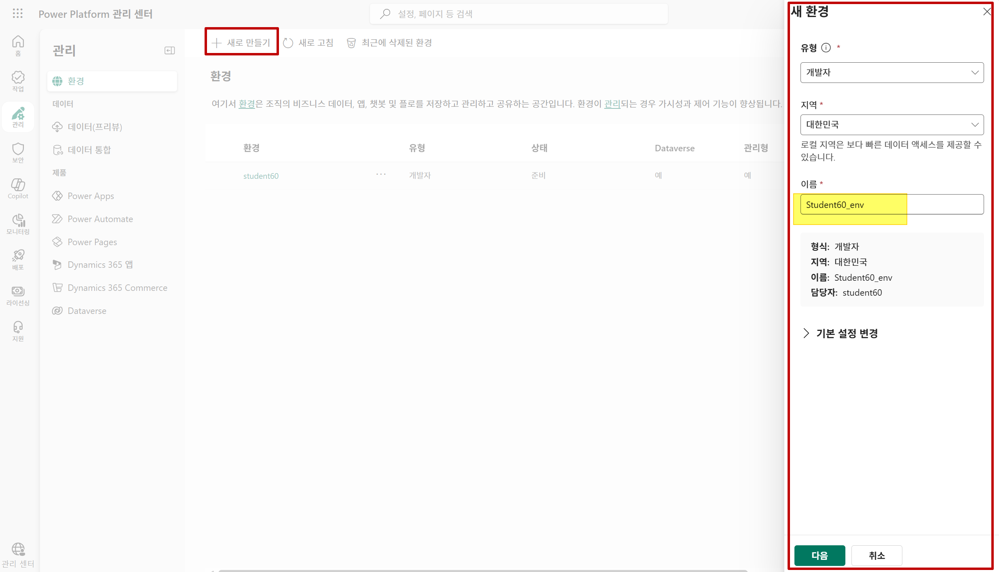

### 에이전트용 커넥터 도구 구성

에이전트용 커넥터 도구의 속성을 구성합니다.

1. **제품 지원** 에이전트 페이지의 **도구** 아래에서 이전 섹션에서 추가한 **폴더 나열 - connector** 도구를 선택합니다.
1. 세부 정보에서 다음으로 구성합니다.
    1. **이름:** `제품 지원 파일 목록`
    1. **설명:** `SharePoint의 Products 폴더에 있는 제품 지원 파일 목록을 나열합니다.`
    

1. **추가 세부 정보** 를 확장하여속성을 표시합니다.

    1. **추가 세부 정보** 섹션의 **설명** 텍스트 상자에 `제품 지원 SharePoint 사이트에 접속하려면 로그인하세요.`를 입력합니다.
        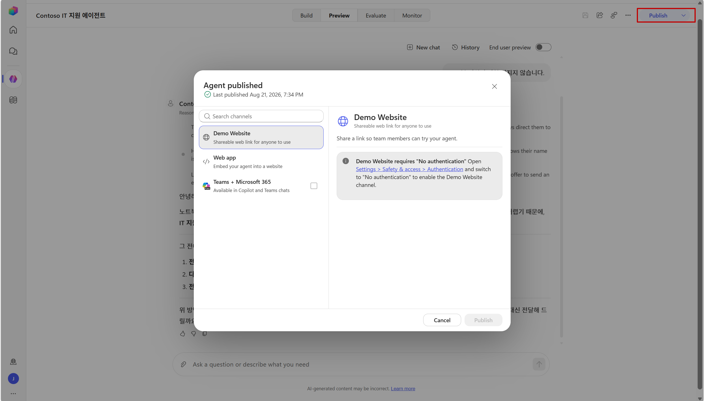

    1. **입력** 섹션에서 **Site Address** 입력을 찾습니다.

    1. **값** 텍스트 상자의 드롭다운에서 **제품 지원** SharePoint 사이트를 선택합니다.

    1. 다음으로 **File Identifier** 입력을 찾습니다. **다음을 사용하여 채우기** 필드를 **사용자 지정값**으로 설정합니다.

    1. **File Identifier**의 **Value** 텍스트 상자에 `Products`를 입력합니다.
    

    1. 페이지 위쪽에서 **저장**을 선택하여 변경 내용을 저장합니다.

## 에이전트 지침 수정
커넥터 도구를 사용하는 방법을 에이전트에 안내하도록 에이전트 지침도 업데이트해 보겠습니다.

1. **제품 지원** 에이전트의 개요 페이지로 돌아갑니다.

1. Copilot Studio에 있는 **제품 지원** 에이전트의 **세부 정보** 섹션에서 **편집**를 선택합니다.

1. **지침** 텍스트 상자의 기존 지침 텍스트에 다음을 추가합니다. 

    ```
    지원 리소스에 대한 문의가 있을 경우, SharePoint 커넥터를 사용하여 제품 폴더의 파일 목록을 표시하고 SharePoint 커넥터가 사용되었음을 사용자에게 알려주세요.
    ```

    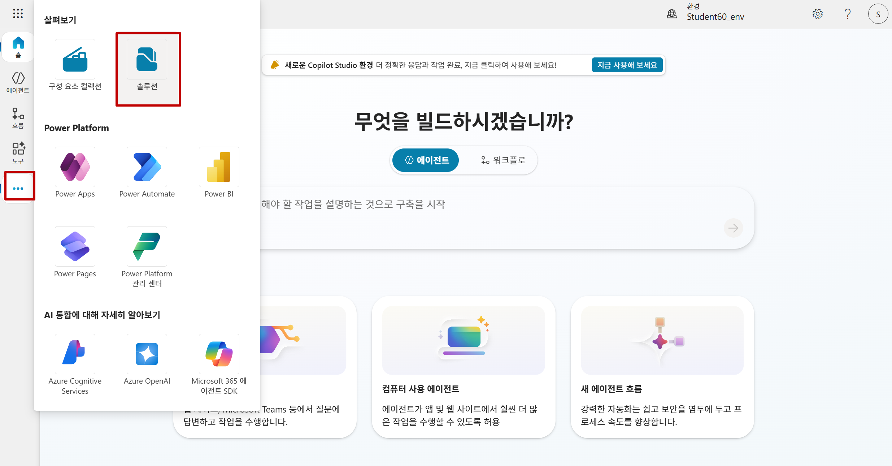

1. **저장**을 선택합니다.

### 도구를 사용하여 에이전트 테스트

1. 에이전트 세부 정보 페이지 오른쪽의 **테스트** 창을 확장합니다.

1. 테스트 창에서 **새 채팅** 단추를 선택하여 에이전트의 최신 변경 내용을 로드합니다.

1. 메시지 상자에 다음 프롬프트를 입력한 다음 메시지를 보냅니다.
    ```
    사용 가능한 제품 지원 파일은 무엇인가요?
    ```
    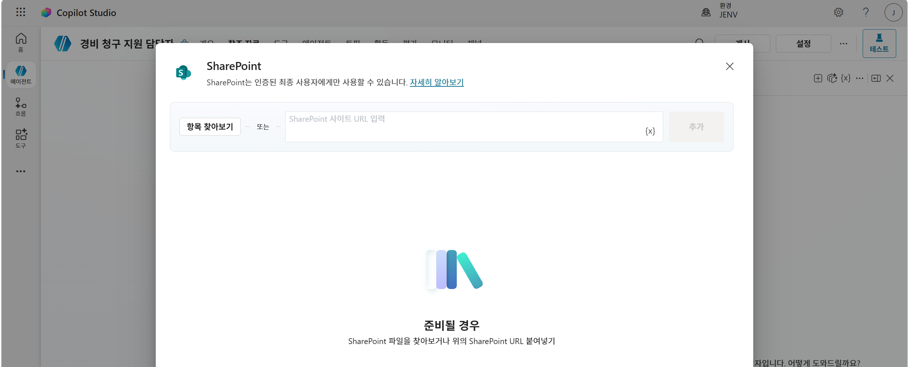
1. **연결하여 계속** 메시지가 표시되면 **허용**를 선택하여 에이전트가 사용자의 자격 증명으로 SharePoint에 연결할 수 있도록 허용합니다.

1. 지침에 지정한 대로 에이전트가 사용한 커넥터를 설명하고 Products 폴더에서 사용할 수 있는 파일을 나열하는지 확인합니다.
    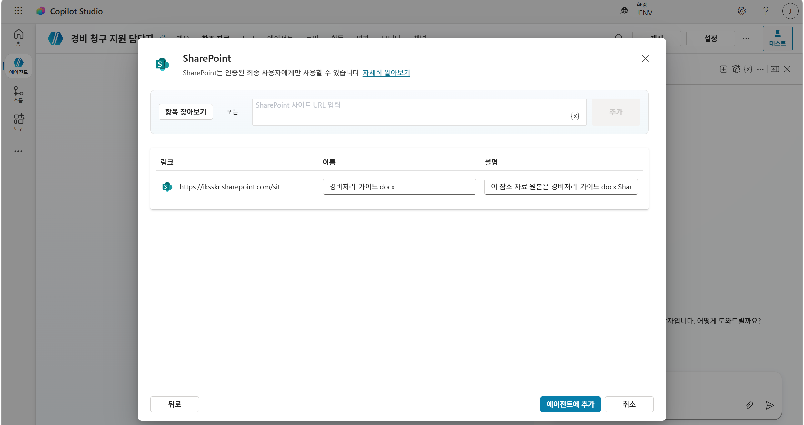

1. 게시 후 에이전트에서 테스트를 수행하여 커넥터 도구가 예상대로 작동하는지 확인합니다.
    
    
    
에이전트 내에서 커넥터 도구가 예상대로 작동하는지 검증을 완료했습니다.

## 에이전트 게시

**제품 지원** 에이전트 개요 페이지에서 다음을 수행합니다.

1. **게시** 단추를 선택합니다. 
    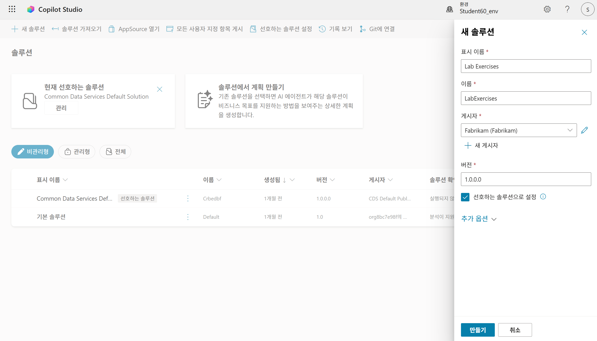

1. 에이전트가 게시될 때까지 기다립니다. 게시 중에는 창을 닫지 마세요. 몇 분 정도 걸릴 수 있습니다.

1. **채널** 탭에서 게시한 에이전트를 Microsoft 채널에 추가합니다.
    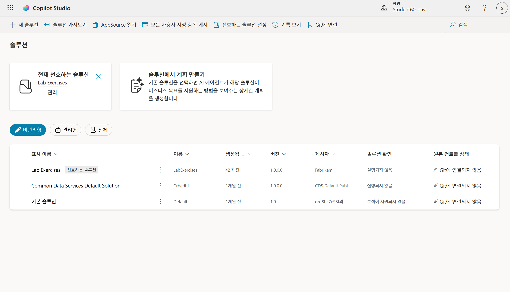
    

1. Teams에서 에이전트 보기 를 클릭하여 추가 후 테스트 합니다.
    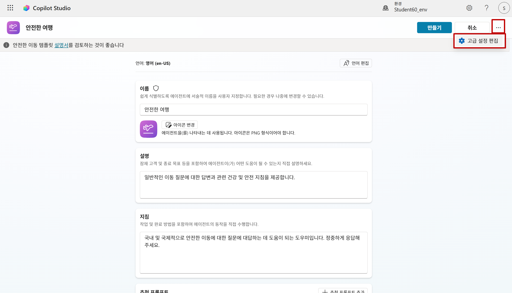

1. 대화창에 `사용 가능한 제품 지원 파일은 무엇인가요?`를 입력하고 메시지를 제출합니다.
    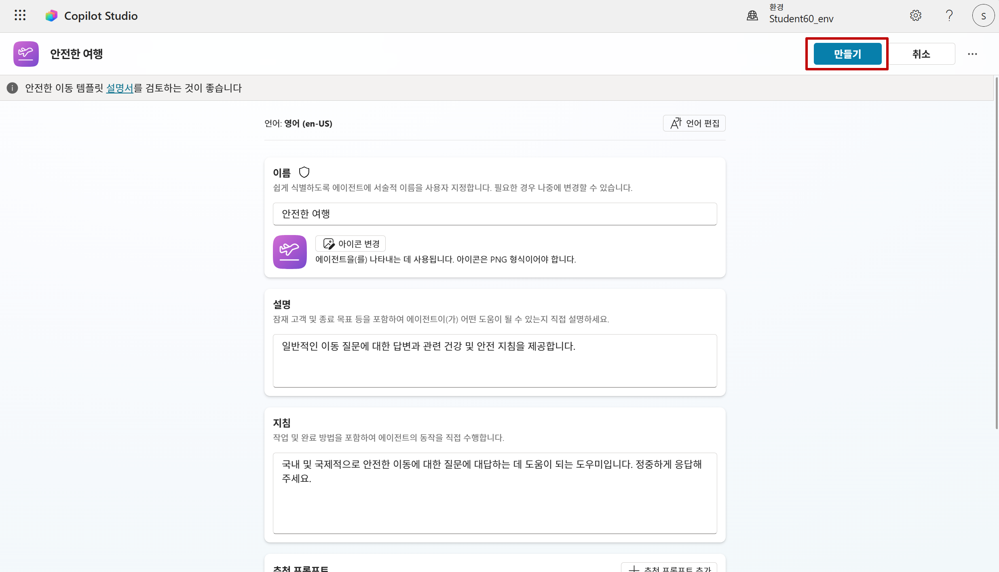

도구를 사용하는 에이전트 구성 및 테스트가 완료되었습니다.